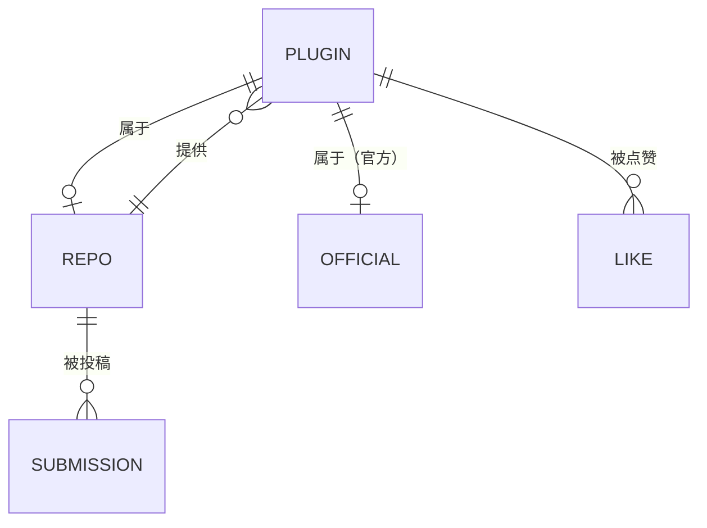
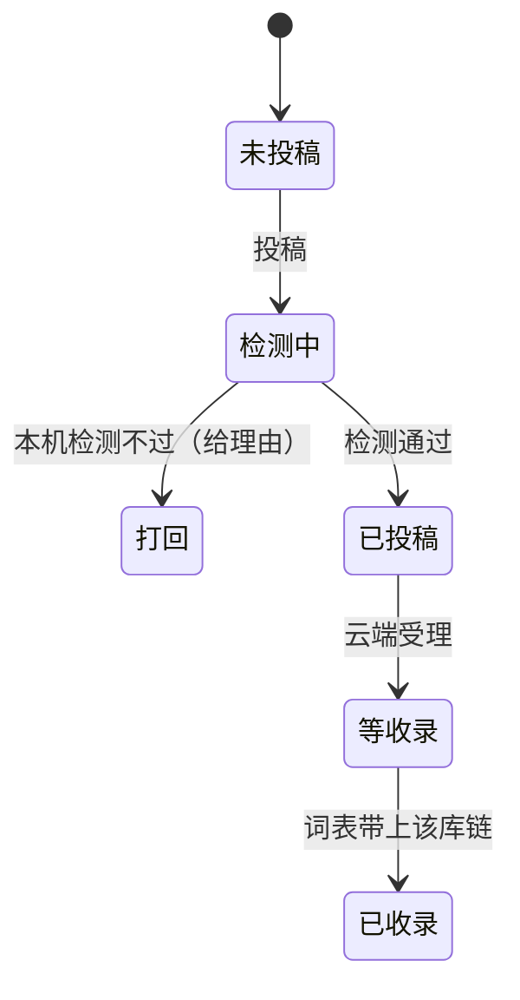

# 插件发现 — 概念模型（conceptual model）

依据 `conceptual-model` 与 `prototype-hci-pack` 的流程产出，输入来自真实代码、还原图与评审报告。
配套：`state-model`/`failure-path-audit`/`cognitive-walkthrough`/`information-architecture` 的内容见 `review-2026-10-06-discovery.md`；术语见 `glossary.md`。

## 0. 本轮设计问题（low-fidelity-prototype-planner 的用法）

在画任何界面之前，本轮必须先回答的问题：

1. 发现页的对象粒度是**插件**还是**库链**？（浏览=插件粒度、加库=库链粒度——两粒度共存会不会混？）
2. 「点赞」的对象是谁：插件、库链、还是作者？
3. 玩家投稿的「入库」和我们周更的「语料」是不是同一个概念？
4. 官方主库的插件要不要出现在同一个列表里（它们不能被加库）？
5. 翻译贡献（改简介译文）属于本页还是属于简介汉化？

**这五个问题在第一轮需求里没有定死就开工画页面，代价是返工了两次样式**（表格版 → 卡片版）。结论：以后新模块先出这份模型，再出 HTML 还原图。

## 1. 用途（Purpose）

让玩家**发现并获取**云库里（含官方主库）的任何插件：搜索/排序/浏览 → 把库加进本机 → 点赞表达偏好 → 投稿新库；同时给维护者一个可持续的语料入口。

## 2. 参与者（Actors）

| Actor | 目标 | 主要任务 | 备注 |
|---|---|---|---|
| 玩家（未装插件） | 找到想要的插件 | 搜索、看详情、（没有库时）先加库 | 默认每周点赞榜 |
| 玩家（已装插件） | 追新 / 发现 | 排序看最新更新、点赞 | `[已在库]` |
| 投稿玩家 | 让云库收录某条库链 | 粘地址、看打回原因 | 匿名、无需 GitHub 账号 |
| 维护者（你） | 语料健康 + 收录审核 | 收通知、看归档、拉黑 | 通过 `repo-inbox` 工作流 |
| 云端流水线 | 翻译与归档 | 增量翻译、写回统计、周档案 | 每周一/五 + 收录触发 |

## 3. 对象（Objects）

| 对象 | 定义 | 关键属性 | 关系 |
|---|---|---|---|
| 插件（Plugin） | 云库/官方主库里的一条插件条目 | 内部名、名称、一行简介、详情、作者、更新、图标 | 属于 0..1 条库链；属于 0..1 个官方主库 |
| 库链（RepoURL） | 一条第三方插件仓库地址 | 地址、是否已加本机、是否启用、推荐数 | 提供 1..n 个插件 |
| 官方主库（Dip17） | 卫月官方分发 | —— | 提供 n 个插件（不可加库） |
| 点赞（Like） | 玩家对**插件**的一周一次投票 | 周标签、总/周计数、同步状态 | 属于 插件 × 周 |
| 投稿（Submission） | 玩家提交的一条库链 | 地址、检测结果、收录状态、时间 | 属于 库链；产出 收录记录 |
| 推荐（Recommends） | 该插件所在库链被加进玩家库的次数 | 计数 | 属于 插件（按插件计数） |
| 统计快照（Stats） | 中继 KV → 仓库 JSON 的聚合 | 周标签、map、更新时间 | 派生自 点赞/推荐 |

## 4. 动作（Actions）

| 动作 | 目标对象 | 前提 | 结果 |
|---|---|---|---|
| 搜索 / 排序 / 换一批 | 列表 | 索引可用 | 视图变化（不改数据） |
| 展开详情 | 插件 | —— | 行内展开（不改数据） |
| 加库 | 库链（从插件行或详情发起） | 未在本机 | 本机库 +1、备份、推荐 +1、`[已在库]` |
| 启用 | 库链 | 已在本机但停用 | 恢复启用 |
| 撤回添加 | 库链 | 最近一次操作是加库 | 移除刚加的库 |
| 点赞 | 插件 | 本周未点过 | 本地立即变灰、匿名上报、计数 +1 |
| 投稿 | 库链 | 本机检测通过 | 云库任务队列 +1、等收录 |
| 顺手加到我的库 | 库链 | 勾选项 | 收录前先加本机 |
| 复制 / 在浏览器打开 | 库链 | —— | 剪贴板 / 浏览器 |

## 5. 状态（见 state-model 详表）

插件：`官方 / 未加入 / 已启用 / 已停用` × `未赞 / 本周已赞 / 未同步`
投稿：`未投稿 → 检测中 → 打回(本机) / 已投稿 → 等收录 → 已收录`
统计：`可用 / 暂不可用（降级）`

## 6. 规则与护栏（Rules / guardrails）

- 点赞：一个插件**一周一次**；跨周（北京时间周一 00:00）重置；不可取消（v1）。
- 推荐：按插件计数；同一库重复加不再计；只在发现页的加库动作计入。
- 投稿：本机 + 云端双检；归一化去重（镜像前缀/尾斜杠/github raw 形态算同一条）；不限次、不限条（用户定）。
- 官方主库：不可加库；可隐藏；不参与推荐。
- 翻译贡献：**不在本页**——描述译文由云端流水线维护（用户 2026-10-06 定「翻译贡献全退场」）。

## 7. 交互类型选择（interaction-type-selector）

| 功能 | 选择的交互类型 | 理由 |
|---|---|---|
| 浏览/筛选 | 列表 + 菜单选择（下拉排序）+ 直接操作（整行展开） | 1900+ 条、需要扫读与对比 |
| 加库/启用 | 直接操作（按钮作用在对象上） | 动作属于该行对象，一步完成 |
| 点赞 | 直接操作（♥） | 轻量、反复使用 |
| 投稿 | 表单提交（输入框 + 按钮 + 结果行） | 低频、需要校验与理由回传 |
| 翻译编辑 | （已移除） | 与「发现」的心智模型不匹配 |

## 8. 心智模型核对（mental-model-checker）

| 问题 | 用户会怎么想 | 系统的概念 | 是否一致 | 处置 |
|---|---|---|---|---|
| 「加库」加的是什么？ | 我要的插件 → 加插件？ | 加的是**库链**，顺带得到插件 | ⚠️ 有落差 | 行内按钮只在未加库时出现；tooltip 说「这条库」；加完该库所有插件都可用 |
| ♥ 数字是什么？ | 谁喜欢过？ | 本周/总赞计数 | ⚠️ 顺序不明 | 顶部说明「每周可点赞一次」，tooltip「周/总」 |
| 投稿 = 加库？ | 都是「把地址给它」 | 投稿进**云库**（所有人可见），加库只影响本机 | ⚠️ 易混 | 两个入口分开、词分开（投稿/加库）、术语表固定 |
| 官方插件为什么不能加库？ | 「加库」应该是通用的 | 官方库本来就在 | ✅ | 官方行不显示加库，说明写在展开区 |
| 点赞能撤回吗？ | 应该有 | v1 不支持 | ⚠️ | tooltip 明说「一周一次、下周可再点」 |

## 9. 歧义与简化建议

- **歧义**：浏览粒度（插件）与动作粒度（库链）不同——用 `[已在库]`、行尾按钮、展开区文案三处对齐；不要在行上再放「加插件」。
- **简化建议**：若将来支持「按库浏览」，不要新增第二张表，改为同列按库分组（避免两套心智模型）。
- **不要做**：把翻译编辑塞回本页；把投稿做成第二个加库按钮；把官方插件混进推荐排行（无意义）。

## 10. Mermaid — 关系与状态

