# 启发式评审 — FireGaze「拦住自动更新」页还原图
> 盲评对象：`C:/everyone/FireGaze/Resources/ui-mockup-autorefresh-tab.png`（2980×1000，2× 缩放，2 帧并排：左=默认态 / 右=关掉第一项）+ 同源 HTML `ui-mockup-autorefresh-tab.html`。
> 方法：逐元素读图 → 读 HTML 取精确文案/间距/层级 → 回到实现交叉核对（`src/FireGaze/UI/InstallerTab.cs`、`MainWindow.cs`、`InstallerListScroll.cs`、`Configuration.cs`、`Plugin.cs`、`UiHelpers.cs`）。引用格式 `文件:行`。本评审为静态阅读，未执行 shell/git（无权限），结尾列出需监督者执行的命令。
> 一致性基线（启发式 4）：本页已有跨页基线 `docs/hci/review-2026-09-16-heuristic.md`（仓库体检页）与 `docs/hci/review-2026-09-17-installer-tab-heuristic.md`（本页前任形态），下文只审**本页新增/未闭环**的项，不复审已覆盖项。
> 还原图性质：这是实现之后的**回填图**（`.git/logs/HEAD`：`1.0.0.36` 加开关 → 下一笔提交「加『拦住自动更新』页还原图（2 帧，2× 截图）供 HCI 盲评」），因此"图与实现不一致"= 验收基线失真，不是设计稿待实现。
> 严重度 0-4：0 = 不是问题；1 = 观感/低优先；2 = 次要可用性问题；3 = 主要可用性问题；4 = 严重/会阻塞或误导用户。
页内可见结构（自上而下 4 块）：①说明句（正文色）②`Separator` ③开关1「防止打开插件管理器自动刷新」+ 缩进灰字 ④`Spacing` + 开关2「记住看到哪里（下次打开接着看）」+ 缩进灰字。

```mermaid
flowchart LR
    A["☑ 防止打开插件管理器自动刷新<br/>InstallerTab.cs:20-23"] --> B["Tick：仅当 安装器这帧在画<br/>且 列表铺开过<br/>InstallerListScroll.cs:140-146"]
    B --> C["把 PluginManager.repoRefreshTask<br/>换成 Task.CompletedTask<br/>:338-376"]
    C --> D["后台重载不再把子窗口换成<br/>「正在加载插件…」→ 位置不被顶掉"]
    E["☑ 记住看到哪里<br/>InstallerTab.cs:30-33"] --> F["list.ScrollY ⇄ Config.ListScrollY<br/>:129 / :321-326"]
    D --> G["用户可见证据：无"]
    F --> G
    G --> H["页面上没有状态/计数/失败提示<br/>AR-01；开关全默认开（AR-07）"]
    style G fill:#3a2020,stroke:#a55
    style H fill:#3a2020,stroke:#a55
```

---
## 1. 逐条启发式结论（按启发式排序）
| ID | Heuristic | Screen/flow/component | Evidence | Why it matters | Severity (0-4) | Recommendation |
|---|---|---|---|---|---|---|
| AR-01 | 1 系统状态可见性 | 整页（无状态行） | 实现里"生效/没生效"只写日志：结构体自检失配 → `layoutOk=false`，只记 `Log.Warning("…本次会话不再遍历窗口：位置记忆与自动刷新拦截将自动停用")`（`InstallerListScroll.cs:389-410`），随后 `FindListWindow` 直接返回空（`:193`），两个功能整会话静默停用；恢复写不进去 → `GivenUp` 也只记日志（`:275-279`、`:300-304`）；拦截实际生效条件是 `open && sawListContent`（`:140-146`）。还原图两帧与 `InstallerTab.cs` 全文零状态信息 | 两个开关的"生效"在页面上完全不可观测：成功 = 什么都不发生（设计如此），失败 = 只有日志。用户无法区分「在生效 / 本次已停用 / 我关的」三种情况；卫月或 ImGui 一升级，开关还画着勾但功能已死 | **3** | 开关组下方加**一行灰字**（不必恢复上一版的状态框）：正常 `状态：已就绪 · 本次已拦住 2 次自动刷新（最近 13:12）`；失配/放弃时 `状态：本次已停用（卫月版本不兼容，详情见日志）`。计数已现成（`maskedRuns`，`InstallerListScroll.cs:81`、`:368`），只需暴露一个只读属性 + 一行 `TextDisabled` |
| AR-02 | 1 | 开关1 的灰字（两帧文本完全相同） | HTML:54 与 HTML:75 逐字相同；`InstallerTab.cs:23-26` 无条件渲染，没有按勾选态分支 | 帧 2 正是产品想展示的"关掉第一项"状态，而这句仍在断言"刷新仍在后台进行，**只是不再**把你正在看的列表顶回顶部"——关闭时它是假的。用户会怀疑"我关了吗/关了到底会怎样" | 2 | 文案两态化或改条件句：开 `开启后：刷新照常跑，但不会再把你正在看的列表顶回顶部。` / 关 `已关闭：仓库重载时列表会回到顶部。`；若不想改文案，至少用 `ImGui.BeginDisabled()` 包住灰字表达"这条当前不适用"，并据此补一帧「两项都关」 |
| AR-03 | 1（可读性） | 两行灰字的取色 | 还原图用 `--muted:#909090`（HTML:10），在 `--win-bg:#191919` 上对比度 ≈ **5.5:1**（达标）；实现用的是 `ImGui.TextDisabled`（`InstallerTab.cs:26,36`），色值由卫月主题决定（ImGui 默认深色主题 `TextDisabled` = 0.50 灰 ≈ `#808080` ≈ **4.4:1**，略低于 WCAG AA 4.5:1）；仓库已有 `UiHelpers.Muted` = 0.65 灰（`UiHelpers.cs:12`）≈ **7.2:1** | 这两行是整页唯一的解释性文字，也是唯一回答"开了会怎样"的信息；它们同时是页面上最暗的文字 | 1 | 若要稳过 AA：改用 `UiHelpers.ColoredText(UiHelpers.Muted, …)`（现成常量）替代 `TextDisabled`；并请实机取一次卫月主题的 `TextDisabled` 实际色值确认（见结尾命令 3） |
| AR-04 | 2 系统与现实匹配 | 页签「拦住自动更新」+ 副标题第三项 | 页签 `MainWindow.cs:69`，副标题 `MainWindow.cs:48`（还原图 HTML:47、HTML:49 同）；同页其余三处用的是另一个词：`自动刷新`（`InstallerTab.cs:22,26`）、`自动重载`（`InstallerTab.cs:17`）；本插件语境里「更新」指的是**插件自身的更新**——旧页的已知问题原文就是"更新新版本的 OmniToolbox / XSZToolbox … 会加载失败"（`Resources/ui-mockup-installer-tab.html:54`），而本页做的事是"重载仓库列表时不替换列表" | ①页面做的事**不包括**阻止插件更新，页签却写成「自动更新」：用户会以为它管更新（期望落空），或反过来怕它挡住更新而关掉一个默认已开的开关。②这是本页签下第二个开关（记住看到哪里）的唯一入口，而名字只承诺了第一个功能：想关掉"记住位置"的用户在页签栏里找不到它（前任页签叫「插件安装器」，同时覆盖两项，`ui-mockup-installer-tab.html:47`）。③副标题三项"汉化 / 体检 / 拦住自动更新"里前两项是名词，第三项是动词短语，并列节奏被打断 | **3** | 页签改回**同时覆盖两项**且用户在游戏里认得的名字：`插件安装器`（推荐，和游戏内窗口名一致）或 `安装器增强`；副标题第三项同步。页内三处用词统一到**自动刷新**（「自动重载」→「自动刷新」）。说明句补一句边界：`不会禁用或延迟插件更新，也不改动插件本体。`（若页签名同为产品指定文案，请按"建议"处理，但"自动更新 ≠ 自动刷新"这点需要产品确认） |
| AR-05 | 2（措辞：**建议性质，非错误**） | 开关1 标签「防止打开插件管理器自动刷新」 | 还原图 HTML:53 / HTML:74；`InstallerTab.cs:22`。两种读法都通：`防止〔打开插件管理器〕自动刷新` 与 `防止打开〔插件管理器自动刷新〕`——前者可被读成"防止打开插件管理器"（阻止安装器被打开）。另：真实生效范围是"安装器**打开期间**、且列表已经铺开过"（`InstallerListScroll.cs:140-146`），而"打开…时"读起来像"仅在打开的那一瞬间" | 这是本页唯一的功能开关标签，读错等于整页读错；"防止 + 打开 + 名词 + 动词"的连动结构在中文里天然有二义 | 2 | 【建议，非错误】按"先对象、后动作、再条件"重写，读法唯一：
① `打开插件安装器时不要自动刷新列表`
② `别让插件安装器自动刷新列表`
③ 或拆成两级：开关 `拦住安装器的自动刷新` + 灰字 `仅在安装器打开、列表已显示时生效`
（都不改行为，只改措辞；若产品坚持原句，建议至少在灰字里补"安装器打开期间"这一条件） |
| AR-06 | 3 用户控制与自由 | 开关2「记住看到哪里」周边（无"忘记位置"入口） | 全页只有两个 `Checkbox`（`InstallerTab.cs:18-37`），无清除项；`Config.ListScrollY` 全仓只在三处出现：`:129`（恢复条件）、`:321`（比对现值）、`:326`（写入），**没有任何地方把它清空**；关闭开关只写布尔值并存盘（`Plugin.cs:309-314`），恢复时仍用旧值（`InstallerListScroll.cs:129` `saved > 1f` 即恢复） | ①用户没有任何办法"忘掉"已记住的位置——这是一条看不见、也删不掉的持久状态（写在插件配置里）。②"关掉开关 → 自由滚动 → 再打开开关"会跳回很久以前那次的位置，看起来像功能坏了。上一轮评审已提过同一根因（`review-2026-09-17-installer-tab-heuristic.md` A3-3 ③），未落地 | 2 | 三选一（推荐 ①+③）：① `Plugin.SetRememberListScroll(false)` 时把 `Config.ListScrollY` 置 `null`（一行）；② 灰字里回显 `上次位置：1240px（09-16 19:24）` + 一个小号 `忘记` 按钮；③ 至少把"关闭后仍保留上次位置"写进灰字 |
| AR-07 | 3 | 默认值 + 说明句的边界 | `Configuration.cs:56` `RememberListScroll = true`、`:64` `BlockInstallerAutoRefresh = true`（与帧 1 一致）；而开关1 的效果来自对**卫月内部状态**下手：把 `PluginManager.repoRefreshTask` 换成 `Task.CompletedTask`（`InstallerListScroll.cs:338-376`，反射取得，`ResolvePluginManager` 同文件后段） | 用户从未打开过这一页，两个开关（含那个改动卫月内部状态的行为）就已经生效；页面上没有任何一行说明"默认已开"或"本页只影响列表显示、不动插件本体"。对"插件会不会被搞坏"敏感的用户（旧页正是因为这个才写了已知问题）没有任何安心的依据 | 1 | 保持默认开也可以，但说明句里加边界 + 机制定位：`仅影响安装器列表的显示方式（不联网行为、不改插件、不禁用更新）。`；或把开关1 改成默认关、由用户显式选择 |
| AR-08 | 4 一致性与标准 | 开关1 标签里的「插件管理器」 | `InstallerTab.cs:22` 写 `插件管理器`；同页说明句写 `插件安装器`（`:17`）；实现里对应的游戏内窗口名是 `插件安装器###XlPluginInstaller`（`InstallerListScroll.cs:89` 候选名）；README 也写「打开 **插件安装器**」（`README.md` 下载使用第 2 步） | 用户是按**游戏里看到的窗口标题**去找的；「插件管理器」在游戏里没有对应窗口，等于让用户去找一个不存在的名字 | 2 | 【建议性质】统一改成 `插件安装器`（与同页说明句、README、游戏内窗口名一致） |
| AR-09 | 4 | 跨产物用词 | `README.md` 功能列表仍写「浏览插件仓库**阻止自动重载**」（英文 `blocking automatic reloads while browsing plugin repositories`）；`pluginmaster.json` 的 `Description` 只列「第三方插件简介汉化」「第三方插件仓库坏链检测」**两项**，第三项功能在市场描述里根本没有；页内副标题却列三项（`MainWindow.cs:48`） | 插件市场/README 是用户安装前的唯一信息来源：那里既用了第四种说法（"阻止自动重载"），又漏掉了第三项功能；安装后页内又是另一套词，用户对不上号 | 1 | README 与市场描述同步为两项/三项一致 + 统一用「自动刷新」；这是上一轮 A4-6/F26 同类问题的延续（当时指出的"（在修复）"已消失，但用词与功能清单仍不同步） |
| AR-10 | 4 | 还原图灰字的**缩进**（与实现不符） | 还原图两条灰字有 `.indent{padding-left:22px}`（HTML:38、HTML:54/59/75/80），渲染后与复选框**标签**左对齐；实现是裸的 `ImGui.TextDisabled("…")`（`InstallerTab.cs:26`、`:36`），**没有** `ImGui.Indent()`，实际会顶格渲染、与复选框**方框**左对齐；全仓 UI 代码没有任何 `Indent` 用法，前任同类图也没缩进（`ui-mockup-installer-tab.html:49,66`），仓库灰字惯例就是顶格（`RepoAuditTab.cs:42-43`、`TranslateTab.cs:104-106`） | 图里表达的是"这句话从属于上面的开关"；实现出来会变成两条像页级注释的顶格灰字，**验收图像与终态不同**。这属于"照图验收会漏掉"的失真（上一轮 F7/A4-4 同类问题，本轮又出现一次） | 2 | 二选一，不要都不做：①实现里在每条灰字外加重 `ImGui.Indent()/Unindent()`（缩进量用 `GetFrameHeight()+ItemInnerSpacing.x` 才是真正对齐标签，写死 22px 仍会偏）；②按实现（顶格）重画还原图，并给灰字加「提示：」前缀（`TranslateTab.cs:106` 已有先例），否则顶格灰字会被读成免责声明 |
| AR-11 | 8 审美与极简 | 说明句 + 两个标签 + 两条灰字 | 同一件事说了三遍：①"不再把列表顶掉"（`InstallerTab.cs:17`）/ 标签「…自动刷新」（`:22`）/ 灰字"只是不再把你正在看的列表顶回顶部"（`:26`）；②"记住你上次看到哪里"（`:17`）/ 标签「记住看到哪里（下次打开接着看）」（`:29`）/ 灰字"列表会回到上次的位置"（`:36`）。还原图一屏内这五句全部可读 | 700px 宽、默认 620px 高的窗口里，用户读完顶部说明再读标签，得到的是同一个信息；真正的边界（会不会影响更新/刷新还在不在跑/失败怎么办）反而没写。这是上一轮 A8-2/F14 同源问题的轻量残留 | 2 | 说明句改成只讲**范围与边界**（例：`插件安装器的列表不会再被后台刷新打断；也不影响插件更新。`），把"怎么生效/关了会怎样"留给每条灰字；或删掉说明句让两个开关自解释（`README` 已解释功能） |
| AR-12 | 9 帮助识别/诊断/恢复 + 4 | 已知问题披露 / 历史产物锚点 | 前任页底有「目前已知问题：开启本插件的情况下，更新新版本的 OmniToolbox / XSZToolbox / PFRadar / OCNFarmer 时会加载失败，需要重启一次游戏解决。」（`ui-mockup-installer-tab.html:53-54`），改版后本页（`InstallerTab.cs` 全文）与市场描述都没有任何已知问题说明；而新实现仍通过反射改写卫月内部字段（`InstallerListScroll.cs:338-376`、`ResolvePluginManager`），同类"与卫月内部耦合、升级即失效"的风险并未消失。同时 `Resources/ui-mockup-installer-tab.*` 与 `docs/hci/review-2026-09-17-installer-tab-*.md` 仍指向**已删除**的 `src/FireGaze/UI/BlockerTab.cs` 与已不存在的「插件安装器」页签 | 用户遇到"更新某个插件失败"时，唯一的线索就是这条已知问题；它现在没有落点。另外，下次核对历史评审时，文档的行号锚点已全部失效（找不到 `BlockerTab.cs`），复核成本上升 | 2 | ①明确"已知问题"是**已解决所以删除**还是**搬到别处**（README / 市场描述 / 页内灰字）；若风险仍在，需有落点。②把前任 mockup 与两份评审文档标注为历史版本（或移入 `docs/hci/archive/`），避免继续被当作当前基线 |
| AR-13 | 10 帮助与文档 | 全页无帮助入口、无"何时生效"说明 | 页面上没有任何帮助/文档/日志入口；`/firegaze` 只支持 `zh`/`update` 两个参数（`Plugin.cs:291-301`），这两个开关没有命令入口，页面也没提"改动立即保存"（实际是立即落盘：`Plugin.cs:309-320`） | 新用户不知道该去哪看说明；老用户没有跳过 UI 的捷径；"改完要不要点保存、什么时候生效"两个问题只能靠猜 | 1 | 灰字末尾加一句 `改动立即保存，下次打开插件安装器时生效。`；若要帮助入口，按上一轮 `review-2026-09-16-heuristic.md` A10-1 的同一建议做（跨页统一，不要只在本页加） |
| AR-14 | 4（验收基线） | 还原图覆盖的态与度量基准 | 还原图窗口固定 `700×420`（HTML:21-24），实现默认 `700×620`、最小 `560×440`（`MainWindow.cs:27-31`）；说明句在图上占约 612/668px ≈ **92% 行宽**（按窗口 944 显示 px = 700 CSS px 换算），按卫月 CJK 实际字号（约 17px，见 `review-2026-09-16-heuristic.md` A8-3）在 700px 下很可能已折成 2 行，缩到最小宽 560px（内容 528px）必然折行；4 种开关组合只画了 2 种（缺「两项都关」与「第二项关」） | 图是验收基线，但"1 行 vs 2 行"、"最小宽度下的排版"、"关闭态文案"这三个最容易被实现做错的地方图上都不可判 | 1 | 按**真实字号**重画，并补一帧最小宽度（560px）；若采纳 AR-02 的两态文案，必须补「两项都关」帧 |
| AR-15 | 5 错误预防 | 本页两个开关 | 页面没有删除/清空/批量类控件；勾选即生效、再点一次即回退，且立即存盘（`Plugin.cs:309-320`） | 无破坏性操作，不存在误操作造成不可逆损失 | 0 | 保留。（对比上一版的 `清空记录`，上一轮判为 sev 3 —— `review-2026-09-17-installer-tab-heuristic.md` A3-1/A5-2；本版删掉它是对的） |
| AR-16 | 7 灵活性与效率 | 两个开关 | 全部交互就是两次点击（`InstallerTab.cs:20-33`）；无多步流程、无批量对象 | 对 2 个二值开关做快捷/批量没有收益 | 0 | 保留（除非将来开关变多） |
---
## 2. 十项速览（每项一句结论）
| 启发式 | 结论 | 最高严重度 | 条目 |
|---|---|---|---|
| 1 系统状态可见性 | 开关的运行状态、生效时机、失败态全部不可见；关闭态的灰字还在断言功能生效 | 3 | AR-01 / AR-02 / AR-03 |
| 2 系统与现实匹配 | 页签「拦住自动更新」与它实际做的事（刷新列表）不一致；开关标签有歧义 | 3 | AR-04 / AR-05 |
| 3 用户控制与自由 | 没有"忘掉记住的位置"的出口，且关掉开关不清除已存位置；默认全开且未披露边界 | 2 | AR-06 / AR-07 |
| 4 一致性与标准 | 同一功能在本页三词（自动更新/自动刷新/自动重载）、跨产物第四词（阻止自动重载）；「插件管理器」≠「插件安装器」；还原图与实现缩进不一致 | 2 | AR-04 / AR-08 / AR-09 / AR-10（已覆盖项引用 `review-2026-09-16-heuristic.md`、`review-2026-09-17-installer-tab-heuristic.md`，不复审） |
| 5 错误预防 | 无破坏性/不可逆动作 | 0 | AR-15 |
| 6 识别而非回忆 | 第二个开关在本页签下没有曝光路径（想关它的人找不到页）；术语需要靠猜 | 2 | AR-04（含 6 的失败点） |
| 7 灵活性与效率 | 两次点击完成，无需快捷方式 | 0 | AR-16 |
| 8 审美与极简 | 五句话讲两件事，重复 3 次；真正缺的信息（边界/失败）反而没写 | 2 | AR-11 |
| 9 帮助识别、诊断、恢复 | 两类静默失败只进日志（AR-01）；已知问题披露在本页没有落点（AR-12） | 3 | AR-01 / AR-12 |
| 10 帮助与文档 | 无帮助入口、无命令入口、未说明"立即保存/何时生效" | 1 | AR-13 / AR-12 |
---
## 3. 最严重的 5 个问题
1. **开关"是否在生效"完全不可观测，且存在静默停用路径（AR-01，sev 3）**：成功 = 什么都不发生，失败 = 只有 `Log.Warning`。结构体自检一失配（`InstallerListScroll.cs:389-410` + `:193`），位置记忆与刷新拦截**整会话一起停用**，而页面上两个框照旧画着勾。
2. **页签/副标题「拦住自动更新」词不达意且只覆盖两个开关中的一个（AR-04，sev 3）**：本页不阻止插件更新；同页的其它三处叫「自动刷新」/「自动重载」；第二个开关功能在页签栏里没有任何曝光——想关掉它的用户找不到入口。
3. **关掉开关1 后，灰字仍在断言功能生效（AR-02，sev 2）**：帧 2 恰好就是这个状态，文案与状态相反，用户无法从页面判断"关了会发生什么"。
4. **"记住的位置"没有出口、关闭也不清除（AR-06，sev 2）**：`ListScrollY` 只写不清（`:321-326`），关掉再打开会跳回很久以前的位置，页面上无法"忘记"（上一轮 A3-3 ③ 未落地）。
5. **还原图与实现不一致的缩进 + 未覆盖的关键态（AR-10 / AR-14，sev 2/1）**：图里灰字与开关标签对齐、实现会顶格；最小宽度、真实字号下的折行、关闭态文案都没画——图作为验收基线在这三处无法作证。
## 4. Quickest wins（单点、低风险）
1. 说明句里加边界与生效时机：`改动立即保存，下次打开插件安装器时生效；不会禁用或延迟插件更新。`（AR-07 / AR-13，一行 `TextDisabled`）。
2. 灰字两态化（或 `BeginDisabled` 包住关闭态的灰字）——AR-02，两行字符串。
3. 开关1 标签按 AR-05 的备选②改写：`别让插件安装器自动刷新列表`（一次文案替换，行为不变）。
4. `SetRememberListScroll(false)` 时清 `Config.ListScrollY`——AR-06，一行（`Plugin.cs:309-314`）。
5. 状态行（AR-01 的最小版）：`If (maskedRuns > 0) TextDisabled($"状态：已就绪 · 本次已拦住 {maskedRuns} 次自动刷新")`；`layoutOk == false` 时改成"本次已停用（见日志）"——一行灰字 + 一个只读属性。
6. 还原图缩进二选一（AR-10）：实现加 `ImGui.Indent()`，或按顶格重画并给灰字加「提示：」前缀。
7. 灰字改用 `UiHelpers.Muted`（`UiHelpers.cs:12`，≈7.2:1）替代 `TextDisabled`——AR-03。
## 5. 需要重做/需产品决策的结构性问题（不是视觉微调）
1. **命名体系需要一次性定案（AR-04 / AR-08 / AR-09）**：页签、副标题、开关、说明句、README、市场描述现在共出现四种说法（拦住自动更新 / 自动刷新 / 自动重载 / 阻止自动重载），且市场描述里第三项功能缺失。建议一次性定：功能叫「拦住安装器自动刷新」，页签叫「插件安装器」（同时覆盖两项），对象一律叫「插件安装器」。
2. **"生效模型"必须有表达（AR-01 / AR-07）**：本功能天生是"什么都没发生 = 成功"，同时又能被版本不兼容静默停用。只加一行灰字是权宜；结构性解法是把状态做成页面的一部分（就绪/已拦截 N 次/本次停用 + 失败原因 + 下一步），并且**不要**重新落回上一版那个固定高度、会被裁的"状态框"（`review-2026-09-17-installer-tab-heuristic.md` A1-1/A1-2/A8-1）。
3. **"记住的位置"缺少生命周期模型（AR-06）**：什么时候记、什么时候清、关掉开关后旧值怎么办、用户能不能看见它——现在全都没有界面表达；建议按"可见（上次位置 + 时间）＋ 可清（忘记）＋ 关闭即清"三件套一次做齐。
4. **还原图基准需要重建（AR-10 / AR-14）**：图必须按实现参数（真实 CJK 字号、是否有 `Indent`、`TextWrapped` 折行、560px 最小宽）生成，并覆盖 4 种开关组合或至少在帧注里声明取舍；否则它仍然无法作为验收证据（与上一轮 F7/A4-4、以及 `review-2026-09-16-heuristic.md` A8-3 同源）。
---
## Review
- **Correct（有证据的好）**：①还原图这次是**真·还原图**——HTML:50/53/54/58/59、71/74/75/79/80 与 `InstallerTab.cs:17,22,26,29,36` 逐字一致（上一版有 4 处与实现不符）；②默认态帧画对了：`Configuration.cs:56,64` 两项都为 `true`，帧 1「默认态（两项都开）」成立（修掉上一版 A4-3/F12 的默认帧错误）；③骨架从上一版 7 块降到 4 块，删掉的都是上一轮判 sev 3 的构件（状态框裁切、记录区、清空记录、三态 `BlockMode`），本页无不可逆动作 → H5 干净；④两个开关真正解耦：`InstallerListScroll.cs:129` 只查 `RememberListScroll`、`:144` 只查 `BlockInstallerAutoRefresh`，无隐式依赖（修掉上一版 F1/A3-3「默认勾着却完全不生效」）；⑤勾选即存盘（`Plugin.cs:309-320`），不存在"忘记保存"；⑥核心事实陈述与实现一致：「刷新仍在后台进行」= 只替换 Task 句柄、不取消重载（`:338-376`）；⑦分隔线/灰字/顶格惯例与仓库其它页一致（`InstallerTab.cs:18` ↔ `TranslateTab.cs:45,85`、`RepoAuditTab.cs:127`）；⑧灰字取色在还原图上 ≈5.5:1，达到 AA（见 AR-03）。
- **Fixed**：无（本次为 review-only，未修改任何文件；未跑 shell/git）。另：技能文件要求把报告写入 `docs/hci/heuristic-evaluation.md`，但本次任务要求直接输出正文且我没有写文件的权限/指令，故按"输出正文"执行；文件落盘由监督者完成。
- **Finding P0**：无（无数据不可恢复、无对游戏进程的破坏性副作用）。
- **Finding P1（发布/定稿前应修）**：AR-01（开关生效与失败态不可见，sev 3）｜AR-04（页签命名词义错位 + 第二项功能无入口，sev 3）。
- **Finding P2（报告级，建议本轮或下轮处理）**：AR-02、AR-06、AR-08、AR-10、AR-11、AR-12（sev 2）；AR-03、AR-07、AR-09、AR-13、AR-14（sev 1）。
- **Merge verdict**：**BLOCK**（仅针对本页**文案与状态可见性的定稿**；页面布局骨架、开关解耦、还原图与实现的一致性都是 OK 的）。理由：本页唯一的两个开关都无法让用户判断"是否在生效/是否已被静默停用"（AR-01），而页签名「拦住自动更新」会让用户对功能范围产生错误预期（AR-04）——这两条会直接影响用户是否敢开、开了能不能用，且都是单点改动即可修掉；AR-10（灰色字缩进与实现不符）会让"照图验收"继续漏掉实现细节，建议与 AR-14 的重画一起处理。修完 P1 两条 + AR-10/AR-14 的重画后可直接复评。
- **需要监督者执行的命令（我无 shell/git 权限，一条都没跑）**：
  1. `dotnet build src/FireGaze/FireGaze.csproj -c Release`（确认改动仍可编译）。
  2. 实机 `/firegaze` → 「拦住自动更新」页，在**默认 700×620** 下确认说明句是 1 行还是 2 行（验证 AR-14 的字号/折行推断）；再把窗口缩到 **560×440** 看折行行数与两行灰字是否贴边。
  3. 实机取一次卫月深色主题下 `ImGuiCol.TextDisabled` 的实际色值（编辑器或 `PushStyleColor` 打印均可），核对 AR-03 的对比度结论。
  4. 实机：关掉开关1，打开插件安装器并触发一次仓库重载，确认列表是否**确实**会被顶回顶部、并闪出「正在加载插件…」——这决定 AR-02 关闭态文案怎么写（若关闭态其实也不顶，说明实现与产品描述不符，另案处理）。
  5. 实机：勾选状态 → 关闭记录开关 → 自由滚动 → 再打开开关 → 重开安装器，确认是否跳回很久以前的位置（验证 AR-06）。
- **残留不确定项（未在报告中作为结论）**：①`repoRefreshTask` 被换成已完成 Task 后，后台重载完成时列表内容是否会在用户不动手的情况下刷新到位（涉及卫月内部实现，静态代码不可判定）——这决定是否需要补一句"想立刻看最新列表点安装器底部的「刷新插件列表」"（前任页有此句：`ui-mockup-installer-tab.html:49,66`，本版删掉了）；②市场描述漏掉第三项功能是有意（功能仍在验证）还是遗漏，需产品确认。
