已读图：`C:/everyone/FireGaze/Resources/ui-mockup-installer-tab.png`（2960×1400，2 帧，2× 缩放，帧1 默认态 / 帧2 开启+有记录）。

---

# 启发式评审 — FireGaze「插件安装器」页（重排后）

> 盲评对象：`Resources/ui-mockup-installer-tab.png`（2 帧）、`Resources/ui-mockup-installer-tab.html`、实现 `src/FireGaze/UI/BlockerTab.cs`，状态文案来源 `src/FireGaze/Plugin.cs`。
> 方法：逐元素核对图 + 交叉核对实现与配置默认值，因此下文把「图上看到的」「实现里真会发生的」「默认值到底是什么」分开标注。引用格式 `文件:行`。
> 一致性（启发式 4）基线：沿用已存在的 `docs/hci/review-2026-09-16-heuristic.md`（仓库体检页）作为同仓库惯例参照，不重复审计其已覆盖项；本页新增的比较只在「同一页内」与「同仓库惯例冲突」两处展开。
> 本评审全部为静态阅读（无 shell/git/build 权限）；需要实机确认的三条列在文末。

## 页内可见结构（自上而下，7 块）
①说明第 1 行（正文色）②说明第 2 行（`TextDisabled`）③分隔线 ④三个 `Checkbox`（拦截 / 记住看到哪里 / 写日志）⑤分隔线 ⑥记录区标题行 + 右对齐 `SmallButton[清空记录]` + 150px 边框 `BeginChild` ⑦分隔线 + 状态框（4 行文本 + 1 行灰字 `最近一次放行`）。

```mermaid
flowchart TD
    A["☑ 禁止安装器打开期间的列表更新<br/>= BlockerMode != Off"] -->|取消勾选 = BlockMode.Off<br/>Plugin.cs:479-486| B["7 个 Harmony 钩子全部卸载"]
    B --> C["☑ 记住看到哪里 完全不生效<br/>RestoreListScroll/NoteListScroll 只从钩子调用<br/>Plugin.cs:658-667, 586-587"]
    B --> D["☑ 把记录写进 dalamud.log 无新记录"]
    A -->|勾选 = InstallerOpenOnly 或 Always<br/>两种模式界面完全一样| E["钩子装上 7 个"]
    E --> F["计数 / 记录 / 最近一次放行 才有数据"]
    style C fill:#3a2020,stroke:#a55
    style B fill:#2a2a2a,stroke:#666
```

## 逐条启发式结论

| ID | Heuristic | Screen/flow/component | Evidence | Why it matters | Severity (0-4) | Recommendation |
|---|---|---|---|---|---|---|
| A0-1 | 4 一致性与标准 | 记录区位置 | `BlockerTab.cs:26-27` 先 `DrawRecordsSection()` 后 `DrawStatusSection()`；开关组在 `:41-56` | 本次重排唯一完全达标的骨架（开关组→记录→状态） | 0 | 保留 |
| A1-1 | 1 系统状态可见性 | 状态框 `###BlockerStatus` 高度公式 | `BlockerTab.cs:103-105` 用 `lines.Length`(=`4`) 算高，但框内实有 **5** 个 item：`:95-101` 四行 + `:114-116` 的「最近一次放行」。框高 ≈ 4×行高+上下内边距+2，内容 = 4×行高+1 行 → 无论 `WindowPadding.Y` 取何值都溢出，第 5 行只剩约 2px 高 + 常驻内部滚动条 | 这一行是"手动刷新到底被放行没有"的唯一证据（`Plugin.cs:270-271` `LastAllowNote`）；看不到 = 用户无法验证功能是否生效 | 3 | 把放行行并入 `lines` 数组统一算高（`lines.Length + 1`），或按 `CalcTextSize` 逐行实测；若做不到就别固定高度（框随内容） |
| A1-2 | 1 | 状态框第 1 行（钩子清单）换行 | `BlockerTab.cs:97` 拼 `BlockerStatusText`，`Plugin.cs:593-596` 产出 `已挂钩：` + 7 个 `firegaze.installer.*` 名（mockup 帧2 已换行 3 行）；失败态更长：`Plugin.cs:547/558/601`（`挂钩失败：{e.Message}`、`找不到插件安装器类型（卫月版本不兼容），未挂钩`） | 高度公式按"一行一条"给高，换行/失败时裁掉 2–4 行；最小窗口 `560×440`（`MainWindow.cs:31-34`）下换行更多。恰好把"为什么坏了"裁掉 | 3 | 钩子清单不进状态框：改「已挂钩 7/7」计数，失败项名内联；全清单走 `/fg log`（`Plugin.cs:410-412`、`:426-439` 已实现）。不要只做 hover tooltip——仓库体检页评审 A2-3 已判过"关键信息只在 hover" |
| A1-3 | 1 | 三个计数行的零值写法 | `BlockerTab.cs:98` 输出 `已跳过列表重建：0 次 · 最近 —`（计数为 0 却仍带"最近"）；`Plugin.cs:276-283` 另两行零值是纯 `—`；`BlockerTab.cs:114-116` 又是 `最近一次放行：—` | 同一个"没有数据"在 3 行里有 3 种写法，用户以为某行坏了或有隐藏数据 | 2 | 统一：计数 0 时不输出"· 最近 …"；"—"只留给"不可用/未知"，零次写"0 次（本次运行）" |
| A1-4 | 1 | 计数 vs 记录区数字 | 记录列表与累计计数存盘（`Configuration.cs:82-87`），另两个计数只在内存（`Plugin.cs:72-77` 私有字段，不写 Config）；`ClearBlockedRecords` 只清存盘的两项（`Plugin.cs:512-521`） | ①点「清空记录」后同时出现 `已跳过列表重建：0 次 · 最近 13:13:56` 与 `已挡下「正在加载插件…」替换：2 次`，看起来像清空失败；②重启后 `20 条记录` 对 `0 次`（`Plugin.cs:73-77` 归零，记录仍在） | 2 | 三个计数一起入 Config（寿命统一），或在不存盘的计数后标「本次运行」；`ClearBlockedRecords` 里同步清 `lastSkipNote/openReloadSkippedCount/listSuppressCount` |
| A1-5 | 1 | 首个复选框「禁止安装器打开期间的列表更新###BlockerEnabled」 | `BlockerTab.cs:40-44` 勾选 = `BlockMode != Off`，取消 = `Off`；但 `BlockMode` 有三态（`Configuration.cs:6-13`），`/fg on` 写入 `Always`（`Plugin.cs:397`）、`/fg open` 写入 `InstallerOpenOnly`（`:405`），两者在界面上完全一样；重勾一次会把 `Always` 静默降级为 `InstallerOpenOnly`（`Plugin.cs:470-471`） | 勾选态回答不了"我现在是哪种拦截"，用户无法判断"生效范围" | 2 | 开关组下方加一行 `TextDisabled`：`当前：仅安装器打开时 · 已挂钩 7/7`；或把三态改成两档单选（仓库体检页已有单选行先例） |
| A1-6 | 1 | 状态框末行 `最近一次放行：用户操作（点过安装器底部按钮）· 13:12:30` | `Plugin.cs:711-770` 只要鼠标落在安装器底部整行矩形内即算"用户操作"，`:41` 给 30 秒窗口（`UserActionGrace`） | 点「设置」「关闭」也算"放行"，导致计数/记录漏报；界面文案未说明触发条件，数字对不上时没人能解释 | 2 | 文案改 `放行原因：安装器底部按钮点击后 30 秒内`；或只把"刷新插件列表"计入 |
| A2-1 | 2 系统与现实匹配 | 状态框第 1 行 | `BlockerTab.cs:97` 直接渲染 `firegaze.installer.draw / .open / .footer / .rebuild / .categories / .list / .loading`（`Plugin.cs:576-591` 的钩子名） | 这是最显眼、也最靠上的一行，却完全是开发者词汇；用户看到的是"内部的接线图"而不是"现在在帮我做什么" | 2 | 第 1 行改用户语言：`拦截正在生效：7/7 项已挂上`；名单移出（见 A1-2） |
| A2-2 | 2 | 三行计数的标签 | `已跳过列表重建` / `已跳过「打开安装器」的仓库重载` / `已挡下「正在加载插件…」替换`（`BlockerTab.cs:98-100`）对应 `Plugin.cs:948-991`、`:780-792`、`:900-935` 三个不同的内部拦截点 | 三个近义短语描述三种不同机制，用户记不住差别，也就无法从数字判断"哪一步在起作用" | 2 | 统一为用户结果句式 `拦下自动刷新：23 次（最近 13:13:56）`；差异说明放进每行末尾的短括号，不放 hover |
| A2-3 | 2 | 说明第 1 行「浏览插件安装器时，拦下「正在加载插件…」。」 | 实际拦截还包含短路 `OnOpen`（不再联网重拉仓库、不扫 dev 插件，`Plugin.cs:682-698`、`:780-792`）与跳过列表重建 | 用户以为只是"不让列表闪一下"，不知道"打开安装器不再联网"，与 A1-6 的"最近一次放行"缺乏因果关系 | 2 | 第 2 行补一下范围：`（打开安装器时也不再联网重拉仓库）` |
| A2-4 | 2 | 复选框「把记录写进 dalamud.log###WriteLog」 | 该开关控制 `Log.Information/Debug`（`Plugin.cs:989-991`、`:959-966`），普通用户不知道 dalamud.log 在哪 | 勾了但无法取用 = 开关的收益不可见 | 2 | 标签或其后加灰字：`（日志在 xloot/Dalamud 日志目录）`，或提供"打开日志目录"入口（仓库体检页已有"打开备份目录"先例 `RepoAuditTab.cs:420-424`） |
| A3-1 | 3 用户控制与自由 | `SmallButton[清空记录]` | `BlockerTab.cs:65-69` 单击直接调用 `ClearBlockedRecords()`；`Plugin.cs:512-521` 无确认、无返回值、无撤回路径（记录既是本页唯一证据，也是 `/fg log` 的数据源） | 不可逆破坏性动作挂在视觉权重最低的控件上，一次误点丢掉全部诊断历史；对照同仓库：删除有模态 + 备份（`RepoAuditTab.cs:644-664`、`:538-541`），撤回有一步兜底 | 3 | 改为二次确认：第一次点击文案变 `确认清空？`（移开鼠标复位），或用仓库体检页同款模态；按钮文案带上条数 `清空记录（20）` |
| A3-2 | 3 | 空态下的 `[清空记录]` | `BlockerTab.cs:66-69` 不判断 `sources.Count`；空态分支只在 child 内（`:74-77`） | 空态点击后画面毫无变化，用户无法判断"点了没生效"还是"本来就没有" | 2 | `sources.Count == 0` 时 `BeginDisabled`（同仓库已有先例 `RepoAuditTab.cs:381-390` 对"撤回上次操作"的处理） |
| A3-3 | 3 | 复选框「记住看到哪里（下次打开接着看）」 | ①**默认勾选**（`Configuration.cs:77` = true），而拦截默认关（`:70`）；②该功能全部逻辑只从钩子调用（`Plugin.cs:586-587` 挂的前缀 → `:658-667`），拦截关时钩子被卸载（`:479-486`、`Plot 198-205`）→ **默认状态下 100% 不生效**；③关掉开关不清 `ListScrollY`（`Plugin.cs:864-867` 直接 return；`Configuration.cs:80` 值保留），再打开会恢复很久以前的位置，页面上没有"忘记位置"的入口；④用户看不到记住了什么值 | 本次重排把这一项提到与另外两个开关并列（同级视觉权重），但它的效果完全从属于第一项；新用户第一眼看到"勾着"，事实是死的——这正是"关/开两种状态能否判断生效"的核心失败 | 3 | 三者一起改：开关行右侧灰字显示 `上次：1234 px · 13:05`；拦截关闭时把该项 `BeginDisabled` + 说明"需先开启上面那项"；关闭该项时清空 `ListScrollY` |
| A4-1 | 4 一致性与标准 | 全页动词 | 说明用"拦下"（`BlockerTab.cs:35`），状态用"已跳过/已挡下"（`:98-100`），记录行写的是"安装器打开中"（`Plugin.cs:978`） | 同一个动作三种说法，用户在记录区和状态框之间对不上号 | 2 | 统一"拦下 N 次"句式；记录行改 `13:13:56 拦下 1 次列表刷新` |
| A4-2 | 4 | 页内两种尺寸策略 | 记录框写死 `150`px（`BlockerTab.cs:72`），状态框按行数算（`:103-105`） | Dalamud 允许调字号：状态框跟着变、记录框不变，同一页两套排版基准；`150` 这个魔数也不随字号伸缩 | 2 | 记录框改成 `行高 × min(6, 条数)`，与状态框同一种算法 |
| A4-3 | 4 | mockup 帧1 的标题「帧 1 — 默认状态：开关未勾选」 | 真实默认：`BlockerMode = Off`（`Configuration.cs:70`，对应未勾选）但对 `RememberListScroll = true`（`:77`）、`BlockerWriteLog = true`（`:72`）→ 默认应有 **2 个勾**，图上画成 0 个勾 | 审的正是"开关组"，而默认态参考图与实现相反；用它验收会把默认生效范围搞反 | 2 | 重画默认帧（只有第 1 项未勾选），并在帧注里注明各项默认值 |
| A4-4 | 4 | mockup 帧2 状态框 | HTML `.frame` 无固定高度（自适应），实现是固定高度公式 → mockup 恰好掩盖了 A1-1/A1-2 的裁切；同类：`.mono{font-variant-numeric:tabular-nums}` 给的等宽数字对齐，ImGui 默认字体没有 | mockup 是本轮唯一的视觉验收物，它在"会被裁"的这一点上无法证明任何事（与仓库体检页评审 B2/A8-3 同类问题） | 2 | mockup 按实现公式把状态框定高；再补一帧「未挂钩 / 挂钩失败」并把换行后的裁切如实画出 |
| A4-5 | 4 | 说明第 2 行「有需要可以手动刷新插件列表。」 | 与同仓库灰字惯例冲突：其它页的灰字提示都带前缀（`TranslateTab.cs:106`「提示：…」、`RepoAuditTab.cs:43`） | 没有前缀的灰字读起来像免责声明/附注，而不是"给你的操作建议" | 1 | 加「提示：」前缀，或把两行并为一行正文（需求给的本来就是连续两句） |
| A4-6 | 4 | 跨面：插件市场描述 | `pluginmaster.json:6` 第三行「浏览插件仓库阻止自动重载（**在修复**）」，而 `Plugin.BlockerFeatureEnabled = true`（`Plugin.cs:32`）、页面正常提供开关；"（在修复）"只对应编译期下线分支（`Plugin.cs:525-529`）；需求 4"删一句技术性说明"没有改前版本可比对（无 git 权限），当前正文里唯一的技术性表述就是这个状态词 + "自动重载" | 市场页说"在修复"，插件里功能是开的，用户不知道该信哪个 | 2 | 去掉"（在修复）"或改"（实验性）"；并把"自动重载"改成用户词"自动刷新"。请复核需求 4 到底删的是哪句 |
| A5-1 | 5 错误预防 | 说明第 2 行 vs 放行判定 | 文案承诺"可以手动刷新"，实现靠"鼠标落在安装器底部按钮行矩形内 + 30 秒窗口"（`Plugin.cs:711-770`、`:41`、`:959-968`）；键盘/手柄触发刷新、点完刷新超过 30 秒才发生重建、或窗口刚关再开（`:691` 每次 OnOpen 清空放行窗口）都不放行 | 承诺与实际判定之间有未披露的条件；刷新没反应时用户会认为功能坏了或"拦截把所有刷新都挡死了" | 3 | 文案补条件（"在安装器底部点过按钮后的 30 秒内会放行"）；同时把"最近一次放行/最近一次拦下"提为状态框第一行作为即时证据（见 A9-3） |
| A5-2 | 5 | `[清空记录]` 的位置 | `BlockerTab.cs:64-66`：与记录区标题同一行、右对齐，位于第三个复选框正下方约 30px 的同一列（图帧1 里复选框第三行与按钮同处右半屏） | 破坏性按钮落在"从开关组往下移向记录区"的鼠标主要路径上，且未加"将删除 N 条"的代价提示 | 2 | 按钮文案带条数 + 二次确认（见 A3-1）；或移到记录框底部，与"在聊天里打印"并排 |
| A6-2 | 6 识别而非回忆 | 状态框三行计数 | `BlockerTab.cs:98-100` 标签在前、数字在后，三行标签长度差 1–3 倍，数字不在同一列 | "扫一眼看数字"做不到，每次都要逐行读完标签才能拿到 23/9/2 | 2 | 数字前置并统一句式：`拦下自动刷新：23 次（最近 13:13:56）` / `保留旧列表：2 次（13:10:12）` |
| A6-3 | 6 | 记录区行文案 | `Plugin.cs:978` 恒为 `{HH:mm:ss} 安装器打开中` | 记录行不含"跳过了什么"，用户必须回读说明句才能对上；20 行完全同文，只有时间戳不同 | 2 | 行文案改 `13:13:56 拦下 1 次列表刷新`；记录区标题改 `最近拦下的时刻` |
| A7-1 | 7 灵活性与效率 | 记录区无导出/检索 | `BlockerTab.cs:72-87` 只有画面内列表；`/fg log` 已能把同一份记录打到聊天（`Plugin.cs:410-412`、`:426-439`） | 求助/自查时要手抄 7 个钩子名和 20 行时间戳，而现成命令在页面上零曝光 | 2 | 记录标题右侧加灰字 `（/fg log 可在聊天里打印）`；或把"复制"做成一次点击动作 |
| A8-1 | 8 审美与极简 | 全页层级 | 三处 1px `Separator` 等权（`BlockerTab.cs:38,58,89`）；只有记录区有标题（`:64`），状态框无标题；答案性内容（`钩子状态`、`最近一次放行`）在最下方、灰白、且被裁（`:97,114-116`） | **层级不成立**：需求要求的顺序做到了，但三块视觉权重几乎相同，唯一有标题的是"明细"，最重要的"现在生效了吗"最弱。用户从上往下读，结论区在最后 86px 里 | 3 | 用标题建立两组：设置组（说明+开关）→ 运行状态组（首行 `运行状态`，用 `PushStyleColor(UiHelpers.Accent)` 着色，仓库主标题已在用 `MainWindow.cs:44`）；把"是否生效/最近一次拦下与放行"上提为状态框头两行，钩子清单降级出去 |
| A8-2 | 8 | 空态记录框 | `BlockerTab.cs:72` 固定 150px，空态只画一句 `（还没有跳过过）`（`:76`）；图帧1 可见一整块空框 | 620px 窗口里 150px ≈ 1/4 页；最小窗口 560×440 下（`MainWindow.cs:31-34`）内容约 465px，必须滚动才能看到状态框，而空框却是首屏最大一块 | 2 | 空态时 child 高度收缩为 1 行；文案改 `打开一次插件安装器就会在这里出现记录`（补下一步指引） |
| A8-3 | 8 | 记录区 vs 状态框首行计数 | `BlockerTab.cs:98` `已跳过列表重建：23 次` 与记录区（上限 20 条 `Configuration.cs:87`、可视约 6 行）说的是同一件事：`Plugin.cs:975-979` 每次跳过同时加计数和插记录 | 23 / 20 / 6 三个数字互相不解释，用户会以为记录丢了（同仓库体检页评审 A1-3 已判过"同一批数字连报两次"） | 2 | 计数上移到记录区标题：`最近拦下的时刻（共 23 次，显示最近 20 条）`；状态框只留结论 |
| A9-1 | 9 帮助识别、诊断、恢复 | 状态框第 1 行 `钩子状态：{BlockerStatusText}` | `BlockerTab.cs:92,111` 无论成功失败都用默认文本色渲染；失败文案有 5 种：`Plugin.cs:501`（`未挂钩（模式为关闭）`）、`:527`（`已暂时关闭（在修复中）`）、`:547`（`Harmony 不可用：…`）、`:558`（`找不到插件安装器类型（卫月版本不兼容），未挂钩`）、`:601`（`挂钩失败：…`）；同仓库已有 `UiHelpers.Warn/Bad`（`UiHelpers.cs:9-12`）与着色先例（`RepoAuditTab.cs:295-297`） | 功能坏掉和功能正常看起来一样；失败后页面不给"下一步"（看日志/重开窗口/反馈），用户只能自己猜 | 3 | 按文案前缀着色：`已挂钩`→Good，`未挂钩/失败/不可用`→Warn/Bad；失败时同行追加一句动作提示（`看 dalamud.log 或重开本窗口`） |
| A9-2 | 9 | 无"复制/导出诊断"入口 | `BlockerTab.cs` 全文无剪贴板/导出；诊断信息（钩子名清单、失败原因）正好是 A1-2 会被裁掉的部分 | 反馈问题时拿不到材料，只能截图被裁的框 | 2 | 加一处 `SmallButton[复制诊断]`（钩子状态+三行计数+最近放行），或至少露出 `/fg log` |
| A9-3 | 9 | 状态框末行 `最近一次放行：…`（`TextDisabled`） | `BlockerTab.cs:114-116`：唯一灰字、唯一被裁（A1-1）、且在 3 行计数之后 | 它是"手动刷新是否被放行"的直接答案，却与说明第 2 行（同一话题）被 200px 的细节隔开、还最不显眼 | 3→见修正 | 与"最近一次拦下"配对提到状态框头两行；说明第 2 行旁即可给出最近一次放行的时刻 |
| A10-1 | 10 帮助与文档 | 全页无命令/文档入口 | `/firegaze [on|off|open|log|zh|update]`（`Plugin.cs:421-424`）在 UI 上完全不可见；设置改动即存盘（`SetRememberListScroll`→`SaveConfig`，`Plugin.cs:771-775`）也没说 | 老用户想跳过 UI 用命令没入口；新用户不知道"改了就生效、不用点保存" | 2 | 记录区下方加一行灰字：`命令：/fg on · off · log`；开关组后补一句"改动即时保存" |
| A10-2 | 10 | 说明第 2 行「有需要可以手动刷新插件列表。」 | 没说"在哪刷新"——安装器底部按钮行里的「刷新插件列表」（`Plugin.cs:41`、`:711-770` 的判定对象） | 不知道操作位置，就不知道什么时候算"有需要" | 2 | 补 `（在安装器底部按钮行点「刷新插件列表」）` |
| A10-3 | 10 | 编译期下线态 | `BlockerTab.cs:21-24`：`BlockerFeatureEnabled == false` 时只隐藏开关组，记录区与状态框照旧渲染；页签本身常驻（`MainWindow.cs:57-63`） | 功能下线时页面仍然"看起来能配置"，且没有一行说明现状 | 1 | 该态下整页只显示一行说明 + 只读状态，或隐藏记录区 |

> A9-3 的严重度修正为 **2**（与 A1-1 的裁切是同一根因，这里只算"灰字末位导致的因果错位"）。

## 空态与满态对照

| 状态 | mockup 证据 | 实现实际 | 判定 |
|---|---|---|---|
| 空态 | 帧1：150px 空框 + 灰字「（还没有跳过过）」；`[清空记录]` 仍正常样式可点 | `BlockerTab.cs:72,76` 同；`:66-69` 无禁用判断；`ClearBlockedRecords` 无反馈 | 空态占据首屏最大一块、无"怎么才会有记录"、按钮点了无任何变化（A8-2/A3-2） |
| 满态 | 帧2：7 行 `13:13:56 安装器打开中`…；计数行 `23 次` | 存最多 20 条（`Configuration.cs:87`），框内可视约 6 行，条数与计数不自洽（A8-3） | 满态下"想看全"要框内滚动，且没有任何"还有 N 条"的提示 |

## 本次重排的需求落地核对（避免把"没做到"和"做不到"混在一起）
- 需求 1 落地（`BlockerTab.cs:35-36`，三行→两行，第二行改为 `TextDisabled`）；需求 2 落地（`:46-50`，与另两项相邻同组）；需求 3 落地（`:26-27`）。这三点无异议。
- 需求 4 **无法核实**：仓库里看不到改前的 `Description`，当前 `pluginmaster.json:6` 仍含"（在修复）"这一状态词，与 `Plugin.cs:32` 的功能开启状态矛盾（见 A4-6）。请提供改前文本或明确被删的是哪句。

## 1. 最严重的 5 个问题（全部 sev 3，按影响排序）
1. **状态框高度公式与内容不符，恒定裁掉最后一行**（A1-1）。`BlockerTab.cs:103-105` 按 4 行给高、框内 5 个 item → 「最近一次放行」完全不可读 + 常驻内部滚动条；换行（帧2 的钩子清单 3 行）与失败态会再多裁 2–4 行（A1-2）。后果：本页"是否生效/为什么失败"的证据被藏起来，而这是唯一证据。
2. **「记住看到哪里」默认勾选、默认完全不生效、且没有任何依赖提示**（A3-3）。`Configuration.cs:77` 默认 true，拦截默认 `Off`（`:70`），而恢复/记录滚动位置的两处逻辑只从钩子进入（`Plugin.cs:586-587`、`:658-667`），拦截关时钩子整体卸载（`:479-486`）；同时关掉开关不清 `ListScrollY`（`:864-867`），没有"忘记位置"的出口。重排把这一项提到与另两项并列，恰好放大了这个错觉。
3. **说明承诺的"手动刷新"与放行判定不匹配**（A5-1）。放行靠"鼠标落在安装器底部矩形内 + 30 秒窗口"（`Plugin.cs:41`、`:711-770`、`:959-968`），键盘/手柄、超时、刚关再开（`:691`）都不放行；失败路径在界面上无任何解释，用户会以为"拦截把所有刷新都挡死了"。
4. **「清空记录」不可逆**（A3-1/A5-2）。单击即删、无确认、无撤回、无条数提示，用最低视觉权重的 `SmallButton`（`BlockerTab.cs:65-69`），且位于开关组正下移路径上；清空后还会残留 `0 次 · 最近 13:13:56` 与 `已挡下…替换：2 次` 并存（A1-4），让人以为清空失败了。
5. **失败/未挂钩与正常状态长得一样**（A9-1）。5 种失败文案（`Plugin.cs:501/527/547/558/601`）与 `已挂钩：…` 同样式渲染（`BlockerTab.cs:92,111`），同仓库已有 `UiHelpers.Warn/Bad` 与着色惯例，失败时也没有"下一步"。
> 同为 sev 3、但不在上面 5 条的还有：**A8-1（页内层级不成立：唯一有标题的是明细，结论区在最下方且最弱）** —— 它直接回答"开关组→记录→状态 的信息层级是否成立"：**顺序成立、层级不成立**。

## 2. Quickest wins（低风险、单点改动、立刻见效）
1. `lines.Length` → `lines.Length + 1`（或把放行行并入数组）—— 一行代码修掉"最后一行永远看不见"（A1-1）。
2. 空态时记录 child 高度改为一行 + 文案改「打开一次插件安装器就会在这里出现记录」—— 首屏省 130px，最小窗口不再必须滚动（A8-2）。
3. `sources.Count == 0` 时 `BeginDisabled`「清空记录」，按钮文案改 `清空记录（20）`（A3-2/A5-2）。
4. `BlockedCount == 0` 时不输出"· 最近 …"；把「已跳过/已挡下」统一成「拦下…」；零值统一（A1-3/A4-1/A8-3）。
5. 按 `BlockerStatusText` 前缀着色 + 失败时追加一句动作提示（A9-1）；`UiHelpers.Good/Warn/Bad` 现成。
6. 关闭「记住看到哪里」时清 `ListScrollY`，并在开关行右侧显示「上次：… 」（A3-3）。
7. mockup 帧1 的默认勾选改正（只第 1 项未勾）；状态框按实现公式定高（A4-3/A4-4）。

## 3. 需要重做而非微调的结构性问题
1. **状态区把三类受众塞进一个固定高度框**：用户结论（是否生效）、用户计数（多少次）、开发者清单（7 个钩子名 + 失败原因）在同一框内争夺 86px，靠"行数 × 行高"估算高度。需要拆成"1 行着色结论 + 1 行计数摘要 + 明细出界面（`/fg log` / 复制诊断）"，并且高度由实际内容决定，而不是按条目数推算（A1-1/A1-2/A2-1/A9-1/A9-3）。
2. **开关组缺少"生效模型"**：一个 `Checkbox` 承载三态 `BlockMode`（`Always` 不可表达，重勾会静默降级）；第 2 个开关的效果 100% 依赖第 1 个，而它默认勾着、默认失效；第 3 个开关只在拦截开启时才有意义。需要有显式的模式选择 + 依赖表达（置灰/缩进/"当前：…"摘要行）（A1-5/A3-3）。
3. **记录区缺少"上限/可见/寿命/清空语义"的一致模型**：存 20 条（`Configuration.cs:87`）、框内约 6 行、计数 23、寿命存盘与内存混杂（`Plugin.cs:72-77` vs `Configuration.cs:82-87`）、"清空"只清一半（`Plugin.cs:512-521`）。需要把"计数—上限—可见行数—寿命—清空范围"一次性对齐（A1-4/A8-3/A6-2）。
4. **说明文案与真实拦截范围、放行条件之间没有契约**：文案只说拦「正在加载插件…」，实际还含 `OnOpen` 联网重拉短路（`Plugin.cs:682-698`）与三次列表重建拦截；"手动刷新"由鼠标几何 + 30 秒窗口实现。需要一条能对上实现的文案 + 一行即时状态反馈（A2-3/A5-1）。
5. **mockup 与实现排版基准不同**：HTML 用网页行高/等宽数字/自适应高度，实现是固定高度 + 会裁切；结果 mockup 无法作为验收证据（与仓库体检页评审 B2/A8-3 同源）。需要"按实现参数（字号、行高、固定高度、换行后行数）生成 mockup"的流程，并补「未挂钩 / 挂钩失败 / 最小窗口」三帧（A4-4）。

---

## Review
- **Correct（有证据的好）**：需求 1/2/3 在实现里全部落地且没有夹带其它改动（`BlockerTab.cs:26-27,35-36,46-50`）；`[清空记录]` 用独立 `###ClearBlocked` id，不会与其它页控件抢状态（`:9-10,66`）；空态有专门文案与分支（`:74-77`）；右对齐沿用仓库体检页既有 `SameLine(maxX - width)` 惯用法（`:122-127` 对照 `RepoAuditTab.cs:373-388`）——目标按钮短，不存在溢出风险，故未计为问题。
- **Fixed**：无（本评审为 review-only，未改任何文件，未跑 shell/git）。
- **Finding P0**：无（没有数据不可恢复、没有游戏内副作用）。
- **Finding P1（挡验收）**：A1-1、A1-2（状态框裁切，sev 3）｜A3-3（记住看到哪里默认勾选却默认失效，sev 3）｜A5-1（放行条件未披露，sev 3）｜A3-1（清空记录不可逆，sev 3）｜A9-1（失败态与正常态同形，sev 3）｜A8-1（页内层级不成立，sev 3）｜A4-3/A4-4（mockup 默认帧画错 + 掩盖裁切，sev 2，但直接影响本轮验收）｜A4-6（pluginmaster「在修复」与实现矛盾，需求 4 无法核实，sev 2）。
- **Finding P2（报告级）**：A1-3/A1-4/A1-5/A1-6、A2-1~A2-4、A3-2、A4-1/A4-2/A4-5、A5-2、A6-2/A6-3、A7-1、A8-2/A8-3、A9-2/A9-3、A10-1/A10-2/A10-3。
- **Merge verdict**：**BLOCK**（针对本页布局定稿与 mockup 定稿，不针对其它页）。理由：状态框在**任何字号、任何状态**下都会裁掉自己的一行（含"是否放行"这一唯一证据），而 mockup 又用自适应高度把这个问题藏住——两者叠加使本轮"布局重排"无法验收；A3-3/A5-1 说明"生效模型"和"文案承诺"都还没有跟实现对齐。修完 P1 的 6 条 + 重画 mockup 帧 1/帧 2 后可直接复评，P2 可留作后续。
- **需要监督者执行的命令（我没有 shell/git 权限，一条都没跑）**：
  1. `dotnet build src/FireGaze`（确认编辑后仍可编译）。
  2. 实机：`/fg` → 「插件安装器」页，默认 700×620 下确认状态框内是否出现内部滚动条、`最近一次放行：—` 是否被裁（验证 A1-1/A1-4）；再把窗口缩到 560×440 看状态框是否落到滚动区之外、钩子清单换行后裁掉几行（A1-2/A8-2）。
  3. 实机：保持第 1 个复选框**未勾选**、第 2 个勾选，打开插件安装器滚动后再关开，确认位置**不会**恢复（验证 A3-3 的"默认不生效"结论）；再把第 1 项勾上复测同一步。
  4. 实机：勾上第 1 项后点「清空记录」，确认状态框是否出现 `0 次 · 最近 HH:mm:ss` 与 `已挡下…替换：N 次` 并存的残留（A1-4）。