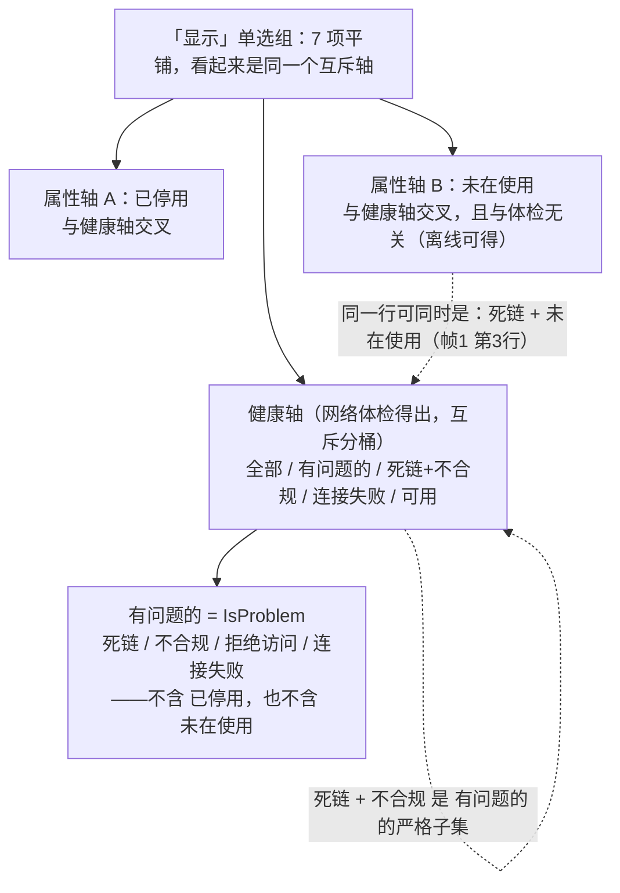

# 启发式评审（Nielsen 十项）— 仓库体检「已装 / 未在使用 + 图标 + 排序」设计方案
> 盲评时间：2026-09-17（按 mockup 提交时刻 +0800 2026-09-17 23:50 推定）。
> 评审对象：`Resources/ui-mockup-repoaudit-usage.png`（4520×1400，2×，3 帧：左=默认 / 中=图标开关开 / 右=按已装降序）与同源 `Resources/ui-mockup-repoaudit-usage.html`。
> 方法：逐元素读图 → 读 HTML 取精确文案/列宽/色值 → 回到实现与配置核对可行性（`UI/RepoAuditTab.cs`、`UI/UiHelpers.cs`、`UI/MainWindow.cs`、`RepoAudit/RepoScanner.cs`、`RepoAudit/DalamudRepos.cs`、`Plugin.cs`、`Configuration.cs`、`README.md`）。引用格式 `文件:行`。
> 性质：评审对象是**未实现的设计方案**，所以"图与实现不一致"的判定标准不是"回填图失真"，而是"设计假设在 ImGui + 本仓库现有结构下是否成立"。
> 一致性基线（启发式 4）：本仓库没有独立的 consistency-audit 产物，沿用 `docs/hci/review-2026-09-16-heuristic.md` 与 `docs/hci/review-2026-09-16-friction.md`（同一页）作为基线，下文只审**本次新增/未闭环**项，不复审已覆盖项（已覆盖项的当前状态按 `RepoAuditTab.cs` 现状标注）。
> 严重度 0-4：0 = 不是问题；1 = 观感/低优先；2 = 次要可用性问题；3 = 主要可用性问题；4 = 严重/会阻塞或误导用户。
> 本评审为静态阅读，未执行任何 shell/git/build；需实机核对的项列在第 6 节。
---
## 1. 逐条发现
| ID | Heuristic | Screen/flow/component | Evidence | Why it matters | Severity (0-4) | Recommendation |
|---|---|---|---|---|---|---|
| AU-1-1 | 1 系统状态可见性 | 「已装」列的时点 + 全页唯一的刷新入口 | 表格行只在扫描时构建（`StartScan()` 里 `this.items = list`，RepoAuditTab.cs:515-560）；未扫描时整页只有 `还没有体检过。点「开始体检」扫描一次。`（:124）而**没有表格**；`已装` 取自卫月已装插件列表，与网络无关，但方案没写何时重算；同页唯一按钮是 `开始体检`（网络扫描：并发 16、单条超时 18s，RepoScanner.cs:69-70；基线上实测 1–3 分钟） | 用户装/卸一个插件后回到本页，数字不会变；想刷新只能跑一次慢扫描或重开窗口；用过期数字做删除决定 | 3 | ①`已装/未在使用` 在每次打开本页、以及插件列表变化后重算（读 InstalledPlugins 是内存操作）；②把"库链清单"的构建从扫描里拆出来（见第 5 节结构性 1）；③列头 tooltip 写"统计自：当前卫月已装插件列表（<时间>）" |
| AU-1-2 | 1 | 统计行 | 三帧统计行都是 `共 12 个仓库：可用 8 · 死链 1 · 内容不合规 1 · 拒绝访问 0 · 连接失败 1 · 已停用 2 · 未在使用 3`（HTML:63/98/142）；前六项相加 = 13 ≠ 12（`已停用` 与 `可用` 交叉，实现里 `disabledCount` 单独统计：RepoAuditTab.cs:108-116、RecomputeCounters）；再追加一个与所有桶都交叉的 `未在使用 3` | 用户拿这行估算"要处理多少"会得到不可能的数字；`未在使用` 被读成与 `死链` 同类的桶，而它是另一个维度 | 2 | 分两组加分隔：`共 12：可用 8 · 死链 1 · 内容不合规 1 · 拒绝访问 0 · 连接失败 1 · 已停用 2 ｜ 本机：在用 9 · 未装 3`；第二组用常规字色，不要 Warn |
| AU-2-1 | 2 系统与现实匹配 | 新列「已装」+ 单元格「未在使用」 | ①"装/停"三义同页并存：勾选框 `扫描范围含已停用`（HTML:62/97/141）、行内 `· 停用`（:80/159）、新列 `已装`——`已装` 可被读成"这个库已装/已启用"，实际是"本机从这个库链装过几个插件"；②值 `未在使用` 用 `--warn` 琥珀（HTML:31 `.unused`），与 `内容不合规` 同一色变量（HTML:30 `.warn`；真机里 Warn 也是 Invalid/Blocked 的颜色，UiHelpers.cs:22-24） | 颜色把"本机没装"提升成"有问题"，而它正落在删除按钮的服务范围里；措辞断言也强于数据（AU-5-1） | 3 | ①列头改 `本机插件`；②`>0` 常规色、`0` 用 Muted 灰（与"未检查"同色），Warn/Bad 只留给真问题；③"未在使用"只用于筛选/统计，且必须带限定语（AU-5-2） |
| AU-2-2 | 2 | 「已装」vs 状态列 tooltip 里的"库内插件数" | 实现里 hover URL 会给出该仓库**提供**多少插件：Note = `$"{check.Count} 个插件"`（RepoScanner.cs:196-200），经 URL 单元格 tooltip 显示（RepoAuditTab.cs:209）。新列 `已装 4 个` 是本机从这个库装了 4 个 | 同一行两个"几个"口径不同；用户会把 `已装 4 个` 读成"这个库有 4 个插件"（库里可能有 12 个） | 2 | 列头 tooltip 并列写两个口径：`本库提供 12 个插件；本机从它装了 4 个` |
| AU-3-1 | 3 用户控制与自由 | 排序状态的回退路径与生命周期 | ①没有"回到默认顺序"的入口：列头只有升/降两态，而当前默认序是严重度序（`OrderBy(UiHelpers.SeverityRank).ThenBy(Url)`，RepoAuditTab.cs:474-475；SeverityRank 见 UiHelpers.cs:27-36），只有把 `状态` 列也做成可排序才有回路；②排序生命周期未写：切换筛选/搜索后是否保持？重扫会不会重置（`StartScan()` 里 `filter` 会重置为 `"problems"`，:544，排序未提） | 本页价值就在"先看最该处理的"；用户在一次误点后停在任意顺序里，没有明确路径回到"死链在最上面" | 2 | ①`状态` 列可排序、比较器 = SeverityRank；②方案写死：进入本页/开始新扫描 → 回到严重度序；切筛选/搜索不改排序 |
| AU-3-2 | 3 | 新勾选框的持久化语义 | 相邻 `扫描范围含已停用` 是存盘设置（写 `Config.ScanIncludeDisabled` + `SaveConfig()`，tooltip 明写"（该设置会被保存）"，RepoAuditTab.cs:66-76，Configuration.cs:87-88）；`Configuration.cs` 没有图标开关字段；图上两个勾选框外观/字号/间距完全一致（HTML:62/97/141） | 用户无法判断"勾了下次还生效吗"；同页同类控件两套语义，且方案没写这个决定 | 2 | 二选一写进方案：①按相邻项存盘（`Config.ShowInstalledIcons`）+ 同样标注"（该设置会被保存）"；②明确"只影响本次会话"，并用竖线分组、分别标注 |
| AU-4-1 | 4 一致性与标准 | 列头排序标记（三帧互相矛盾）+ 默认态 | ①帧 1 自述"默认"，却在 `已装` 列头画了 `▼`（HTML:75），同行数据 `4 个 / 未在使用 / 未在使用 / 1 个 / 未在使用`（:76-80）——既不是按已装排（`1 个` 排在 `未在使用` 后面），也不是实现的默认严重度序（死链在第 3 行）；②帧 2 四个列头连 `sortable` 类和 `▼` 都没有（:110 对比 :75/:154）；③帧 3 的 `▼` 才对应"按已装降序"（:135/:154-160） | 验收会把"默认按已装排"当成设计——那样装了 4 个插件的可用库会盖住死链，直接抵消本页目的；用户也无法判断当前是什么顺序 | 3 | 默认排序 = 现状严重度序，`状态` 列显示 ▼/▲；帧 1 重画为默认态；三帧列头标记一致（可排序列常驻暗色 ⇅，激活列高亮） |
| AU-4-2 | 4 | 图注/提示的归属与位置 | 三条灰字只在各自帧出现且互不相同：帧 1 `提示：点列标可按该列排序（再点一次反向）。`（HTML:82）、帧 2 `图标只有在本机缓存里才有；没图标的插件排在最后（灰虚线格）。`（:125）、帧 3 `排序只影响显示顺序，不影响筛选与勾选。`（:161）。若三条都进真机就是新增 2 行常驻文字（基线已判本页说明文字过多、列表可视高度仅 7–8 行：review-2026-09-16-heuristic.md A8-1/A6-4）；帧 2 的 tooltip 例示用绝对定位 `left:214px; top:596px`（HTML:129），距它要解释的图标条（:111-116）约 300px 且压在动作条上 | ①验收分不清这三句是图注还是界面文字；②tooltip 例示离锚点太远，看不出属于哪个图标 | 2 | ①只留必要的一条：把"排序不影响勾选"并入已有摘要行 `结果 N 行 · 已选 M`（RepoAuditTab.cs:365-370），其余下沉 tooltip；②tooltip 例示紧贴所解释的图标，并注明"悬停显示的是插件名" |
| AU-4-3 | 4 | 「首次记录」列文案回退 | 新图写 `安装前`（HTML:79/119/158），实现是 `未记录` + 解释性 tooltip（RepoAuditTab.cs:241-243）；上一轮正是把"6 行 `—`"改成可读文案（review-2026-09-16-heuristic.md A2-4） | 图纸与已定稿实现用词不一致，且 `安装前` 没有说明"是本插件没见过，不是卫月不留记录" | 2 | 统一为 `未记录`（保留 tooltip），或两者都改成 `本插件未记录` 并写进图注 |
| AU-4-4 | 4 | 图标条是"跨 4 列"的画法 | mockup 用 `<td></td><td colspan="4">…`（HTML:104-107、:113-116）；ImGui 表格**没有 colspan**：每个单元格自带裁剪区，跨列只能靠 `PushClipRect(intersect:false)`/表外绘制（现有表结构 4 列 + `TableNextRow/TableNextColumn`，RepoAuditTab.cs:166-169）；加列后 `状态` 列仅 140px，图标 24px + 间距 ≈30px/个 → 放进状态列约只露 4 个 | 图上"从状态列一直铺到最右"的排版在真机上不会自然出现，照图验收会与实测不符（同类问题：基线 A8-3/B2 的列宽假设） | 2 | 方案里指定图标条落进哪一列（推荐 `仓库地址`，stretch ≈330-400px）并写上限（最多 N 个 + `+M`）；或明确"表外绘制跨列"的代价 |
| AU-4-5 | 4 | 新色值 `.used{#9ad3ff}`（HTML:28） | 仓库既有调色板是 UiHelpers.cs:9-14 的五色；这是第 6 个蓝，与 `Info(#9ec2f0)` 视觉上区分不出含义 | 一个不承载判断的"信息色"，用户从中得不到任何信息，还与既有 Info 用法撞车 | 1 | 用 Info 或直接常规字色；颜色预算只留给有判断意义的项 |
| AU-5-1 | 5 错误预防 | 「已装 / 未在使用」的**假 0** | 两类假 0：①**读不到已装列表 → 全表都是 0**：现有反射读 `PluginManager.InstalledPlugins` 的写法是"读不到就当没有"（`AnyPluginLoading()` 的 catch 注释即"读不到就当没有，靠超时兜底"，Plugin.cs:178-203）；卫月改字段名/改名后每个库链都显示"未在使用"，与"确实 0 个"完全同形；②**URL 字面不等 → 假 0**：`InstalledFromUrl` 是安装当时的字符串，而本插件自己就把 GitHub 地址当多线路处理（`gh.atmoomen.top`/`gh-proxy.org` 镜像，RepoScanner.cs:325-338），用镜像地址装的插件对原始 raw 地址统计不到；仓库 URL 直接来自 `ThirdRepoList`，无任何规范化（DalamudRepos.cs:52-80） | 0 是删除决定唯一的输入；把"读不到/对不上"渲染成"确定 0 个"，会把仍在用的库推进 `全选当前 → 删除所选` 的射程，且用户从界面察觉不到（受影响插件仍在本机，但失去更新来源，README.md:47） | 3 | ①匹配前规范化（Trim、忽略大小写、去尾 `/`、已知镜像前缀映射回原地址）；②区分"确认 0"与"无法判断"（读不到时整列 `—` 并在状态行报错，沿用现有 `读取仓库列表失败：…` 的报错口 RepoAuditTab.cs:150-155）；③不要在没有统计结果时把 0 画成"未在使用" |
| AU-5-2 | 5 | 「未在使用」筛选 → 全选当前 → 删除 的完整路径 | `未在使用` 以单选项进入筛选组（HTML:68-73 等）；`全选当前（N）` 遍历的是**当前筛选快照**（RepoAuditTab.cs:332-345，`Filtered()` = 筛选+搜索后的结果），随后 `删除所选…`（:304）→ 模态确认只写 `你确定要从仓库列表里删除这 N 个库链接吗？`（:806），**仅当**选中集含 `连接失败` 时才多一句警告（:821）；产品自己列出的边界（别的机器装过、备用源、dev/手动装）全页无一处说明 | 破坏性路径对"未在使用"这一新类别完全无差别对待；"过滤→全选→删除→确认"即可把仍在用的库移出列表（可撤回，但要用户意识到要撤回） | 3 | ①选中集含 0 值行时，确认弹窗追加：`其中 N 条本机没有从它装过插件——不代表这个库没用（可能在其他机器/手动装过）`；②筛选为 `未在使用` 时给一句同义限定语；③`0` 值去掉问题色（AU-2-1） |
| AU-5-3 | 5 | 「已装 N 个」的反向诱导 + 删除后果缺失 | README.md:47 已写明"仓库「删除」只影响你的第三方仓库列表，不会删除任何已安装的插件"，但界面（含确认弹窗 RepoAuditTab.cs:801-830）只讲备份/撤回；新列把"使用量"摆在了删除按钮旁边 | 用户会归纳出"未在使用=可删、已装=别动"，而真实关系相反：**删掉 `已装 4 个` 的库**才会让那 4 个插件从此没有更新来源 | 2 | 确认弹窗与列头 tooltip 各补一句后果：`删除库链不会卸载插件，但该库的插件将不再有更新来源` |
| AU-5-4 | 5 | 排序不影响勾选（正向确认） | 帧 3 图注明确写"排序只影响显示顺序，不影响筛选与勾选"（HTML:161）；实现里选中集合是 URL 集（`HashSet<string> selected`，RepoAuditTab.cs:12），与 `Filtered()` 的排序解耦（:456-475） | 这一点做对了：排序不会静默改变选择范围 | 0 | 保留；并按 AU-4-2 把它并入摘要行，而不是新增一行灰字 |
| AU-6-1 | 6 识别而非回忆 | 图标条：唯一身份线索只在 hover | 帧 2 里图标是唯一标识，插件名只在悬停时以 `.tip` 出现（HTML:122-124、:127），一次只看得到一个名字；图标来自各插件自带图（图上三个就是 "Ba/BM/Sr" 字母块式占位），抽象 logo 很常见；悬停是键盘/手柄拿不到的交互（基线 A7-4） | 4 个图标要 hover 4 次才知道装了什么；不知道"里面是什么"就无法判断这个库该不该动——本页所有决定都基于此 | 3 | ①图标条整体一个 tooltip，一次列出全部名字（`本机装了：BossMod Reborn、…（4 个）`）；②占位格改用插件名首字母（与旁边字母块同语言）；③沿用本页已有右键菜单（:207-230）加 `复制已装插件列表`，给键盘/手柄与非 hover 场景出口 |
| AU-7-1 | 7 灵活性与效率 | 清理工作流的次序 | 想用新功能清库，当前次序是：跑一次慢网络体检（1–3 分钟，基线 A1-1）→ 才看得到列表与 `已装` 列（AU-1-1）→ 切筛选 → 全选 → 删除 | 新功能的收益（离线可得的使用情况）被前面那次与本任务无关的网络扫描拖住；用户第一次尝试就可能放弃 | 2 | 与 AU-1-1 同解：打开本页即可构建列表（状态 = 未检查），体检只负责填健康度 |
| AU-8-1 | 8 审美与极简 | 图标条的空间代价 | 图标是**每行再加一行**（mockup `.icons td`：24px 图标 + 上下内边距，HTML:16-17、:104-107）；本页表格可视高度基线实测约 250px（≈7–8 行）；按 17px CJK 估算图标行 ≈30-34px → 打开开关后同样高度只显示约 4 条库链（估算） | 本页主任务是在上千条里定位坏链；用近一半可视容量换"能看出装了哪些插件"，而开关默认关——用户打开后列表立刻变短一半 | 3 | 按省空间排序三选一：①图标并进 `已装` 单元格（`4 ▣▣▣+1`，行高零成本，但该列要加宽到 ≈150px）；②图标条并入 `仓库地址` 单元格同一行；③保留独立行但最多 5 个 + `+M`，开关标签写成 `显示插件图标（列表会变矮）` |
| AU-8-2 | 8 | 工具行：第二个勾选框进了扫描行 | 新行：`[开始体检] ☑扫描范围含已停用 ☑显示已装插件图标 [搜索 URL…]`（HTML:97）。实现里搜索框搬进扫描行是**有意的**，注释写"给筛选行留出空间（中文字号下筛选行很宽）"（RepoAuditTab.cs:78-85）；窗口 700×620、最小 560×440（MainWindow.cs:31-34）。按 17px CJK 估算：按钮 ≈80-90 + 勾选框1（7 字）≈140-150 + 勾选框2（8 字）≈155-165 + 搜索框 170 + 间距 ≈24 ≈ **570-600px**；最小窗口内容区 ≈528px → 搜索框被挤出右边界；700px 窗口下字号 1.3× 也会溢出（估算）。另：现有两处连续 `ImGui.SameLine()`（:79-80）按 ImGui 语义不会叠加出额外空隙，别指望用它拉开距离（建议实机量一次） | 搜索框是本页唯一定位工具（基线 A7-1 指出 1241 行无检索），被新的显示开关挤掉是净损失；且"显示图标"不是扫描选项，放在扫描行会让人以为它影响扫描范围 | 3 | 勾选框挪到与显示相关的行/位置：①动作条第二行（`结果 N 行 · 已选 M` 右侧留白充足，RepoAuditTab.cs:365-385）；②筛选行左端；③标签缩为 `显示插件图标`（本页只有"已装插件"可显示，"已装"冗余），tooltip 写"列表每行会多一行图标" |
| AU-8-3 | 8 | 筛选行 7 个单选项 + 与既有项重复 | HTML:68-73 共 7 项，第 7 项为新增 `未在使用`；基线已实测筛选行约占 91% 行宽（review-2026-09-16-heuristic.md A8-3，13px 下），按 17px CJK 估算 7 项 ≈560-600px，最小窗口 560 必裁；另 `死链 + 不合规` 与 `有问题的` 语义重叠：`IsProblem = Dead/Invalid/Blocked/Unreachable`（RepoAuditItem.cs:44-46），前者是后者的严格子集 | 这是决定"你在看哪些库"的关键行，被裁掉的正是最右边的新项；同时存在两个重叠筛选项，数字对不上会让用户怀疑程序 | 3 | 三选一：①`未在使用` 移出单选组，做搜索框同行的独立小开关（`只看本机未装`）；②筛选行分两行（状态组 / 使用组）；③顺手删冗余（保留更可执行的 `死链 + 不合规`，`有问题的` 改名 `全部问题`）；无论哪种都按字号自适应，而不是"13px 下画得下" |
| AU-9-1 | 9 帮助识别、诊断与恢复 | 无图标格的 `?` | `.icon.none` 用 `?`（HTML:127-129），语义像"未知/有毛病"，真实原因是"本机图标缓存里还没这个插件的图"（方案自述写在帧 2 灰字，HTML:125）；同行其它格是字母块 `Ba/BM/Sr`；多个无图标插件会变成一排完全相同的 `?` | `?` 会被读成"这个插件有问题"；一排相同 `?` 既不能识别也不能计数 | 2 | 占位改用插件名首字母（与相邻字母块一致），tooltip 写"图标还没下载到本机缓存" |
| AU-9-2 | 9 | "没有图标的排在最后"这条规则 | 规则来自方案自述（HTML:125、:135）；图标有无取决于**本机图标缓存是否已下载** → 同一插件今天在最后、缓存到位后跳到中间 | 位置随缓存变化，用户无法建立空间记忆；该规则只服务少数情况却改动了全局排序语义 | 2 | 去掉后置规则，改固定顺序（插件名 Ordinal 或安装时间），缺图标格用首字母占位——位置稳定且仍可识别 |
| AU-10-1 | 10 帮助与文档 | 新能力与三个新术语没有文档锚点 | README.md:19 仍只列三项功能（汉化 / 坏链检测 / 拦住自动刷新），插件市场描述同源；`已装`、`未在使用`、图标缓存三个概念在页面外无任何解释入口，而本仓库惯例是"解释下沉 tooltip + 状态文本自证"（RepoAuditTab.cs:189-213、:427-445） | 用户装之前看不到这个能力（发现性），装之后要靠猜"未在使用"的口径，而它直接关联删除决定 | 2 | ①README 与市场描述补一句新能力（例：`看清每条库链在本机装了几个插件，一键找出没在用的`）；②界面把口径写进列头/单选项 tooltip（口径 / 不计入的情况 / 结论边界三句，见 AU-5-1、AU-2-1） |
### 按启发式汇总
| 启发式 | 本次新增的问题 | 严重度峰值 | 关联 ID |
|---|---|---|---|
| 1 系统状态可见性 | 使用时点的数据没有刷新路径，且被绑在网络扫描之后；统计行交叉计数不可加 | 3 | AU-1-1、AU-1-2 |
| 2 系统与现实匹配 | `已装/未在使用` 措辞与色语义；同屏两个"几个"口径 | 3 | AU-2-1、AU-2-2 |
| 3 用户控制与自由 | 排序无回路、无生命周期定义；新开关持久化语义未定 | 2 | AU-3-1、AU-3-2 |
| 4 一致性与标准 | 默认排序态三帧矛盾；图注归属未定；文案回退；跨列图标条不可直接实现；多一个无语义蓝 | 3 | AU-4-1~AU-4-5（已覆盖项引用基线，不复审） |
| 5 错误预防 | 假 0 未与真 0 区分；删除路径对新类别无提示；删除后果缺失 | 3 | AU-5-1~AU-5-3（AU-5-4 为正向确认） |
| 6 识别而非回忆 | 插件名只在 hover（本页已两轮被判过同类问题） | 3 | AU-6-1 |
| 7 灵活性与效率 | 清理流被扫描阻塞 | 2 | AU-7-1 |
| 8 审美与极简 | 图标行吃掉一半可视容量；两行控件溢出 | 3 | AU-8-1~AU-8-3 |
| 9 帮助识别/诊断/恢复 | `?` 占位与"无图标后置"规则 | 2 | AU-9-1、AU-9-2 |
| 10 帮助与文档 | 新能力/新术语无文档锚点 | 2 | AU-10-1 |
---
## 2. 两个维度被压进一个单选组（对应专问 ⑤）

图上帧 1 第 3 行是 `死链` + `未在使用`、第 5 行是 `可用 · 停用` + `未在使用`（HTML:78-80），这正是"两轴交叉"的直接证据——但单选组的形态把它藏起来了。
---
## 3. 专问五条
### ① 「已装」列与「未在使用」措辞会不会让用户误判"可以删"
**会，而且误判有两个相反方向和一条更危险的暗线。**
- **正向（产品担心的那条）**：`未在使用` 用问题色（HTML:31 `.unused` = `--warn`，与 `内容不合规` 同色）、进入统计桶、另给一个单选项；配合 `全选当前（N）`（遍历当前筛选快照，RepoAuditTab.cs:332-345）与 `删除所选…`（:304），"过滤 → 全选 → 删除 → 确认"四步就能把 3 条仍在用的库移出列表；确认弹窗只警告 `连接失败`（:821），对"本机没装"零提示。修法与证据见 AU-2-1、AU-5-2。
- **反向**：`已装 4 个` 会被读成"这个库有价值，别动"。而删除库链不会卸载插件（README.md:47），真正需要谨慎的恰恰是**从它装过插件的库**——删掉之后那些插件仍在本机、但从此没有更新来源。列头/弹窗需要补这句后果（AU-5-3）。
- **暗线（我认为最该先解）**：措辞之争的前提是那个 0 是真的。读不到已装列表（现存反射写法就是"读不到就当没有"，Plugin.cs:178-203）或 URL 字面不等（镜像地址装的插件对原始 raw 地址，RepoScanner.cs:325-338，仓库 URL 无规范化，DalamudRepos.cs:52-80）都会产生**假 0**，而界面上它与真 0 完全同形（AU-5-1）。所以第一优先不是改词，而是把"0 的确信度"画出来：能确认才显示 `0`，读不到就显示 `—` 并在状态行报错。
- **措辞结论**：列头用 `本机插件`（"已装"会与同页"已停用/停用"打起来）；单元格 >0 常规色、0 用 Muted 灰；"未在使用"这个短语只用于筛选与统计，且必须与限定语同屏出现。
### ② 列标可点排序是否可发现、默认排序该是什么
- **可发现性：不够。** 图上只有**激活列**有 `▼`，其余可排序列没有任何标记（HTML:75/154）；唯一的说明是一行常驻灰字（:82），而它在帧 2/3 被换成了别的文案，帧 2 的列头甚至丢了 `sortable` 类（:110）。ImGui 的列头平时没有"可点"的外观暗示，用户不会去点一个看起来是纯文字的列头。修：所有可排序列常驻暗色 `⇅`、激活列用 Accent 色的 `▲/▼` + 列头文字高亮，配 hover tooltip `点击按此列排序（再点反向）`，并删掉那行常驻提示（AU-4-1、AU-4-2）。
- **默认排序：保持现状的严重度序**（死链 → 内容不合规 → 拒绝访问 → 连接失败 → …，`UiHelpers.SeverityRank`，RepoAuditTab.cs:474-475），`状态` 列显示 ▼。理由三条：①本页是"体检/分诊"视图，首屏必须先把坏链放在眼前；②扫描后的默认勾选也落在死链/不合规上（RepoAuditTab.cs:563-565、:612），首屏顺序与默认选择范围必须一致，否则会出现"上面几行没勾、下面几行却勾了"；③帧 3 的"按已装降序"是第二种探索视图，一旦当默认，装了 4 个插件的健康库就会盖住死链——恰好抵消本页目的。帧 1 目前画成"默认态却带 `▼`、数据又不是按已装排"，属于必须重画的状态（AU-4-1）。
- **附带**：`状态` 列的排序比较器必须是 `SeverityRank` 而不是字符串比较，否则"可用/死链/内容不合规"会按码位排出无意义顺序；各列比较器与平序规则（`未在使用` 视为 0 还是排最后、`未记录` 怎么排）应在方案里逐列写死（AU-3-1）。
### ③ 图标行（"悬停才显示名字""无图标后置"）是否可理解，有没有更省空间的表达
- **"悬停才显示名字"：不可取。** 4 个图标要 hover 4 次；插件图标是各插件自带的图（抽象 logo 很常见，图上就是 `Ba/BM/Sr` 字母块式占位），本身不足以辨识；键盘/手柄完全拿不到。这在本仓库已是第二次被判（基线 A6-1"关键信息只存在于 hover"）。**最低成本修法：整条图标用一个 tooltip，一次列出全部名字**；再加右键菜单 `复制已装插件列表`（复用本页已有的行内右键菜单，RepoAuditTab.cs:207-230）。
- **"无图标后置"：建议删掉。** 图标有无取决于本机缓存是否已下载 → 同一个插件今天在最后、缓存到位后跳到中间，位置不稳定（无法建立空间记忆）；多个无图标插件还会变成一排完全相同的 `?`（帧 2 只画了 1 个，掩盖了这个情况）。占位改**插件名首字母**即可同时解决"位置稳定"与"可识别"两件事（AU-9-1、AU-9-2）。
- **更省空间（按省空间排序）**：
  1. **零行高成本**：保留 `已装 N 个`，"装了哪些"放进悬停列表/右键菜单，不做图标行——图标没有信息量优势（它不可读），却要一行高度。
  2. 图标并进 `已装` 单元格：`4 ▣▣▣+1`，计数与"装了哪些"同格，代价是该列要加宽到 ≈150px。
  3. 图标条并入 `仓库地址` 单元格同一行（URL 右侧），不加行高。
  4. 若坚持独立行：最多 5 个 + `+M`，整条一个 tooltip，开关标签写 `显示插件图标（列表会变矮）`。
- **量化**：独立图标行 ≈30-34px/行；表格可视 ≈250px（基线实测，≈7–8 行）→ 打开开关后可见库链约 4 条（估算，按 17px CJK 字号）。另外 ImGui 没有 colspan，图上"从状态列铺到最右列"的画法必须指定落到某一列（推荐 stretch 的 `仓库地址`，AU-4-4）。
### ④ 第 3 条的勾选框是否让工具行过挤/信息过载
**是。** 三条证据：
1. **扫描行溢出**：`[开始体检] ☑扫描范围含已停用 ☑显示已装插件图标 [搜索 URL…]` 按 17px CJK 估算约 570-600px，最小窗口（560×440，MainWindow.cs:31-34）内容区仅 ≈528px → 搜索框被挤出右边界；700px 窗口下字号 1.3× 同样溢出。而搜索框搬进这一行是**实现里有意为之**的取舍（注释原文"给筛选行留出空间（中文字号下筛选行很宽）"，RepoAuditTab.cs:78-85），新勾选框正好把它占回去（AU-8-2）。
2. **筛选行溢出**：7 个单选项 ≈560-600px（基线实测 6 项时已占 91% 行宽，review-2026-09-16-heuristic.md A8-3），被裁掉的必然是最右端的新项 `未在使用`（AU-8-3）。
3. **除此之外还各多一条**：统计行 +1 桶（AU-1-2）、图注/提示再 +1 行（AU-4-2）。三处叠加后，本页的高度预算比宽度预算更紧张。
**根因**：`+0 按钮` 的约束被满足了，但复杂度被推给了本来就 100% 满的两行。约束应该改写成"**不新增控件行 / 不新增常驻文字行**"。（另：`显示已装插件图标` 的位置也不对——扫描行表达的是"扫什么"，这是一个显示密度选项，放在一起会让人以为它影响扫描。）
**建议**：勾选框移到动作条第二行（`结果 N 行 · 已选 M` 右侧留白充足，RepoAuditTab.cs:365-385）或筛选行左端；标签缩为 `显示插件图标`；筛选行的 `未在使用` 移出单选组（搜索框同行的独立小开关）或另起一行；统计行的"未在使用"另起一组。
### ⑤ 「未在使用」筛选与"有问题的"筛选的语义关系是否清楚
**不清楚，并且已经能推出两个具体错误。**
- 关系本身**不是包含或互斥，而是正交**：`有问题的` 是健康谓词（`IsProblem = Dead/Invalid/Blocked/Unreachable`，RepoAuditItem.cs:44-46），`未在使用` 是使用属性；两者交集非空（帧 1 第 3 行 `死链 + 未在使用`，HTML:78）。
- 错误一：用户在 `有问题的` 里看不到"未在使用"的库，会以为"没别的问题了"；切到 `未在使用` 又看到 `死链`、`可用 · 停用` 混在一起，却看不出自己换了轴（单选组的形态掩盖了这一点）。
- 错误二：如果为了"能一次看到全部待清理项"把 `未在使用` 算进 `有问题的`，那么扫描后的 `已自动勾选 N 个死链/不合规项`（RepoAuditTab.cs:612）就与筛选项数量对不上，会重演基线 A4-2/A5-2 那类"计数与视图不一致 → 用户不再相信计数"。
- 处置建议（三条一起做）：①**写死** `未在使用` 不进 `IsProblem`（保持与"自动勾选"的一致）；②筛选组显式分轴：`健康：○全部 ○有问题的 ○死链+不合规 ○连接失败 ○已停用 ○可用 ｜ 使用情况：○全部 ○未在使用`（或至少用竖线分组并把名字改成 `本机未装`）；③统计行同样分组（AU-1-2）。顺带处理 `死链 + 不合规` ⊂ `有问题的` 这个既有冗余，正好腾出一点宽度给新项。
---
## 4. 最严重的 5 个问题
1. **假 0 被画成确定值（AU-5-1，sev 3）**：读不到已装列表（现有反射写法"读不到就当没有"，Plugin.cs:178-203）或 URL 字面不等（镜像地址 vs raw 地址，RepoScanner.cs:325-338）都会让"未在使用"批量出现，而这正是删除决定的唯一输入；界面上与真 0 无法区分。**这是本次设计里唯一会造成"真实损失且用户察觉不到"的一条。**
2. **`未在使用` 被染成问题色 + 破坏性路径无差别对待（AU-2-1 + AU-5-2，sev 3）**：`--warn` 与"内容不合规"同色、进入统计桶、`全选当前 → 删除所选` 畅通，确认弹窗只警告"连接失败"，产品已知的三条边界全页无一处说明。
3. **默认排序与列头呈报自相矛盾（AU-4-1，sev 3）**：帧 1 标"默认"却带 `▼`、数据又不是按已装排；帧 2 列头无标记。若验收照帧 1/3 把"按已装降序"当默认，死链会被健康库挤出首屏，本页的分诊价值失效。
4. **图标行用一半可视容量换一个不可读的标识（AU-8-1 + AU-6-1，sev 3）**：独立行 ≈30-34px → 可见库链从 7-8 条降到约 4 条；名字要逐个 hover 才看得到，图标本身不具辨识度。
5. **两行控件溢出（AU-8-2 + AU-8-3，sev 3）**：扫描行被塞入第二个勾选框 → 搜索框在最小窗口/大字号下被挤出右边界（而搜索框是本页唯一的定位工具）；筛选行 7 项同理，被裁的正是最右端的新项。
---
## 5. 最易改的 3 个（quick wins）
1. **改颜色 + 改列头 + 改一格占位**（纯视觉/文案，零结构改动）：`0` 用 Muted 灰、>0 用常规色（去掉 `--warn` 的挪用，HTML:31）；列头 `已装` → `本机插件`；无图标格 `?` → 插件名首字母。同时消掉 AU-2-1、AU-4-5、AU-9-1。
2. **列头常驻 `⇅` + tooltip，删掉那条常驻排序提示行**（AU-4-1、AU-4-2）：把"排序不影响勾选"并入已有摘要行 `结果 N 行 · 已选 M`（RepoAuditTab.cs:365-370），净增 0 行文字，还顺手省下一行高度。
3. **确认弹窗加一行针对性警告 + 一行后果句**（AU-5-2、AU-5-3，只在 `RepoAuditTab.cs:806-825` 那段加两行文本）：`其中 N 条本机没有从它装过插件——不代表这个库没用（可能在其他机器/手动装过）`、`删除库链不会卸载插件，但该库的插件将不再有更新来源`。这是把"误删"从"靠用户自己想到"变成"弹窗里看得见"，成本最低、收益最高。
---
## 6. 需要结构性重构（不是调样式能解决）
1. **"库链清单"与"体检结果"必须是两个状态**：现在列表只在扫描后存在（`StartScan()` 构建 `items`，RepoAuditTab.cs:515-560；未扫描时整页无表格，:124）。而本次新增的 `已装/未在使用` 是**离线实时可用**的数据——它却被绑在一次 1–3 分钟的网络扫描之后（AU-1-1、AU-7-1）；同时"扫描快照"与"实时已装数"混在同一行里，会持续产生不同步。建议：打开本页即从 `Repos.ReadAll()` 构建清单（状态 = 未检查），扫描只负责回填健康度；已装数实时算。
2. **筛选模型需要"轴"这个概念**：现状是一个扁平 `filter` 字符串（RepoAuditTab.cs:29、456-475），而现在要同时表达健康轴（互斥分桶）与属性轴（已停用、未在使用，交叉标记）；7 个单选项平铺已经产生了重复项（`死链+不合规` ⊂ `有问题的`）与语义混淆（专问 ⑤）。要么 UI 分组，要么把属性轴改成独立的小开关，并明确 `IsProblem` 不含 `未在使用`。
3. **表格需要两件新能力**：①"每行两态"（图标条）——HTML 的 `colspan=4` 在 ImGui 里不存在，图标条必须落进某一列或表外绘制（AU-4-4）；②列比较器注册 + 字号自适应列宽——现有 4 列全部是固定像素（32/140/stretch/96，:166-169），加第 5 列只是把基线 A8-3/B2 的隐患放大（AU-4-4、AU-2-x 列宽部分）。
4. **必须在"使用量列"和"删除路径"之间建立契约**：0 的确信度如何表达（确认 0 / 无法判断）、确认弹窗写什么、以及"删除库链 ≠ 卸载插件"这条知识（README.md:47 有，界面没有）——这三件事必须一起定，否则这一列只是给误删增加了一个看起来很有说服力的理由（AU-5-1~AU-5-3）。
---
## 7. 静态图判断不了 / 需实机核对的项
| # | 项 | 说明 |
|---|---|---|
| S1 | 图标缓存的实际命中率 | "无图标后置"规则是为少数情况设计的，还是常态？若多数插件无图标，图标行会变成一排占位。需实机统计（本机已装插件中图标已缓存的占比），再决定 AU-8-1 的第 1/2 方案。 |
| S2 | 字号与列宽实测 | 我的溢出估算按 17px CJK 字号；需实机量 `CalcTextSize("未在使用")`、搜索框 170px 后的实际行宽，以及 `TableSetupColumn` 固定宽度下的裁切表现（AU-4-4、AU-8-2、AU-8-3）。 |
| S3 | "已装"计数的口径细节 | 是否包含"已安装但在卫月里被禁用/未加载"的插件？`InstalledFromUrl` 是否对所有已装插件都非空（内置插件、开发版）？这决定 0 的语义与和"停用"的组合读法。 |
| S4 | 现有两处连续 `ImGui.SameLine()`（RepoAuditTab.cs:79-80） | 按 ImGui 语义不应叠加出额外间距（第二次相对同一 PrevLine 计算），但这是"扫描行还有没有余量"的关键假设，建议实机量一次。 |
| S5 | 三帧的列头/提示哪些进真机 | 帧 1/2/3 各有一条不同的常驻灰字（HTML:82/125/161），无法从图上判断它们是否为界面文字（AU-4-2）。 |
---
## Review
- **Correct（做对了的）**：①用勾选框而不是按钮承载图标开关，且**默认关**——符合"不增加按钮"，也避免默认吃掉行高；②排序明确不改变筛选与勾选（HTML:161 + 实现里 `selected` 是 URL 集合、与排序解耦，RepoAuditTab.cs:12、456-475）；③mockup 内部对"已装"口径自洽：`4 个` 的行画 4 个图标、`1 个` 的行画 1 个图标（HTML:76-77 vs 111-116、:79 vs 118-121）；④改动范围克制：只 +1 列 / +1 筛选 / +1 开关，既有按钮、搜索框、状态语义都没动；⑤数据源是本机插件列表，离线可得、不引入新的网络请求或隐私面。
- **Fixed**：无（本次为 review-only，未改动仓库任何文件；我也没有写权限工具，正文即交付物）。
- **Finding P0**：无（最坏路径仍可恢复：删除前备份 + `撤回`，RepoAuditTab.cs:801-830）。
- **Finding P1（设计定稿前应修）**：AU-5-1 假 0 未与真 0 区分（sev 3）｜AU-2-1 + AU-5-2 `未在使用` 问题色 + 删除路径无针对性提示（sev 3）｜AU-4-1 默认排序/列头三帧矛盾（sev 3）｜AU-8-2 扫描行溢出、挤掉搜索框（sev 3）｜AU-8-3 筛选行 7 项溢出 + 与 `有问题的` 重复（sev 3）｜AU-8-1 + AU-6-1 图标行空间代价与 hover-only 命名（sev 3）｜AU-1-1 使用情况被绑在慢扫描之后且无刷新路径（sev 3）。
- **Finding P2（报告级）**：AU-1-2、AU-2-2、AU-3-1、AU-3-2、AU-4-2、AU-4-3、AU-4-4、AU-7-1、AU-9-1、AU-9-2、AU-10-1（sev 2）；AU-4-5（sev 1）；AU-5-4（sev 0，正向确认）。
- **Merge verdict**：**BLOCK**（仅针对这份设计方案的定稿；既有页面结构与已有实现不算在内）。理由：这一列数值直接喂给本页唯一的破坏性动作，而它的失效方式（读不到 / URL 对不上）在界面上与"确定 0 个"完全同形（AU-5-1），再叠上问题色与无差别删除路径（AU-2-1/AU-5-2），会形成"看起来很有依据的误删"；同时"默认排序 + 列头呈报"三帧自相矛盾（AU-4-1），若照帧 1/3 实现会把死链挤出首屏，直接抵消本页目的；两行控件在最小窗口/CJK 字号下溢出（AU-8-2/AU-8-3）会让这份图无法作为验收基线。修完 P1 + 按第 3 节①~⑤ 定稿后可直接复评；P2 可作为同批文案整理一起处理。
- **需要监督者执行的命令（我无 shell/git 权限，一条都没跑）**：
  1. 确认这份 mockup 与实现解耦：`git show --stat HEAD`、`git show HEAD -- Resources/ui-mockup-repoaudit-usage.html`（应只有 Resources 下的图/HTML，无 `src/` 改动）。
  2. 确认新数据源目前没有既有实现：`grep -rn "InstalledFromUrl" src/`（预期无命中；已装列表只有 `AnyPluginLoading()` 在用，Plugin.cs:178-203）。
  3. 实机量 S1/S2/S4：`dotnet build src/FireGaze/FireGaze.csproj` 后进游戏 `/fg` → 仓库体检，按 700×620 与最小 560×440 各截一次图，量扫描行/筛选行实际宽度与 `未在使用` 的裁切情况；并统计本机已装插件中图标已缓存的占比。
  4. 落盘（本次未写任何文件）：按本仓库已有命名惯例建议写入 `docs/hci/review-2026-09-17-repoaudit-usage-heuristic.md`（skill 默认路径为 `docs/hci/heuristic-evaluation.md`，但该目录现有产物均为带日期+范围的文件名，沿用后者更好检索）。
