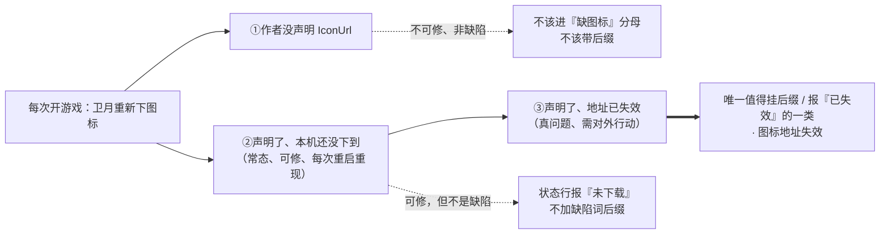

# 启发式评审（盲评）：仓库体检 × 图标体检（第三代改稿后的新增设计）
> 被评对象：`Resources/ui-mockup-icon-audit.png`（3 帧，2×）/ `ui-mockup-icon-audit.html`（下称 `IA.html:行`）——**设计稿**（「检查并补齐图标」按钮 + 状态行复用 + tooltip 后缀）。
> 对照基线：`ui-mockup-repoaudit-usage-v3.html`（v3 定稿，本页第三代改稿的落地版本）、`docs/hci/review-2026-09-17-repoaudit-usage-{heuristic,friction,v2-heuristic,v2-friction}.md`。**上轮已立的标准不重复举证**，只在"本轮改动把它改坏了"时点名。
> 可行性核对（未改动）：`src/FireGaze/UI/RepoAuditTab.cs`、`UI/UiHelpers.cs`、`UI/MainWindow.cs`、`RepoAudit/InstalledPluginsIndex.cs`、`RepoAudit/RepoScanner.cs`、`Configuration.cs`。
> 严重度 0-4 沿用本页既有口径：0 不是问题 / 2 次要 / 3 主要 / 4 严重误导。静态阅读，未执行任何 shell/git/build，未写任何文件。
## 前提偏差（先说，因为它影响你如何用这份报告）
材料写"尚未实现"，但**工作区里这套功能已经存在，而且正在被编辑**：
- 按钮与状态字段：`RepoAuditTab.cs:47-52`、按钮 `检查并补齐图标###IconAudit`（`:226`）、运行中禁用 `canAudit = indexReady && !this.scanning && !this.iconAuditRunning`（`:220`）。
- 状态行带进度条分支：`:262-270`（注释已从"只在有事件结果时出现"改成"…；图标体检进行中带进度条"）。
- 主流程：`StartIconAudit/TickIconAudit/FinishIconAudit`（`:1320/:1351/:1394`）、45 秒上限（`:1345`）、tooltip 后缀 `· 缺图标`（`:1180`）、`RepoScanner.ProbeUrlAsync`（`RepoScanner.cs:91-97`）。
- **我这次会话内两次读同一文件，行号发生位移**（`TickIconAudit` 由 `:269` → `:277`），说明有人正在并发改这几个文件；下文行号以最近一次 grep 为准，可能继续漂移。
我的处理：按"设计定稿"口径给判定（材料是图，评审对象是设计），但每一条都用现有实现核对可行性，并**把设计没写死、实现已自行决定的规则点出来**（超时 45s、①类被排除、404 探测是第二阶段）。如果这批代码就是待合并的内容，那么 IA-2、IA-3 已经在代码里被踩中（给了行号）。
---
## 一、评审结论
**合并判定：BLOCK（窄口径——4 条 P1 全部是"改一句话 / 定一条规则"的量级，不涉及结构重做；改完可直接放行）**
理由三条：① `缺图标` 这个词把"本版卫月的会话级缓存状态"断言成了插件缺陷，而按已确认的实现事实，开游戏后"缺图标"是**常态**、且每次重启重现——这会让用户把常态读成故障、把一次点击读成修复；② 三种原因（作者没给 / 本机没下到 / 地址失效）在方案里没有写死归属，按设计④字面执行会给出一个**永远补不掉、也永远不解释**的标记；③ 设计把这一功能的进度与结果放进**全页单槽状态行**，但没定义它与「开始体检」以及 停用 / 删除 / 撤回的**优先级与互斥**，结果会互相吞掉（含破坏性动作的"可撤回"提示）。
---
## 二、逐条发现
| ID | Heuristic | 位置 | 证据 | 为什么重要 | 严重度 | 最小修法 |
|---|---|---|---|---|---|---|
| **IA-1** | 2 与现实匹配 | 设计④后缀 + 设计③结果句 | 帧 3 tooltip 只给名字挂 `· 缺图标`（`IA.html:158-161`）；同一状态在图标条里已有另一套说法："图标还没缓存到本机，插件本身已装"（`RepoAuditTab.cs:1284`）；已确认事实：本版卫月**不落盘缓存**，开游戏后所有图标都要重下 | "缺图标"读作插件缺陷（像"死链"），实际多为"本会话还没下到"，且每次重启重现 → 用户会去问作者/以为插件坏了 | **3** | 后缀只给"地址失效"那一类（`· 图标地址失效`）；②类不加后缀（图标条占位已经说过了）；按钮 tooltip 与首次结果句各写一次"本版卫月不落盘缓存，重开游戏后会重新下载" |
| **IA-2** | 5 错误预防 / 9 诊断 | 设计②的范围 vs 设计④的范围 | 设计②的遍历范围＝"声明了图标地址但本机没有图"（①不在分母内）；设计④的范围＝"缺图标的插件名"（①的插件**永远**没有图标）→ 同一份方案里两句话范围不同；实现选择了排除①（`:1174-1181` `if (!entry.DeclaresIcon) return entry.DisplayName;`） | 若按设计④字面执行，作者没声明 IconUrl 的插件会被永久打上"缺图标"，每次点按钮都补不上、界面从不解释 → 等价于"点了没反应"；这正是本页前几轮反复清掉的"看起来像结论、其实是环境状态"那类表述 | **3** | 方案里写死：①不进分母、不带后缀；若要报数，另起一句且只统计第三方（**现在实现里这条是错的**：`:1453` 把官方库残留也写成"没有图标地址，作者就没提供"，而 `noAddress` 是 `leftover` 里非"第三方且有 IconUrl"的部分，`RepoAudit.cs:1410-1415`） |
| **IA-3** | 1 状态可见性 / 3 用户控制 | 设计③（状态行复用）+ 页内 开始体检 | 状态行是**单槽** `statusMessage`，渲染时"只在有事件结果时出现"（`:262-272`），且由扫描开始/取消/出错/完成、停用、删除、撤回等多处写入；图标体检**每帧**写这一格（`:1384`）；扫描完成句只在 `statusMessage.StartsWith("开始体检")` 时才写（`:887-890`）；互斥只做了单向：图标体检按钮在扫描中被禁用（`:220`），而 **开始体检 在图标体检进行中仍可点**（`:60-76` 只看 `this.scanning`） | 两条后果都真实：①用户在图标体检运行中点 开始体检 → 下一帧进度句覆盖掉"开始体检 N 个仓库…"，扫描结束时 `StartsWith` 判断失败 →「体检完成（用时 Ns）：已自动勾选 N 个死链/不合规项」（`:890`）**永远不出现**；②图标体检最多跑 45 秒（`:1345`），期间 停用/删除/撤回 的确认句（含"可点「撤回」恢复"）会被逐帧覆盖 → 破坏性动作的安全网消失 | **3** | 方案里加一条规则：图标体检进行中禁用 开始体检，且"后台进度"不得覆盖"用户动作确认"类文案（二选一：定优先级，或给状态行分两个槽位——后者是唯一需要动结构的候选） |
| **IA-4** | 1 / 3 | 设计②"模拟不可重复点" + 设计③"完成后…" | 方案只写了两个状态（下载中 / 完成），没有结束条件：无取消、无上限、无用时；同页既有先例相反：扫描可取消（同一按钮位替换，`:76`）、并报"用时 Ns"（`:890`）。实现自行定了 45s 上限（`:1345`）并**没有在界面上说**。进度按帧推进（`TickIconAudit` 在 `Draw` 内，`:277`；只有选中的标签才 `Draw`，`MainWindow.cs:62-66`） | ①"永远停在 3/12"没有出口（按钮是唯一状态指示）；②切到别的标签页/关窗后轮询停住，切回时墙钟已过 45s（`:1387` 判定），当帧只轮询 6 个（`:1352-1358` 附近 budget=6）→ 可能报"补上 6 个、6 个仍缺"，而卫月其实都下好了 = **误报缺口** | **3** | ①运行中按钮文案换成「停止检查」（复用本页"开始体检→取消扫描"的同位替换，不新增控件）；②结果句加"用时 Ns"，与既有口径一致；③写死跨页/关窗行为（推荐：结果只报"本轮已确认"，切回时再轮询一轮才定稿） |
| IA-5 | 4 一致性 | 筛选行第二行标签 | v3 定稿写的是 `显示插件图标（列表行会变高）`（`v3.html:79/120/164/205/246`），本轮改回 `显示插件图标`（`IA.html:70/109/140`）；实现里的 tooltip 也没写代价（`:216`） | 这是上轮放行清单里"必须拍板"的那条（图标行=每行多一行、可视行数近半），本轮把代价提示**整条删掉**且没在别处补 | 2 | 二选一：把 `（列表行会变高）` 加回标签，或在按钮/开关 tooltip 里写一句代价——但**不能什么都不写** |
| IA-6 | 4 | 设计①按钮名 vs 设计③结果句 | 按钮 `检查并补齐图标`（`IA.html:71/110/141`）与结果句 `图标体检…`（`:112/143`；实现 `:1346/1406/1419`）是两套叫法 | 用户按下的东西和反馈他的东西名字不同；且"体检"在本页已被"仓库体检/开始体检/体检完成"占用（`:890`），同格并列两个"体检" | 2 | 结果句改用与按钮同源的句式：`图标检查：…` / `图标检查完成：…` |
| IA-7 | 2 | 设计③结果句 | 帧 3 文案 `其中 1 个图标地址已失效 404，1 个下载超时`（`IA.html:143`） | `404` 是 HTTP 术语（本页面向的是"链接失效"概念，`:669` 已有"链接已失效（404 / 410）"的写法但仍属状态列 tooltip）；"下载超时"把原因断言死，实际只能观察到"等待窗口内没拿到"（实现已退一步写成"下载超时或网络失败"，`:1448`） | 2 | 跟着实现改：去掉 `404`、把"超时"写成"未完成/网络失败" |
| IA-8 | 1 | 设计③结果句 | `图标体检完成：…2 个仍缺` 是点时刻快照，句内无时点，也不随后台补齐更新（状态行只在下一个事件时被覆盖，`:262-272`） | 用户勾上图标开关、卫月把剩下的也下好后，图标条里出现了、tooltip 后缀消失（实时算，`:1174-1181`），状态行却still说"2 个仍缺" → 同一页两处互相矛盾，本页历史上正是被这类不一致反复判过 | 2 | 句首或句尾加"本次"（`本次图标检查完成：…`），必要时在用时后加时间点 |
| IA-9 | 4 | 设计④的 tooltip 内容 | 帧 3 的 tooltip 第二行写的是列头 tooltip 的那句"离线统计，装/卸插件后自动重算"（`IA.html:159`；`RepoAuditTab.cs:321`），而单元格 tooltip 现有的第二行是"（这条库一共提供多少个插件，把鼠标放在仓库地址上看）"（`:1155`） | 照图实现会把既有的**跨列指引**冲掉（本页"两个『几个』口径"的解法就是靠这句） | 2 | 图按现有两行画，只在其后追加图标信息 |
| IA-10 | 2 / 6 | 设计④后缀的形态 | 帧 3 的 tooltip 是手工换行的 `
`（`IA.html:158-161`）：`BadApple、BossMod Reborn · 缺图标` 换行 `SrankTool、NamePlate` —— 后缀挂在一行两个名字的末尾 | 真实 tooltip 是**一个字符串**、换行位置由宽度/字号决定，作者在图上必须手工断行才让它"看起来对"；线上它可能落在行尾、孤零零或与别的名字相邻 → 后缀指代不清，用户会以为"缺图标"是这条库的属性 | 2 | 缺图标的名单另起一行（`缺图标：BadApple、BossMod Reborn`），不要给名字后缀 |
| IA-11 | 4 / 7 | 设计①的落点 | 新按钮落在"改看哪些行"的筛选行，与两个视图开关同级同形（`IA.html:68-71`）；本页其它动作都作用于勾选集/当前筛选快照 | 用户会预期它作用于"当前可见/已勾选的行"，而它实际遍历**全部**本机已装插件（跨所有库、与筛选勾选无关）→ 本页唯一一个新动作落在唯一一行"改视图"的地方 | 2 | 图上把按钮的 tooltip 画出来（实现 `:233` 已写"本机已装插件里…"），并在图上用本页既有的 `│` 分隔（`:547`）与两个开关断开 |
| IA-12 | 1 / 7 | 三帧的「显示插件图标」 | 三帧都画成勾选（`IA.html:70/109/140`），而它默认关（`Configuration.cs:88` 无初值；`RepoAuditTab.cs:207-213` 从配置读）；图标只在勾选时绘制/预取（`:281`、`:474`） | 帧 1 标题写"默认"却勾着一个默认关的开关 → 图纸证不了默认态；而默认态下点完按钮，屏幕上唯一变化是状态行一句话（后缀要 hover 才见）→ 用户无法确认"补齐了没" | 2 | 完成句在开关未勾选时补一句可行动作（"勾选「显示插件图标」可以看见补齐的图标"），并补一帧默认态 |
| IA-13 | 4 | 数据不可用态 | v3 已为同排复选框定义了 `只看本机未装的（数据不可用）`（`v3.html:245`），本轮方案对新按钮在该态下的形态**零定义**（实现选择 disabled，`:220`，但不带原因） | 同排两个控件两套处理；且这个页面已经立过"数据不可用时显示 `—`、并说清原因"的规矩 | 2 | 与同排复选框同一套：disabled + 原因（放在按钮 tooltip 或既有 warn 行里） |
| IA-14 | 4 | 图纸行首的 `筛选` | 三帧筛选行都以 `筛选` 标签开头（`IA.html:68/107/138`），而实现里这一行行首没有标签（`:193` 直接是复选框） | 本页历史同类问题：图注 vs 界面文字分不清；这里还多算两个字宽（本行是"要再塞一个按钮"的那一行） | 2 | 说明它是图注还是界面文字；若是界面文字，要按它重算宽度 |
| IA-15 | 1 | 设计③的进度条 | 帧 2 画成 6px 细条（`IA.html` `.progress{height:6px}`），实现是标准 `ImGui.ProgressBar`（宽 180，`:264-270`）；同页扫描进度也是标准条 + 计数（`:127-131` 区） | 图纸与可实现形态不一致，验收别照图量；同页会出现"两种进行中"的形态 | 1 | 图纸按标准条画，或明确接受差异 |
### P1 的完整证据链（摘要表之外的细节）
- **IA-1**：事实层——本版卫月不落盘缓存 ⇒ 每次开游戏全部图标都要重下 ⇒ 启动后"缺图标"是**常态**；而设计④把它做成**插件名后面的标记**、设计③把它做成**结果里的缺口**。用户可得的两个结论都是错的：插件有问题 / 这次点击修好了（下次开游戏照旧）。本页前几代刚把"0 个 ≠ 没问题"、"未在使用 ≠ 可删"这类断言清理干净，这里又把一个**环境状态**写成名词性缺陷。
- **IA-2**：这是"写一句话"级别的缺口，但后果是最坏的一类——一个**永久存在、永不清除、永不解释**的标记，用户唯一的应对动作（再点一次按钮）恰好无效。必须拍板：①不进分母/不带后缀（推荐），或给①一个显式词（`· 未提供图标`）并在结果句里单列。
- **IA-3**：把"进度/结果复用已有状态行"这句话落到实现上，就是**两个作业抢一格文本**。现已确认至少一条会被吞掉的是**扫描的完成摘要**（它同时报告"已自动勾选 N 个死链/不合规项"，`:890`），另一条是**破坏性动作的撤回提示**。方案至少要写一条优先级规则；如果产品不想在这里加规则，那这条设计就要改成"图标体检进行中禁用 开始体检 + 只允许用户动作写状态行"。
- **IA-4**：设计只描述了两帧的**文本**，没描述**生命周期**。运行中按钮灰掉是"有反馈"，但不是"可控"：没有取消、没有上限（实现偷偷定了 45s）、没有用时、没有"可以离开这一页吗"的说明。同页的扫描已经把"可取消 + 报用时"教给了用户，同一个页面里两个网络作业两套规则。

---
## 三、五个专问
### ①「检查并补齐图标」能不能让人预期"它会联网下载"
**不能，而且"补齐"还比它能做到的更响。** "检查"读作本地检查，"补齐"读作把缺的补上——补的来源在词面上不必然是网络。这一页的既有约定恰恰是**网络行为由说明句/tooltip 承担**（页头说明 `IA.html:58`、扫描行各控件的 tooltip 体系），而本设计给这个按钮**一个 tooltip 都没画**（三帧唯一的 `.tip` 是单元格 tooltip，`IA.html:158`），状态句又只在按下之后出现 ⇒ 按下之前用户唯一线索就是按钮名。另外"补齐"承诺了它做不到的事：①（未声明）和③（已失效）都补不上。
**最小修法**：名字可以留（"补齐"是这个功能的真实价值，改成「下载缺失图标」虽更诚实但会丢掉诊断含义、且和"检查"分家），但必须把 tooltip 变成交付物并画进某一帧，内容按本页口径写：会联网让卫月重新下载一次、可能要等十几秒、本版卫月不落盘缓存、作用域是本机已装插件。现实现已有前半句（`:233`），缺的是后半句和"画进图"。
### ② 异步 + 可能很慢/失败：按钮 + 状态行够不够
**覆盖了"有反馈"，缺三件必需品：结束条件、可中断、以及"没有可见产出时的收尾"。** 具体见 IA-4（无取消、无上限、跨页后误报）与 IA-3（和扫描抢同一格）。另外两点要在方案里写死：
- **分子的语义**：`3/12` 现在是"已确认拿到图标数"（`:1384` `iconAuditFixed`），不是"已发起下载数"。两者在文案上同形，建议写成 `已补齐 3 / 12`，避免被读成进度百分比。
- **失败后的下一步**：失败信息只有状态行一句 + 逐格 hover，用户拿不到"哪几个失效"。按本页"不加控件行/列"的约束，出口只能是 tooltip（见③）。
**最小补法**：运行中按钮换「停止检查」；结果句加"用时 Ns"；结果句末尾给一个可行动作（"地址失效的那 1 个可以报给作者"或"勾选「显示插件图标」看看结果"）。
### ③ 三种原因要不要在界面上区分、怎么最省地方
**要，但只需两个层次，且不新增行/列就够。**
- **层次 1（必须，改字就行）**：分母不能混。①不可修、不是缺陷 → 不进"缺图标"计数、不带后缀；②可修但每次重启重现 → 不能用缺陷词（IA-1）；只有③是真正的坏消息。
- **层次 2（最省地方的落法）**：状态行三段 + 后缀只给③，表格侧只改 tooltip 一处：
  - 状态行：`图标检查完成：12 个未下载，补上 10 个 ｜ 1 个地址失效，1 个未完成（本次用时 18s）`；当①>0 时另起短语 `另有 3 个插件作者未声明图标，补不了`。
  - 表格：只有地址失效的插件名挂 `· 图标地址失效`（与既有 `· 停用` 同形，本页已有先例）；②不加后缀——图标条占位格的"图标还没缓存到本机"（`:1284`）已经在说这件事，再加一个"缺图标"就是同一状态两种说法。如果坚持只留一个后缀词，就用"未下载"语义的词，**不要**用断言性的"缺图标"。
- **反面教材就在现实现里**：①被排除在分母外是对的，但官方库残留被写成"没有图标地址，作者就没提供"（`:1453`）是错的（官方库有通道、不是"作者没提供"）。别把这个包袱背到新文案里。
### ④ 按钮放在筛选行第二行是否合适
**位置可以，语义不行，两条都必须处理，否则加一个补丁就行、不必换行。**
- **可**：这是本页唯一还有宽度的常驻控件行，且与"显示插件图标"同主题；不新增控件行这条纪律被遵守了（含"状态行平时不占位"，实现确实是 `if (!string.IsNullOrEmpty(...))` 才渲染，`:262-272`）。
- **不可**：①这一行的两个成员是"改看哪些行"的视图开关，新按钮是**全页面范围的动作**（跨所有库、与筛选/勾选无关），而本页其它所有动作都作用于"当前筛选 + 勾选"（全选当前用的就是 `Filtered()` 快照）；②图纸还给这一行加了 `筛选` 前缀（`IA.html:68/107/138`）、而实现里没有这个标签（`:193`）——一个明写"筛选"的行里放动作，把错配写在脸上，而且这个前缀在图注里没交代是不是界面文字（IA-14）；③三个同级同形元素连排，本页既有的分组手段（`│`、间距，`:547`）一个都没用（IA-11）。
- **最小修法（三选一，都不加行）**：a) 去掉 `筛选` 前缀 + 按钮前用 `│` 与两个开关断开 + 把按钮 tooltip 画进图（写明"作用于本机已装插件，与勾选、筛选无关"）；b) 把按钮移到行末并用间距拉开，视觉上成为"行末动作"；c) 若愿意动一次结构，把两个开关留在筛选行、按钮挪到"本机"相关的行（例如统计行本机组右侧）——但这会碰到已定稿的落点，需要产品拍板。
- **宽度（估算，需实机量）**：本行按 17px CJK 约 424px（`只看本机未装的` + `显示插件图标` + `检查并补齐图标`），含新增的 `筛选` 前缀约 466px；700px 窗口内容区 ≈668px 够用，560×440 最小窗口（内容区 ≈528px）在用户字号放大到 ≈20px 时会溢出。这一页已经两次在"13px 下量得下"上翻车，别第三次。
### ⑤ 与「开始体检」会不会语义混淆
**会，三层都占。**
- **词**：两个结果句都以"体检"落尾、并且落在**同一格**：`体检完成（用时 Ns）：已自动勾选…`（`:890`）vs `图标体检完成：…`（`:1406/1419`）。同格、同句式、不同对象，再加上它们会互相覆盖（IA-3），最容易发生的事就是把图标结果读成仓库体检结果。
- **位置/形态**：`开始体检` 在扫描行（`:60-76`），新按钮在它正下方一行（`:226`）；图纸里两者外观完全相同（都是 `.btn`，无颜色/分组差异，`IA.html:59/71`）→ 读成一组同级动作。
- **作用域**：`开始体检` 扫"第三方仓库列表"，图标检查的对象是"本机已装插件"——**两个集合不重合**（没装的插件不在图标检查内；图标检查的结论也不出现在表格里）。而 tab 名是"仓库体检"、图上唯一的说明句也只讲仓库与链接（`IA.html:58`）⇒ 用户没有任何地方得知这个按钮换了个对象。
- **最小修法**：①结果句不用"体检"，改成与按钮同源的 `图标检查…`（同时消掉 IA-6）；②按钮 tooltip 明写作用域（实现 `:233` 已经写了，图要跟上）；③两者互斥（IA-4/IA-3）。
---
## 四、最易改的三条
1. **改后缀 + 改结果句（纯文案，零结构）。** `· 缺图标` → 只给"地址失效"那类挂 `· 图标地址失效`；①从分母与后缀里明确排除；结果句去掉 `404`、把"超时"改成"未完成"、加"本次 + 用时"。一次消掉 IA-1、IA-2、IA-7、IA-8 的大半。
2. **把三句话写进方案并画进帧 1/帧 2。** 按钮 tooltip（会联网 + 本版卫月不落盘缓存 + 作用域）＝一个句子的量；运行中按钮文案换「停止检查」；结果句加"用时 Ns"。消掉 IA-4、IA-12 与专问①②⑤的主要疑问，且不新增任何控件。
3. **补两条一致性。** 把 v3 的 `显示插件图标（列表行会变高）` 加回标签（IA-5）；去掉图纸新增的 `筛选` 前缀、并用本页既有的 `│` 把按钮与两个开关分组（IA-11、IA-14）。改完这一页"新按钮像筛选行里的第三个开关"这件事就不成立了。
## 五、需要监督者执行的命令（我无 shell/git，一条都没跑）
1. 确认材料与实现的关系（**这条现在很重要**）：`git status --short`、`git show --stat HEAD`；并确认是否有人正在改 `src/FireGaze/UI/RepoAuditTab.cs`（我会话内行号从 `:269` 漂到 `:277`）。
2. 复核我引用的行号（可能已漂移）：`grep -n "图标体检\|检查并补齐图标\|缺图标\|没有图标地址" src/FireGaze/UI/RepoAuditTab.cs`。
3. 实机量（对应专问④与 IA-15）：`dotnet build src/FireGaze/FireGaze.csproj` 后进游戏 `/fg` → 仓库体检，在 700×620 与 560×440、并把字体放到 1.3× 各截一图，量筛选行第二行三件套的实际宽度与是否折行；并确认状态行那条进度占掉的高度吃的是表格高度还是页面底部。
4. 需要产品拍板两处：① ①类（作者未声明图标）在界面上的归属（带不带后缀、要不要单列一句）；② 图标检查与扫描的互斥方式（禁用 开始体检，还是给状态行两个槽位）。
---
## Review
- **Correct（做对了的）**：①数字是干净的——帧 3 的 `12 = 补上 10 + 仍缺 2` 严格可加（本页历史上栽过"统计行不可加"，这次没有）；②"不新增控件行、不新增表格列"被真实遵守：按钮进已有的筛选行第二行，状态行复用"平时不占位"的既有位置（实现侧确认 `:262-272` 只有非空才渲染，进度条分支也只在自己运行时出现）；③"运行中不可重复点"这条状态设计正确，实现里还额外与扫描互斥（`:220`，但只做了单向，见 IA-3）；④愿意自己发一次请求去区分"地址失效"与"下载不到"——三种原因里只有这一类需要用户对外行动，方向选对了（`RepoScanner.ProbeUrlAsync`）；⑤结果句给的是可核对的事实（几个失效、几个未完成），而不是"部分失败"这类含糊话。
- **Fixed**：无（review-only，未改动仓库任何文件，也未写任何文件；如需落盘到 `docs/hci/`，请监督者按现有命名惯例执行）。
- **Finding P0**：无。最坏路径仍可恢复（删除前自动备份 + 撤回）；本功能只触发下载与读缓存，不改动任何库或插件状态。
- **Finding P1**：IA-1 术语把会话级缓存状态断言成插件缺陷（`IA.html:158-161`；`RepoAuditTab.cs:1180/1284`）｜IA-2 ①类的归属未写死，会产生永远清不掉的标记（方案设计②/④范围不一致；实现 `:1174-1181`，反例 `:1453`）｜IA-3 单槽状态行 + 无优先级/单向互斥，会吞掉扫描完成摘要与撤回提示（`:220`、`:262-272`、`:277`、`:887-890`、`:1384`；`MainWindow.cs:62-66`）｜IA-4 运行期与结束条件未定义（无取消、无上限、跨页后按墙钟误报；`:1345`、`:1387`）。
- **Finding P2**：IA-5（v3 的代价提示被删）｜IA-6（按钮与结果句两套叫法 + 同格两个"体检"）｜IA-7（`404` 进文案、"超时"断言原因）｜IA-8（完成句是快照、与 tooltip 实时值会矛盾）｜IA-9（图上的 tooltip 换掉了既有跨列指引句）｜IA-10（后缀挂在 `、` 名单里 + 图上手工换行）｜IA-11（全页范围动作落在筛选行、与两个开关同级同形、无分组）｜IA-12（默认关的开关在图上全被勾选、默认态产出不可见）｜IA-13（数据不可用态下新按钮形态未定义）｜IA-14（图纸新增 `筛选` 标签、图注/界面未定 + 宽度）｜IA-15（sev1：进度条形态差异）。
- **Merge verdict：BLOCK（窄口径）**——4 条 P1 全部是"改一句文案 / 定一条规则 / 补一次拍板"的量级，不涉及结构重做：①`缺图标` 改语义并区分三类原因；②①类的归属写死；③状态行优先级与互斥；④运行期（取消 / 上限 / 用时 / 跨页）写死。改完可直接复评放行；IA-5～IA-15 建议同批处理（都是文案与图纸一致性）。
