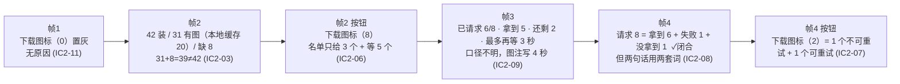
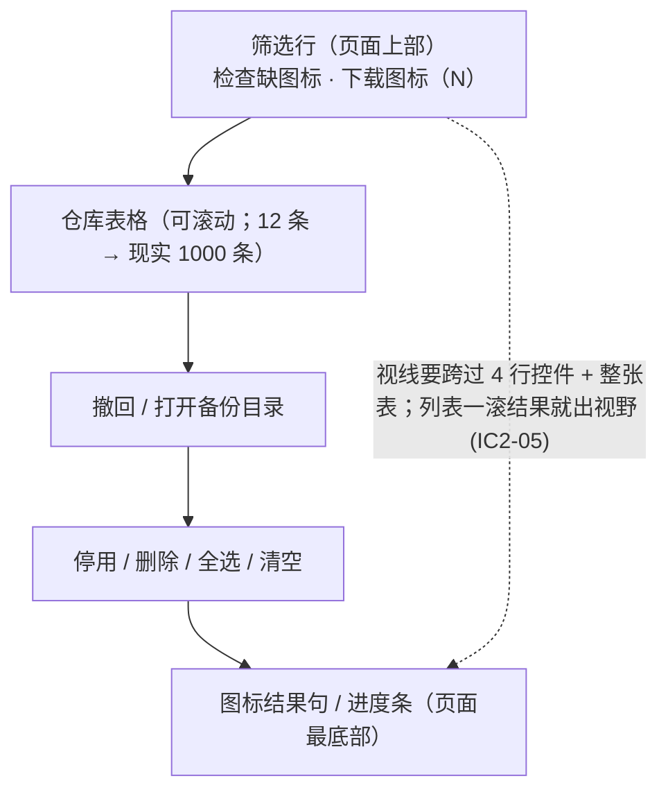

## 启发式评审：仓库体检 × 图标缓存 v2（Nielsen 十项）
**被评对象**：`C:\everyone\FireGaze\Resources\ui-mockup-icon-audit-v2.png`（浏览器 2× 还原图，4 帧，700×620 窗口）、`ui-mockup-icon-audit-v2.html`（下称 `v2.html:行`）。
**评审依据**：仅该 PNG 与该 HTML。未读实现代码、未执行任何 shell/git/build、未写任何文件。
**一致性基线（启发式 4）**：本仓库没有独立的 consistency-audit 产物，按 `docs/hci/review-2026-09-17-repoaudit-usage-heuristic.md:6` 的既有约定，沿用 `docs/hci/review-2026-09-16-heuristic.md` 与本页定稿 `Resources/ui-mockup-repoaudit-usage-v3.html`（下称 `v3.html:行`）。**基线已覆盖的项不复审**，只在 v2 把它改坏/没闭环时点名。
**严重度口径（技能守则原文）**：0 不是问题 / 1 观感或低优先 / 2 次要可用性问题 / 3 主要可用性问题 / 4 严重、会阻塞或误导用户。
---
### 一、结论先说
图标这条支线的**流程骨架是对的**（检查 → 用户决定 → 下载 → 报结果 + 下一步，下载中可停止），四帧的数字链在帧 3→帧 4 之间是闭合的。问题集中在三类，都不是"美化"：
1. **列表与状态的关系没画出来**：四帧筛选状态完全相同，表格行数却是 3/2/1/3，页脚恒为「结果 5 行/已选 1」，页头说 12 条库（含死链 1、连接失败 1、未检查 1），这四帧里一行这样的行都没出现过，也没有滚动条或「还有 N 行」。实现者必须自己猜三件事（列表怎么滚、结果行会不会被列表挤走、5 与 12 什么关系）。
2. **选择态在图纸上是不可见的**：四帧行内复选框全为空格，页脚却写「已选 1」，旁边就是「停用所选（1）」「删除所选（1）…」。v3 基线是画 ✔ 的（`v3.html:84`）。
3. **图标支线在页面上没有"家"**：按钮在筛选行右端（`v2.html:72-73`），结果句/进度条在页面最底部、隔着表格 + 撤回行 + 工具条（`:124/:162/:202`）。1000 条库的列表一滚，结果就没影了。
---
### 二、做对了的（不计入问题）
| # | 做对了什么 | 证据 |
|---|---|---|
| C1 | 「先检查（只查不下载）→ 再决定下载」被真实拆成两个按钮，检查前下载按钮置灰 —— 用户先看到清单再授权联网 | `v2.html:72-73`（帧1）；`:111-112`（帧2 变为可用） |
| C2 | 下载中按钮**同位替换**成「停止下载」，且把「开始体检」「检查缺图标」置灰 —— 给出了取消出口，互斥方向与同页"开始体检→取消"惯例一致 | `v2.html:143/:150/:151` |
| C3 | 完成句给了分母、用时与可行动作，且**数字闭合**：6 + 1 + 1 = 8；帧3（6 请求）→帧4（8 请求）也自洽 | `v2.html:202` vs `:162` |
| C4 | 删库的安全网仍在页脚常驻（撤回 + 备份目录），破坏性按钮有危险色与 `…` 预告 | `v2.html:84-85` |
| C5 | 上一版"三帧全勾着一个默认关的开关"没有复发：帧 1「显示插件图标」这次是未勾 | `v2.html:69` vs `v3.html:79` |
---
### 三、逐条发现
| ID | 启发式 | 位置（帧/元素） | 现象（证据） | 为什么是问题 | 严重度 | 可执行建议 |
|---|---|---|---|---|---|---|
| **IC2-01** | 1 可见性 / 4 一致性 | 四帧「表格 + 页脚计数」 | 四帧筛选状态完全相同（`显示=全部`，两个"只看…"均未勾：`:60-74`/`:99-113`/`:138-152`/`:176-190`），表格却分别是 **3 行/2 行/1 行/3 行**（`:79-81`/`:118-119`/`:157`/`:195-197`）；页脚四帧恒为「结果 5 行」（`:84/:122/:160/:200`）；页头恒为「共 12 个仓库 … 死链 1 … 连接失败 1 … 未检查 1 … 已停用 2」（`:59` 等），而 4 帧里一行 `死链/连接失败/未检查` 都没有；表格下方还有整片空白，全图无滚动条、无「还有 N 行」。基线口径是 5 行 ↔ 结果 5 行一一对应 | 这个页面的全部价值就是"12 条库的真实状态都看得见"。图纸没表达：列表怎么滚、5 与 12 什么关系、底部的结果行是常驻还是随列表滚走。照图实现必错一件，且用户无法判断自己看到的是不是全部 | **3** | 四帧要么固定画 5 行（含 死链 1 / 未检查 1 各一行，与统计行对得上），要么画滚动条 + 「已显示 3 / 共 5 行」；把「图标结果行」明确画在列表滚动区**之外**（或用一条分隔线标出常驻区） |
| **IC2-02** | 1 / 4 | 四帧首列复选框 + 页脚「已选 1」 | 四帧所有数据行的勾选框都是空框（``，无 `on`：`:79-81/:118-119/:157/:195-197`），页脚却写「已选 1」，工具条写「停用所选（1）」「删除所选（1）…」「全选当前（5）」（`:84-85` 等）。同仓库基线用 ✔ 表达选中行并同时给出「结果 5 行 · 已选 1」（`v3.html:84/:91`） | 破坏性批量动作的全部安全感来自"我看得见选了哪条"。图上既看不到选中谁，也看不出勾选态该怎么画 → 用户无法在执行删除前核对，实现/验收也无从对齐 | **3** | 每帧把被选中的那行画成 ✔（照基线）；若该行不在当前筛选内，页脚写成「已选 1（不在当前筛选内）」 |
| **IC2-03** | 2 匹配现实 / 4 | 帧2 底部「图标检查：…」句 | `该句为：已安装 42 个插件 ｜ 图标已有 31 个，其中本地缓存 20 个 ｜ 缺图标 8 个 ｜ BadApple、BossMod Reborn、SrankTool 等 8 个`（`:124`）。**31 + 8 = 39 ≠ 42**，差 3 个无归属；「图标已有 31（其中本地缓存 20）」里另外 11 个是什么状态完全没交代；「8 个」在一句里出现两次（一次是计数、一次是名单长度）；「等 8 个」意味着 5 个名字没给 | 下载按钮上的 `（8）` 就是这句推出来的：用户既无法核对"要下什么"，也无法理解"已有 31"里那 11 个为什么不用下——而"本地缓存图标"开关和"下载"按钮的差别正好卡在这 11 个上 | **3** | 改成可加的分解，例：`本机已装插件 42 个 ｜ 其中 20 个图标在本机缓存里、11 个只有清单里的地址（本会话会现下）、8 个两处都没有（可下载）、3 个作者没给图标地址（补不了）`；名单不要用「等 N 个」带过（见 IC2-06） |
| **IC2-04** | 2 / 5 / 6 | 四帧筛选行「本地缓存图标」开关 | v2 新增控件（`:70/:109/:148/:186`），四帧**全部勾选**（含自称"默认态"的帧1），而它在帧 1 的邻居「显示插件图标」是未勾（`:69`）；全图没有任何 tooltip 或说明句解释它；唯一相关线索是帧2 那句「其中本地缓存 20 个」 | 名字可读成"把图标缓存到本地"（＝下载，与旁边的「下载图标（N）」重叠）、也可读成"只用本机已缓存的图标显示"。两种读法导致完全不同的预期；而图纸把"默认开"这个断言画了四遍却不解释 | **3** | 二选一：①改名为「只显示已缓存的图标」并在 tooltip 里写清与「显示插件图标」的叠加关系；②删掉它——缓存由「下载图标」按钮承担，这张图不需要第二个同名概念的开关 |
| **IC2-05** | 6 认知而非回忆 / 10 帮助 | 帧1/2 按钮位置 ↔ 帧2/3/4 结果位置 | 图标控件在筛选行第二行右端（`:72-73`/`:111-112`），结果的落点却在页面最底部：帧2 结果句在表格+撤回行+工具条**之后**（`:124`），帧3 进度条在同样位置（`:162`），帧4 完成句也在同样位置（`:202`） | 同一支线的"输入"在页面上部、"输出"在最底部，中间隔着整张可滚动列表（现实 1000 条库）。用户按完按钮要把视线跨过 4 行控件和整张表才知道结果；列表一滚，结果出视野，更不可能"看着结果再决定要不要重试" | **3** | 给这条支线一个固定位置：把结果句/进度条画在「检查缺图标 / 下载图标」两个按钮**同排右侧或紧邻下一行**（还在列表之上），或把两个按钮 + 结果行收成一组独立小行并画进四帧 |
| **IC2-06** | 6 认知而非回忆 | 帧2「…等 8 个」+ 帧4 tooltip | 帧2 只给 3 个名字带「等 8 个」（`:124`）；完整名单只能靠逐条悬停「已安装」列（帧4 tooltip 走的就是这个口径，`:203-206`），而图上**画出的那条 tooltip 只标出 4 个名字里的 1 个**；帧4 按钮说还剩 2 个（`:189`），图上标出的只有 1 个 | 用户在授权下载前看不到完整的 8 项；下载完也看不到"剩下的 2 个是谁"。1000 条库的表格里逐个 hover 找，等于没有出口 | **3** | 帧2 的结果句给出可核对的名单出口（例：`缺图标 8 个：BadApple、BossMod Reborn、SrankTool…（悬停本句看全部）`），并把"悬停可见完整名单"这一条画进图 |
| **IC2-07** | 4 一致性 / 2 | 帧4「下载图标（2）」按钮 | 同一标签在两帧两种含义：帧2 = 缺图标总数（`:112`），帧4 = 失败+未完成（`:189`，与 `:202` 的「1 个地址已失效 + 1 个没下完」对应）；而同一句明说地址失效那个「需要插件作者更新清单」——**这一个再点多少次都不会成功**，却被算进了 `（2）` | 用户会反复点击一个注定失败的按钮，并据此判断"工具修不好"。按钮是这一支线唯一的动作入口，含义漂移代价最大 | **3** | 帧4 按钮改「重试失败（1）」；结果句同时写明「另有 1 个地址已失效，重试也没用，需要作者更新清单」，让 `（N）` 只包含"再点一次有意义"的项 |
| **IC2-08** | 2 / 8 / 9 | 帧4 完成句 | 同一批项在两句话里两套词：`这次请求 8 个，拿到 6 个，失败 1 个，1 个没拿到` 与 `1 个图标地址已失效…；1 个没下完，可以再点一次`（`:202`），没有一对一标注；整句 3 行连排、无断行、无颜色/图标分层，而同页其它状态是绿/黄/红着色（`:23-24`） | 用户要做一次隐式映射才知道"失败的那个是不是地址失效的那个"；"没拿到"与"没下完"与"失败"三个词指向 2 个对象，图注承诺的"三类归属"在画面上落不了地 | **2** | 拆成三段并对齐用词与着色：`拿到 6`（正常色）/ `失败 1 · 图标地址已失效`（黄）/ `未完成 1 · 可以再点一次`（黄），三段用同一组词贯穿按钮与结果句 |
| **IC2-09** | 1 / 6 | 帧3 进度条 + 进度句 | `已请求 6/8 · 拿到 5 · 还剩 2，最多再等 3 秒`（`:162`）：到手 5，未到手 3（1 个在途 + 2 个未发起），「还剩 2」与后面「再等 3 秒」并排读作"只有 2 件事"；进度条 62% = 5/8（拿到），与「已请求 6/8」= 75% 是两套分子且条上无标注；**到期后的处置四帧都没说**（只有帧4 事后说"1 个没下完"）；图注写「再等 4 秒」（`:130`）而界面写「最多再等 3 秒」 | 这个倒计时是本次下载唯一的结束条件，也是用户"等还是按停止下载"的唯一依据；现在它既不可核算，也不说明超时代价 | **2** | 三处对齐：①统一口径 `已到手 5 / 8 · 在途 1（还剩 2 个排队）· 1 个未完成`，进度条旁标出它算的是哪个分子；②加一句「到点未完成的会记为未完成，可以再点一次」；③图注与界面统一为一个秒数 |
| **IC2-10** | 3 用户控制 / 5 防错 | 帧3 工具条与撤回行 | 下载中把「开始体检」「检查缺图标」置灰（`:143/:150`），但「停用所选（1）」「删除所选（1）…」「全选当前（5）」「清空选择」「撤回：删除 2 个」「打开备份目录」全部保持可用（`:160-161`），数据行复选框也可点（`:157`） | 同一屏两套禁用规则：读取类动作被锁，破坏性/改选择动作放行。下载途中改选择或删库，界面既不提示影响范围，也让"这批下载代表谁"变得说不清；且与帧3 自己的禁用意图（防并发）自相矛盾 | **2** | 帧3 明确禁用「删除所选」与「全选当前/清空选择」（或冻结选择集，并在按钮 tooltip 写明"下载中不改选择"）；「停止下载」之外的破坏性入口一律置灰 |
| **IC2-11** | 5 防错 / 10 帮助 | 帧1 置灰的「下载图标（0）」 | 置灰无原因：全图没有 tooltip、界面里没有一句话说明为什么（"先点检查缺图标"只出现在**图注** `:52`，不在界面内）。同页既有先例是给不可用态写原因（如基线对数据不可用态写「数据不可用」+ 一行解释，`v3.html:235-236`） | 用户进这个页签遇到的第一个控件就是一个不能点、也不解释的按钮；ImGui 里置灰控件默认不给提示，用户只能猜 | **2** | 帧1 给这个按钮画出 tooltip：「先点「检查缺图标」看看本机缺哪些，再决定下不下」；或在结果行位置放一句同样的提示 |
| **IC2-12** | 4 一致性 | 四帧「显示」单选组 + 状态词表 | 单选组里混着"互斥分类"与"子集"：`有问题的 / 全部 / 可用` 与 `连接失败 / 已停用`（`:60-66`）；而状态词表有 6 个（统计行 `:59`：可用/死链/内容不合规/拒绝访问/连接失败/未检查）——**死链、内容不合规、拒绝访问、未检查 都没有对应筛选项**；基线还用过状态列的「可用 · 停用」后缀画法（`v3.html:86`），v2 四帧全部消失，但筛选里仍有「已停用」项 | 用户选「有问题的」时不知道含不含 死链/未检查；想把统计行里那条「死链 1」找出来只能肉眼在「全部」里翻；选「已停用」则不知道会看到什么（没有任何行带停用标记） | **2** | 让筛选词表与状态词表同源：`有问题的`后加括注（=死链/内容不合规/拒绝访问/连接失败/未检查），或直接按 6 个状态给筛选项；状态列补回基线的「· 停用」后缀 |
| **IC2-13** | 2 / 4 | 统计行「已安装 9」+ 列头「已安装」+ 帧2「已安装 42 个插件」 | 同一屏三种"已安装"口径：统计行 `已安装 9 · 未安装 3`（`:59`，无单位）、表格列头 `已安装` 为 1 个/4 个/0 个（`:79-81`，每条库的插件条目数）、帧2 `已安装 42 个插件`（`:124`）。基线写的是「本机：已装 9 · 未装 3」（`v3.html:69`） | 9 与 42 差 4.7 倍、又是同一个词，用户会怀疑统计行和列表不是一回事，进而怀疑整页数字 | **2** | 统计行按基线口径改回「本机：已装 9 · 未装 3」；帧2 句首写「本机已装插件 42 个」，并在 tooltip 里点明"库链数 vs 插件条目数"的关系（基线已有跨列指引句，可复用） |
| **IC2-14** | 4 | 全图术语 | 同一对象三种称呼：`仓库`（`:59` 统计行、`:75` 搜索框、状态列/列头）、`库链`（帧4 tooltip `:203`「从这条库链装了 4 个插件」）、`库`；6 个状态词全图**零解释**，尤其 `死链` 与 `连接失败` 在用户眼里是同一件事（`:59` 两个词并列出现） | 1000 条库的页面，术语就是导航；`死链 vs 连接失败` 不可区分会让统计行的两个数变得无法行动 | **2** | 统一用「仓库」；帧1 给「状态」列画一次 tooltip，把 6 个词各配一句人话（并接上「与卫月同款校验」） |
| **IC2-15** | 8 极简 | 帧4 tooltip 内容与体积 | 一个白框里装了三类内容（`:203-206`）：本行数据（装了 4 个插件）＋ 跨列指引（"把鼠标放在仓库地址上看"）＋ 全局图例与免责（"图标只影响列表里的小图，不影响插件运行"）。图上这个浮层**盖住了第 2/3 行的仓库地址右半段、被悬停列的值，以及「撤回：删除 2 个 · 12:03」「打开备份目录」「清空选择」三个可点控件**（PNG 帧4，定位 `left:340px; top:330px`）。7 行文本靠手工换行撑住（`NamePlate` 独占一行、"下载图/标」"被拆开）；图例里的第二类「图标地址失效」在画面上一个例子都没有 | hover 浮层同时承担数据、教学、免责，还遮住它自己指的东西（它说"可以点「下载图标」"，同一块浮层压着"撤回"）；7 行手工断行说明它已超出 tooltip 的容量，实现时换行位置由字号决定，图上的对齐不成立 | **3** | tooltip 只保留 1–2 行与本列直接相关的内容（本行装了哪几个 + 缺哪几个）；跨列指引压成一行保留；图例/免责句移到固定位置（帧4 已有完成结果句，或状态列的一次性 tooltip）；图例里出现过的标记类型必须在画面上有实例 |
| **IC2-16** | 1 / 6 | 帧4 tooltip 指代 | 图上没有画出被悬停单元格/行的任何高亮，"从这条库链装了 4 个插件"要读者自己去找哪一行是 4 个（`:203` vs `:196`）；浮层落在表格中部，离「已安装」列很远 | 实现者无法从图判断 hover 归属与高亮形态；真实列表里多行同值时，用户也不知道浮层说的是哪条 | **2** | 图上给被悬停行画高亮底色，并把 tooltip 贴到该单元格（或画一条引导到该单元格） |
| **IC2-17** | 6 / 5 | 四帧（缺口：数据不可用态） | v3 基线为"读不到本机插件列表"定义了整态：统计行「本机：数据不可用」+ 一行原因 + 列值 `—` + 相关控件不可用（`v3.html:235-236,250-253`）；v2 的整条图标支线（"已安装 42 个插件""缺图标 8 个"）全部依赖这份数据，四帧**没有一帧**画这个态 | 这一页已经立过规矩：数据不可用时显示 `—` 并说清原因。照 v2 实现会出现"图标按钮可点、结果句给 42/8"这类假数 | **2** | 补画一帧（或至少在帧1 旁注）：数据不可用时「检查缺图标/下载图标」置灰 + 一行原因，结果句位置显示 `—` |
| **IC2-18** | 4 | 帧1~帧4 页脚 | 基线页脚是「结果 5 行 · 已选 1 · **排序：默认（状态）**」（`v3.html:91`），v2 四帧去掉了排序段，只剩列头 `状态 ▲`/`已安装 ⇅`/`首次记录 ⇅`（`:77` 等），而「▲ = 由重到轻」这条口径全图没有文字 | 上轮已拍板的排序指示被删且没在别处补；列头记号本身不表达"由重到轻" | **1** | 页脚补回「排序：默认（状态）」，或给状态列头一个 tooltip 写清 ▲ 的含义 |
---
### 四、图标支线：数字链（哪里闭合、哪里断）

---
### 五、需要重做结构（不是调样式）的部分

- **图标支线的落点**：控件在列表之上、结果在列表之下——这是 IC2-05 与 IC2-15 的共同根因。要么把结果行提到按钮同排/紧邻下一行，要么把两个按钮与结果行收成一组。**这一条只能靠改图纸结构解决**，改字号/颜色都没用。
- **列表的可视性契约**：`共 12 条库`／`结果 N 行`／`可见行`／`滚动区边界` 四者必须在图纸里定义一次（IC2-01）。本页现实的 1000 条库让这件事不再是图纸细节。
- **"已完成 / 部分失败"的呈现格式**：现在是一个 3 行灰字段落（IC2-08）。对一个会部分失败的网络动作，这一块需要固定的分段模板（拿到/失败/未完成 + 下一步），而不是一句话。
---
### 六、最快见效（改词/画一行，不动结构）
1. 每帧把被选行画成 ✔，页脚「已选 1」与之对齐（IC2-02）。
2. 帧2 的 42/31/20/8 改成可加的分解（IC2-03）。
3. 「本地缓存图标」改名或删掉（IC2-04）。
4. 帧4 按钮改「重试失败（1）」，并与结果句用同一组词（IC2-07/IC2-08）。
5. 帧1 给置灰按钮补 tooltip；帧3 统一秒数与分子口径（IC2-11/IC2-09）。
6. 帧4 tooltip 砍到 2 行 + 去掉遮挡（IC2-15/IC2-16）。
---
## Review
- **Correct**：C1–C5（见第二节）。其中最关键的是 **检查与下载拆成两步**、**下载中同位替换为「停止下载」并把读取类动作置灰**、**完成句数字闭合（6+1+1=8）** —— 这三点是上一版评审要的东西，v2 都落地了。
- **Fixed**：无（review-only；未改动仓库任何文件，未写任何文件；如需落盘请监督者按既有命名写到 `docs/hci/`）。
- **Finding P0**：无。图标支线只读清单 + 落盘缓存，最坏路径可恢复（删库有备份 + 撤回），卡片面上不产生不可逆后果。
- **Finding P1（severity 3）**：IC2-01 列表/计数/滚动关系未定义（`:59/:79-81/:84` 四帧互不相符）｜IC2-02「已选 1」无可见勾选，紧邻破坏性按钮（`:79-81` vs `:84-85`；基线 `v3.html:84`）｜IC2-03 帧2 图标检查数字 31+8≠42（`:124`）｜IC2-04「本地缓存图标」语义未定义且四帧全勾（`:70` 等）｜IC2-05 图标控件与结果分列页首/页尾（`:72-73` vs `:124/:162/:202`）｜IC2-06 缺图标完整名单在图上不可达（`:124`、`:203-206`）｜IC2-07 帧4「下载图标（2）」语义漂移且含不可重试项（`:189` vs `:202`）｜IC2-15 帧4 tooltip 三类内容混装并遮住 3 个可点控件（`:203-206`）。
- **Finding P2**：IC2-08/09/10/11/12/13/14/16/17（均为"改一句文案 / 补一次画法"量级）；IC2-18（severity 1）。
- **Merge verdict**：**需修改**（按本仓库既有口径即 **BLOCK（窄口径）**）—— 无 P0，P1 全部是"画一行 / 改一句话 / 定一条口径"的量级，概念与流程不用推翻；改完可复评。
---
**总评：需修改**（无 P0；P1 八条均为"改一句话/画一行/定一条口径"的量级，照下面 5 条改完即可复评放行）。
**必须修的最多 5 条：**
1. **IC2-01** — 四帧把「共 12 条库 / 结果 N 行 / 可见行 / 滚动区」的关系画清楚（画全含 `死链 1`、`未检查 1` 的行，或给滚动条 + 「已显示 X / 共 Y 行」），并标明底部的图标结果行在滚动区之外。
2. **IC2-02** — 每帧把选中的行画成 ✔，与页脚「已选 1」、按钮「停用/删除所选（1）」对齐。
3. **IC2-03 + IC2-06** — 帧2 的「42 / 31（本地缓存 20）/ 8」改成可加的分解，并给"缺图标名单"一个可核对的出口（不再用「等 8 个」带过）。
4. **IC2-04** — 「本地缓存图标」改名（并写清与「显示插件图标」的关系）或直接删掉。
5. **IC2-07 + IC2-08** — 帧4 按钮改「重试失败（1）」，结果句与按钮用同一组词、分段并着色；同一批把 IC2-15（tooltip 砍到 2 行、不再遮挡「撤回/打开备份目录/清空选择」）一起处理。
**需要监督者执行的核对（我无 shell/git，一条都没跑）**
1. 若要把本报告落盘：写到 `docs/hci/review-<日期>-icon-audit-v2-heuristic.md`（我未写任何文件）。
2. 实机量一次（本评审只依据 PNG + HTML）：在真实 ImGui 里以 700×620 与最小窗口各截一张「仓库体检」页，确认列表滚动区的实际高度、底部结果行是常驻还是随列表滚走、以及「已安装」列 tooltip 的真实尺寸与换行位置。
3. 需产品拍板一处：帧4 的 `下载图标（N）` 到底是"仍缺 N 个"还是"可重试 N 个"（IC2-07）。
