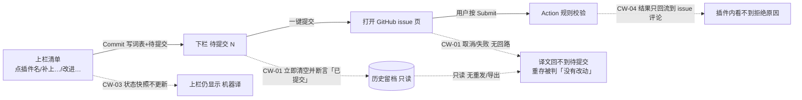

# 启发式评审：参与翻译 · 两栏工作区 + 翻译评分（3 帧）
- **评审对象**：`Resources/ui-mockup-contribute-workspace.html`（下称 `H:行号`）、`Resources/ui-mockup-contribute-workspace-all.png`（帧 1「待提交」/ 帧 2「历史留档」/ 帧 3「评分」）。
- **实现锚点**：`src/FireGaze/UI/ContributeWindow.cs`、`src/FireGaze/Translate/ContributionsStore.cs`、`scripts/validate_contribution.py`、`.github/workflows/validate-contribution.yml`；约束侧另核 `Translate/TranslationIndex.cs`、`Translate/TranslationTable.cs`、`Plugin.cs`、`UI/MainWindow.cs`、`README.md`。
- **方法**：Nielsen 十项 + 严重度 0–4。每条发现都锚到"具体帧 / 具体控件文字 / 具体代码行"。
- **按前提接受的规则（不作为问题提出）**：上栏清单 + 下栏工作区；下栏 = 待提交（N）+ 日期命名留档（悬停看时间、只读）；下栏只有 5 个按钮；一个插件一个字段只留一条；删除/清空后词表回滚且可撤回；评分是第三种视图、每页 10 条、只列赞 ≥ 1、👍 显票数 / 👎 不显票数、可取消、可挑一条；提交后由 Action 做确定性规则校验、不调模型。
## 关系图（本次评审发现的断点位置）

---
## 一、发现清单（主表）
| ID | Heuristic | Screen/flow/component | Evidence | Why it matters | Severity (0-4) | Recommendation |
|---|---|---|---|---|---|---|
| CW-01 | 9 错误恢复 / 1 状态可见性 / 3 用户控制 | 帧 1→帧 2 的「一键提交（3）」（`H:143`）与提交后状态 | `ContributeWindow.cs:1948-1965`：`SubmitContributions()` 先 `OpenIssue()`（只 `Process.Start` 打开预热好的 issue 页）再 `ArchiveSubmission()` 并写 `SetStatus("已提交 {count} 条…")`；`ContributionsStore.cs:227-236`：`ArchiveSubmission()` 一旦落档就 `records.Clear()` + `undoStack.Clear()`；tooltip 却写「发完这里会清空」（`ContributeWindow.cs:1595-1602`）；历史页签只读（`ContributeWindow.cs:1802-1830`），下栏 5 个按钮里没有任何「重发/导出」；且重存同一译文会被 `Commit()` 的 `current == next` 直接判 0（`ContributeWindow.cs:1483-1496`），弹窗预填又来自 `Pending(...) ?? entry.Entry?.XXX?.Translated`（`:1240-1250`）→ 用户无法把这批译文重新放回「待提交」。帧 2 正是落档后的画面：一键提交（0）/删除（0）/清空/撤回全部禁用（`H:198-203`） | 主按钮撒谎：浏览器被关掉/没按 Submit 时，界面照样说"已提交"，而这批译文既回不到待提交栏、也不能重做一遍（保存会回「没有改动」），历史又是只读 → 贡献静默掉出管线 | 4 | 把提交改成三态：`待提交 → 已导出（等你在 GitHub 按 Submit）→ 已提交`；落档时机改为"用户回插件后确认已提交"或"下次打开时确认"，至少在历史页签加「重发这一批 / 导出 JSON」；文案与时机对齐（`SubmitContributions` 不要在同一帧里既打开浏览器又清空） |
| CW-02 | 3 用户控制 / 9 错误恢复 | 帧 1 下栏「撤回」（`H:146`） | `ContributionsStore.cs:186-206`：`PushUndo()` 存**整份** records 快照，`Undo()` 用快照**整体替换** records；`ContributeWindow.cs:1926-1943` 撤回后只把快照里的条目重新 `MarkUserTranslation`，不回滚被丢掉的条目；tooltip 只说「把上一次删除 / 清空恢复回来」（`:1645-1660`） | 删除/清空之后又改了别的插件，再点撤回 → 之后新增的待提交条目被静默移出下栏（词表里的译文还在，上栏会显示"你译"），用户看不到任何提示，提交那一批时会少条 | 3 | 撤回改成记录级合并（只把被删的那几条加回来），或在撤回前提示「会同时移除之后新增的 N 条」并在状态行写明；同时把词表与待提交列表的差异在同一帧内对齐 |
| CW-03 | 1 状态可见性 / 6 识别而非回忆 | 帧 1 上栏状态列 vs 下栏 待提交 | 帧 1 上栏 Questionable = `机器译`（`H:119`），同一帧下栏 待提交 里有「Questionable · 插件名 · 任务助手」（`H:138`）。实现侧：`TranslationIndex.cs:39-42`（`HasUserTranslation`/`State` 等是 `init` 快照）+ `:83-88`（`FinalizeState()` 只在建索引时调一次）+ `:307-317`；`ContributeWindow.cs:1044-1048` `InvalidateIndex()` 注释明写「不重建反射索引」；`SaveEdit`（`:1429-1470`）保存后不重建索引；索引只在 `:900` 建一次、`:133` 重试时置空 | 保存一条译文后，上栏的「状态 / 缺译文 / 机器译 / 我提交过 / 完成度」全都不变；用户会以为没保存上，筛「缺译文」也筛不掉刚译完的插件——而帧 1 已经把这个矛盾原样画出来了 | 3 | 要么保存/删除/清空/撤回后重建索引（后台 Build 很快，`Plugin.SnapshotTable` 已带锁），要么把 `State`/`MissingFields`/`TranslatedFields` 改成按当前表实时算；图纸验收条件里写死「改完那一行立刻变你译」 |
| CW-04 | 5 错误预防 / 9 错误恢复 | 编辑弹窗（三帧都没有这一帧）+ `validate_contribution.py` | 弹窗文本框只有 4096 缓冲、无字数提示（`ContributeWindow.cs:1413`、`:1423`）；规则上限 `FIELD_LIMITS = {"Name": 40, "Punchline": 99, "Description": 999}`（`validate_contribution.py:28`）；校验结果只作为 issue 评论回流（`.github/workflows/validate-contribution.yml` 的 `gh issue comment`），插件里没有任何入口；更关键：`:137-143` 的循环对 **译文和原文都**跑 `CONTROL/URLISH/HTMLLISH/DENY_WORDS`，而文件头注释写的是「译文里不该出现链接与标记」（`:24-25`） | 用户写完 3000 字的详情、或译文里带了 `discord.gg`、或上游原文本身含网址，都要等提交后在 GitHub 才知道不收；含网址的**原文**玩家改不了 → 这类插件永远提交不上去，界面上也永远看不到原因 | 3 | 编辑弹窗按字段显示上限 + 实时计数（超限变红）；提交前在本地跑同一套规则、把不合格项逐条列在状态行/弹窗里；原文侧的规则改为「只警告不拦截」或与注释一致（只查译文） |
| CW-05 | 4 一致性与标准 / 1 状态可见性 | 帧 3 整页 vs 帧 1/2 | 帧 3 的 `.body`（`H:220-324`）只有：说明（`222`）→ 视图单选（`224-229`）→ 两个复选框+分页（`231-235`）→ 候选列表（`239-319`）→ 说明+刷新行（`321-323`）；**没有** `.ws` 下栏（对照 `H:126-149`、`H:181-205`）、**没有** 搜索行与状态筛选行（对照 `H:85-97`/`H:167-168`）。实现里下栏是无条件绘制的：先算 `bottomHeight` 再 `DrawWorkspace(bottomHeight)`（`ContributeWindow.cs:200-206`），搜索/筛选/视图三行也在同一条固定顺序里（`:143-190`） | 同一页的三个帧结构不同：切到「评分」时下栏（待提交数、一键提交、留档）整体消失，搜索与筛选也没了，而唯一的分栏控件「视图」从页内第 3 行跳到第 1 行——整排控件跟着跳位；照帧 3 实现会出现"评分视图我没法提交" | 3 | 帧 3 补回下栏与搜索/筛选（或在方案里明确写死"评分视图收起下栏、搜索失效"，并在帧上画出收起后的完整样子：下栏条 + 说明），三帧的页内行序必须一致 |
| CW-06 | 2 匹配真实世界 / 10 帮助与文档 / 1 状态可见性 | 帧 3 视图单选（`H:105`/`228`）+「选它」（`H:252/262/280/295/301/315`）+「刷新候选」（`H:323`） | 全仓没有评分/投票实现：`grep -rn "赞成\|反对\|票数\|评分" src/` 只命中无关的 `InstallerListScroll.cs:174`（"候选名字"）；视图单选在实现里只有两个（`ContributeWindow.cs:176`/`:182`），帧 3 的第三个单选框没有对应代码。帧 3 也没有任何加载/失败/离线态，而本插件对外的定位是本地化、不带服务端：`ContributionsStore.cs:77` 类注释「只存在玩家自己机器的配置目录里，不上传、不联网」。跨帧证据显示「选它」不改词表：帧 1/帧 2 里 Penumbra 一行简介的生效译文是「运行时模组加载与管理器。」（`H:117`、`H:191`），正是帧 3 里 12 赞**未被选中**的那条（`H:295`），被选中的是 4 赞的「运行时的模组加载与管理工具」（`H:301`） | 这个视图的三个前提都没落地：票数从哪来（谁写、写在哪、怎么同步）、离线/加载失败长什么样、「选它」之后发生什么（本地书签？进待提交？维护者能看见吗？）；用户点完「选它」之后界面上没有任何回显位置，「刷新候选」也没有新鲜度信息 | 3 | 先定后端与同步模型并写进方案，再补三帧（加载中/失败或离线/空），帧里加「候选来源（机器译 / 玩家译 / 我提交的）+ 词表现在生效的译文」两列信息，并把「选它」的后果写成一行界面说明 |
| CW-07 | 8 极简设计 / 4 一致性 | 图纸窗口 vs 实机窗口尺寸；下栏按钮行 | 图纸窗口固定 `720×860`（`H:20`），下栏写死 `330px`（`H:52`）；实机默认 `700×620`、最小 `560×440`（`MainWindow.cs:29-34`）。实现按可用高度切：`bottomHeight = Clamp(available*0.42, 150, 420)`、`topHeight = Max(140, available - bottomHeight - ItemSpacing*4 - 62)`（`ContributeWindow.cs:201-203`）。按 14px CJK 粗估，帧 1 下栏那一行 = `一键提交（3）+删除（1）+清空+撤回+查看历史提交记录`≈390px + 常驻说明「这一栏是你改过、还没提交的译文」（`H:148`）≈218px + 5 个间距 ≈ 8px → **≈610-670px**，而 700px 窗口内容区 ≈668px、560px 窗口只有 ≈528px | 图纸的纵向比例只在 860px 高时成立；620px 高时两栏一起被压到 140/150px（硬下限），440px 高时 `150+140` 的下限本身就可能顶破可用高度；最小窗口下那一行说明必然被裁（ImGui 不换行） | 3 | 按 700×620 与 560×440 各补一帧并核算：三层说明行要不要收成一行/tooltip、下栏那行说明是否与页签名「待提交（3）」重复可以删、下栏按钮是否该分两行；`needs 实机量`（命令见文末） |
| CW-08 | 4 一致性与标准 | 帧 1 ↔ 帧 2 的页内常驻控件 | 帧 1 有操作条 `翻译所选（0）/全选当前/清空勾选 │ 添加到我的库（0）/撤回添加（0） │ 或粘一条仓库地址…/添加这条`（`H:107-111`）、筛选行有「连着已停用的库」（`H:99`）、顶部有 3 行说明（`H:80-82`）；帧 2 三样全无（只有 `H:167/168/169` 三行就直接进表格 `H:171`），说明只剩 1 行（`H:165`），帧 3 也只剩 1 行（`H:222`）。实现里操作条与两个开关都是无条件绘制的（`ContributeWindow.cs:129-200`、`:256-277`） | 同一页同一状态的两帧控件不一致，表格上方的可用高度不可比（验收方照帧 2 实现就会丢掉整条操作条）；帧 2/3 恰好把那句数据丢失警告「点『从 GitHub 更新词表』会整份覆盖本地改动，没提交出去的译文会消失」（`H:82`）删掉了 | 2 | 三帧统一常驻控件集合；若确定要收说明行，就把那句警告挪成 tooltip 并在方案里写明"三行说明收成一行"的规则 |
| CW-09 | 1 状态可见性 / 5 错误预防 | 帧 1 操作条 vs 上栏勾选 | 帧 1 上栏 Penumbra 行已勾选并且整行高亮（`H:117`：`tr.picked` + `chk on`），但操作条写「翻译所选（0）」（`H:108`）且画成可用态；实现里这个计数来自 `selected.Count`，为 0 时 `ImGui.BeginDisabled()`（`ContributeWindow.cs:855-880`） | 计数器与勾选状态互相打脸：用户会怀疑勾选没生效（或者以为按钮能点）；同帧里「添加到我的库（0）/撤回添加（0）/添加这条」都是禁用态，只有「翻译所选（0）」被画成可用 | 2 | 帧 1 把计数改成（1）；并给"0 勾选时禁用"这一状态补一帧或在图上标出禁用样式 |
| CW-10 | 1 状态可见性 / 6 识别而非回忆 | 帧 2 日期页签 vs 表内行数 | 页签写「2026-09-21（6）」（`H:184`）、提示框写「共 6 条」（`H:208`），表里只画了 4 行（`H:191-194`：Penumbra 一行简介 / Penumbra 插件详情 / Questionable 插件名 / Splatoon 一行简介），且表格区域下方还有大片空白 | 帧 2 是「凭日期页签回看当时交了什么」的唯一示范帧：数字说 6、画面只有 4，读者无法判断是滚动截断还是记录丢了；作为验收依据会让"页签计数"这一条无法核对 | 2 | 补到 6 行或在帧里画出滚动条并标注"仅示 4/6" |
| CW-11 | 4 一致性与标准 / 5 错误预防 | 帧 2 的「清空」禁用态 vs 实现 | 帧 2 把「清空」画成禁用（`H:200`）；实现里 `清空` 没有禁用守卫（`ContributeWindow.cs:1634-1643`），而空表点它会走 `ClearContributions()`（`:1911-1927`）：`store.ClearAll()` 在 records 为空时直接 return、不压撤回栈（`ContributionsStore.cs:186-193`），但状态行仍写「已清空 0 条待提交译文（可用「撤回」找回）」 | 图纸与实现不一致（禁用 vs 可点）；且空表清空后界面会承诺一个不存在的撤回（`CanUndo` 仍为 false），与同排「撤回」的禁用态自相矛盾 | 2 | 三选一并对齐：给 `清空` 加 `pending == 0` 的禁用守卫；或清空后按实际栈写状态行；或帧 2 不再画禁用态（图纸与实现二选一） |
| CW-12 | 1 状态可见性 | 帧 3 的「每页 10 条 / 共 47 条候选 / 第 1 / 5 页」 | `H:229`「· 每页 10 条 · 只显示有候选的插件 · 共 47 条候选」+ `H:235`「第 1 / 5 页」，而画面里是 4 个插件、共 6 条候选（Aetherphone 2 `H:246/256`、Questionable 1 `H:274`、Penumbra 显示的 2 `H:292/298`、Splatoon 1 `H:312`） | 「每页 10 条」的"条"= 插件还是候选没有定义，且帧里两个口径都对不上（4 个插件 / 6 条候选）；47/10=5 页这个换算又暗示按候选分页 → 验收时没人知道该数什么 | 2 | 定一次口径（建议"每页 10 条候选"）并把帧内数字改成自洽（补满 10 条候选或注明"仅示 6/10"） |
| CW-13 | 4 一致性与标准 | 帧 3「我选中的候选」标记 + 帧 1/2 的高亮 | 帧 3 里 Aetherphone 的选中项带 `.cand fav` 左蓝条 + 蓝色主按钮（`H:246`/`252`），Penumbra 的选中项只有蓝色主按钮、**缺** `.cand fav`（`H:298`/`301`）；而这个蓝左条在帧 1/2 表示的是"已勾选的行"（`H:47` `.picked td:first-child` 用同一个 `--accent`） | 同一个视觉记号在两个视图里表示两件事（勾选行 vs 我选的候选），而且帧 3 自己只画对了一半 → 实现时必然走样 | 2 | 给"我选的候选"独立记号（如 `✓ 我已选` 文本 + 独立颜色），帧 3 两条选中项统一；或在方案里写明蓝左条只用于"当前/已勾选" |
| CW-14 | 1 状态可见性 | 帧 3 的 👍/👎 按钮 | `H:250` `vote on`（蓝色 + 赞成 7）vs `H:295` `vote`（灰 + 赞成 12）；`H:261` `vote off on`（红色 反对）vs `H:295` 灰色 反对。是否已投**只靠颜色**区分，`H:322` 那行说明还得用文字解释「再点一下取消」 | 已投/未投这个关键状态没有符号或文字冗余，色觉差异用户只能靠票数变化反推；图注被迫承担界面职责也是同一问题的症状 | 2 | 已投态加一个非颜色标记（`✓ 你已赞` / 按钮描边或加粗），并把这行说明降级为按钮 tooltip |
| CW-15 | 3 用户控制 / 4 一致性 | 帧 1/2 留档页签顺序 | 帧里顺序是 `待提交` → `2026-09-21（6）` → `2026-09-14（2）`（`H:128-130`、`H:183-185`，最新在左）；实现按 `store.History` 正序追加页签（`ContributeWindow.cs:1546-1557`），而历史是 `Add` 追加（`ContributionsStore.cs:224-231`）→ **最旧的在最左**，最新那批在最右 | 照帧实现会把现有顺序反过来；两处不一致时验收无法判定"最近一次提交是不是第一个页签" | 2 | 二选一并写进方案（建议实现改成倒序渲染，让最新在「待提交」右侧，与图纸一致；`查看历史提交记录`（`:1666`）也就不用跳到最右端） |
| CW-16 | 6 识别而非回忆 / 8 极简设计 | 帧 1/2 留档页签的数量形态 | 实现最多保留 60 批（`ContributionsStore.cs:99`、`:227-230`），每批一个页签（`ContributeWindow.cs:1546`），图纸只画 3 个也没有滚动/列表形态；页签名只用日期（`ContributionsStore.cs:69` `DateLabel`），同一天两次提交会出现两个同名页签（帧里 `2026-09-21（6）` 这种写法在两个同批次上完全一样），只能靠悬停看具体时间（`ContributionsStore.cs:72` `TimeLabel`） | 60 个页签在 700px 窗口里会触发 ImGui 的压缩/滚动，"找上周那批"没有可用形态；同日多批同名页签让"悬停看时间"变成必经操作 | 2 | 定一个上限形态（如只留最近 5 个页签 + 「全部留档…」列表），并在日期重复时给页签加 `HH:mm` 后缀（保留"日期命名 + 悬停看时间"的规则，只是同日不再同名） |
| CW-17 | 2 匹配真实世界 / 4 一致性 | 帧 1 上栏「清空勾选」（`H:108`）与下栏「清空」（`H:145`） | 实现里两个按钮分别是 `清空勾选###ClearSel`（清勾选，`ContributeWindow.cs:886-890`）与 `清空###ClearContrib`（清空待提交，`:1634`），后者带确认弹窗、标题却是「清空待提交」（`:1692`）；着色上 `删除（1）` 是 `danger` 红（`H:144`），`清空` 是中性色 | 同一页两个"清空"作用对象不同；破坏性动作的着色与确认口径相反（真正清整栏的那个不红、却反而是唯一带确认的），用户按颜色判断危险度会判反 | 2 | 下栏按钮改「清空待提交（N）」，统一"破坏性 = danger 色 + 确认"的口径（`删除` 也补确认，或把 `清空` 改成中性+确认并把理由写进 tooltip） |
| CW-18 | 1 状态可见性 / 10 帮助与文档 | 三帧都没有状态行 | 实现把动作反馈都放在页底一行：`statusMessage`（保存/删除/清空/撤回/提交/复制库链的结果）、`extraHint`（提交导出文件路径）、`repoMessage`（地址非法）（`ContributeWindow.cs:206-228`、`:2090-2094`）；删除/清空的"可用「撤回」找回"、提交后的"本地留档可在页签回看"都只在这里出现。帧里没有这一行，也没有它的位置 | 这页唯一的动作反馈通道在图纸上不存在 → 无法验收它和新增的下栏按钮行、与最窄窗口怎么共处；而它恰恰承载"可撤回"这类安全网信息 | 2 | 三帧补画出状态行（含一条示例文案），并把它与下栏按钮行的纵向预算一起核算 |
| CW-19 | 6 识别而非回忆 / 4 一致性 | 帧 3 的候选条 | 帧 3 每条候选只有译文 + 👍/👎 + 选它（`H:246-252` 等），没有"来源（机器译/玩家译/我提交的）"，也没有"词表现在生效的译文"；而帧 1/2 已经建立了「机器译 / 你译 / 缺译」这套词汇（`H:117-120`） | 用户无法判断自己是在给谁投票、也无法看出"选它"会替换掉当前哪一条（跨帧证据见 CW-06）——识别成本被推到界面之外 | 2 | 候选行加来源标签 + 一条「当前词表：…」参考行；与帧 1/2 的着色词汇保持一致 |
| CW-20 | 7 灵活性与效率 / 5 错误预防 | 帧 3「只看我没评过的」/「只显示我选过的」（`H:232-233`） | 两个复选框独立，「只看我没评过的」默认勾上；勾了它再去投票，条目就从当前列表里消失；两个都勾或评完当页会得到空列表，而三帧没有任何空状态画面（帧 3 只有非空示范） | 投票过程中列表会自己变短（容易误点到下面一条）；筛出空列表时不给解释，用户会以为候选丢了 | 2 | 给"投完这一条是否立刻消失"下一条规则（建议保留到翻页/刷新），并补一帧空状态（含"试试取消筛选 / 去下一页"） |
| CW-21 | 10 帮助与文档 | 帧 1 顶部第 2 行说明；README | 帧 1 画的是未完成的句子「提交的译文优先于机器翻译，每周一词表维护时将汇总本周提交交给大家评审，可以在 Github（待补完）」（`H:81`），实现里同句带 TODO 注释（`ContributeWindow.cs:109-110`）；README 仍只列三项功能（`README.md:19-21`：汉化 / 坏链检测 / 拦住自动刷新），全文没有「参与翻译 / 一键提交 / 评分」的任何入口，`docs/positioning.md:130` 已记录过同类缺口（F4） | 用户看到半句话且找不到"评审入口"；README 里没有这一页 → 新用户不知道译文从哪来、提交去哪、评分规则是什么，只能靠页内灰字猜 | 2 | 定稿那句文案并补上 GitHub 入口（或删掉后半句）；README 增一节"参与翻译：怎么改、提交去哪、评分怎么算" |
---
## 二、三档结论
### 必须修（阻断放行，共 5 条）
1. **CW-01（sev 4）提交假成功 + 无回路**：这是唯一一条"界面断言与事实不符 + 用户无法自救"的问题（`ContributeWindow.cs:1948-1965` + `ContributionsStore.cs:227-236` + `Commit()` 的 `current == next` 短路）。建议先定这段状态机，再改任何视觉。
2. **CW-03（sev 3）上栏状态/筛选不与下栏同步**：帧 1 已经画出矛盾（`H:119` vs `H:138`），且用户改完立刻能看到，属"界面在骗人"里最常见的一类。
3. **CW-05 + CW-06（各 sev 3）评分视图的两半空白**：帧 3 的结构与其余两帧不一致、且"选它/票数"三个前提都没有落地；先拍板"评分要不要做、数据从哪来"，否则帧 3 不该作为验收依据。
4. **CW-04（sev 3）提交规则不可自查**：长度/网址/HTML/违规词四类拦截，界面一无预检、二无结果回流，还额外把玩家改不了的**原文**一起判死（与 `validate_contribution.py:24-25` 的注释自相矛盾）。
5. **CW-07（sev 3）图纸尺寸与实机不符**：`720×860` vs `700×620 / 560×440`，两栏硬下限 140+150 的账必须在实机上量一次；量完再决定说明行/下栏说明留几个字。
### 建议修（同批带上，不单独阻断，共 15 条）
CW-08（三帧常驻控件与说明行数不一致，含数据丢失警告只在 1/3 帧）｜CW-09（`翻译所选（0）` 与勾选行矛盾）｜CW-10（页签 6 条 vs 表内 4 行）｜CW-11（`清空` 禁用态与实现不符 + 空表清空的误导状态行）｜CW-12（每页 10 条 / 47 条 / 5 页 与 4 插件 6 候选不自洽）｜CW-13（"我选的候选"标记缺一半 + 蓝左条一词两义）｜CW-14（已投/未投只靠颜色）｜CW-15（页签顺序与实现相反）｜CW-16（60 个页签的形态 + 同日同名）｜CW-17（两个"清空" + 破坏性着色/确认口径反转）｜CW-18（状态行在图纸上没有位置）｜CW-19（候选缺来源与"当前生效译文"）｜CW-20（投完票条目消失/空列表无空状态）｜CW-21（`（待补完）` + README 无入口）｜CW-02（撤回的整表快照回滚，触发路径窄但后果是静默丢条目）。
### 可不修（记录项，sev ≤ 1）
- 帧 2 提示框文案「提交于 2026-09-21 18:44 / 本地留档，只读 / 共 6 条」（`H:208`）比实现的 tooltip 多一句「共 N 条」（`ContributeWindow.cs:1556-1558`）：属图纸与实现的文案差，实现补上更好，不影响判断。
- 帧 3 把「· 每页 10 条 · 只显示有候选的插件 · 共 47 条候选」直接挂在「视图」单选行后面（`H:229`）：位置别扭（统计串贴在控件组尾部），可挪到分页行左侧。
- 帧 1 `tr.picked` 的行底蓝色（`H:46`）在实现里没有任何对应（`DrawRow` 只用 `RowBg`）：若采纳请单独说明这个底色的语义，否则实现时不会出现（本条与 CW-13 的记号问题同源，取其一即可）。
- 帧 3「刷新候选」放在页底右（`H:323`），离列表较远：可挪到分页行。
---
## 三、Top 5 与结构性建议
### Top 5 最高严重度
1. **CW-01** — 一键提交的"已提交"是假的，且事后无法把译文放回待提交（sev 4）。
2. **CW-03** — 上栏状态/筛选是建索引时的快照，改完不下栏与上栏自相矛盾（帧 1 已现形，sev 3）。
3. **CW-05 + CW-06** — 评分视图：结构与其他帧不一致（下栏整体消失）+ 数据源/离线态/「选它」后果三空白（sev 3）。
4. **CW-02** — 撤回 = 整表快照回滚，静默丢掉撤回后新增的待提交条目（sev 3）。
5. **CW-04** — 四类提交规则界面无预检、结果不进插件，且原文被连坐（sev 3）；**CW-07** 并列（空间预算在最小窗口不成立，需实机量）。
### 最快见效（改图/改一行文案即可）
CW-09（计数改 1）→ CW-13（补上 Penumbra 选中项的标记）→ CW-11（帧 2 `清空` 不再画禁用）→ CW-12/CW-10（把 6/4/47 这些数字改成自洽）→ CW-15（页签倒序，图纸与实现各一行）→ CW-17（`清空` → `清空待提交`）→ CW-19（候选加来源标签）→ CW-18/CW-21（补一条状态行示例、把 `（待补完）` 定稿）。
### 需要重构而不是视觉微调
- **提交状态机（CW-01）**：`待提交 / 已导出待你按 Submit / 已提交` 三态，落档时机与"重发/导出"出口必须一起设计；顺带把历史页签从"只读"升级为"只读 + 重发"。
- **索引刷新时机（CW-03）**：`State/MissingFields/TranslatedFields` 目前是 `init` 快照且只在建索引时算一次；要么做事件驱动的增量重建，要么实时算——这不是改文案能解决的。
- **撤回模型（CW-02）**：整表快照 → 记录级合并，是存储层的接口变化。
- **评分视图的定位（CW-05/CW-06）**：它现在是"上栏的第三种视图"却要占掉整页（连下栏都没有），而且需要服务端数据。要么改成"上栏内的第三种列表形态 + 下栏照常"，要么把这个视图放进独立的窗口/页签。
- **页面 chrome 与窗口尺寸（CW-07）**：三层说明行 + 搜索行 + 5 个状态筛选 + 2 个开关 + 视图行 + 2 条操作行，在 620px 高的默认窗口里占掉约一半；需要决定哪几行走 tooltip/折叠，而不是继续在图上加行。
---
## 四、需监督者执行的核对（我无 shell/git 权限，一条都没跑）
1. `git show --stat HEAD` —— 确认图纸与实现解耦（同一次提交里不应同时有 `src/` 改动）。
2. `grep -rn "赞成\|反对\|票数\|评分" src/ scripts/` —— 复核"评分视图零实现"（我读到的是只命中 `UI/InstallerListScroll.cs:174` 的无关词）。
3. 复核"原文被连坐"（CW-04）：
   `printf '%s' '{"contributions":[{"InternalName":"Penumbra","Field":"Punchline","Original":"Runtime mod loader. See https://example.com","Translated":"运行时模组加载器。"}]}' | python scripts/validate_contribution.py`
   预期输出「不收 1 条：原文里有网址」——若如此，说明规则与 `validate_contribution.py:24-25` 的注释不一致。
4. 需实机量（CW-07/CW-03/CW-01/CW-11）：`dotnet build src/FireGaze/FireGaze.csproj -c Release` 后进游戏 `/firegaze` → 参与翻译，在 700×620 与 560×440 各截一图，量：
   - 下栏按钮行（一键提交/删除/清空/撤回/查看历史提交记录 + 那行说明）是否被裁或折行；
   - 上栏表格实际可见行数（预估 ≈5 行）；
   - 改一条译文保存后，上栏状态列是否变「你译」（按代码预期**不会**变 → 验证 CW-03）；
   - 点「一键提交」后**不要**在浏览器按 Submit，看下栏是否已清空、状态行是否写「已提交」、随后打开该插件点保存是否回「没有改动」（按代码预期是 → 验证 CW-01）；
   - 待提交为空时点「清空」，看状态行是否写「已清空 0 条…（可用「撤回」找回）」而「撤回」仍禁用（验证 CW-11）。
---
## Review
- **Correct（做对了的）**：①帧 2 的四个禁用条件与实现四道守卫逐一对应——`pending==0` → 一键提交、`selectedRecords==0` → 删除、`!CanUndo` → 撤回、`History.Count==0` → 查看历史提交记录，且只有「查看历史提交记录」保持可用（`H:198-203` vs `ContributeWindow.cs:1584-1680`），下栏说明也同步换成「历史留档：只读，可对照看当时交了什么」（`H:204` vs `ContributeWindow.cs:1685-1688`）；②帧 1 两个开关的默认值与 `Configuration.cs:91`（显示图标 默认关）/`:94`（连着已停用的库 默认开）一致，视图默认「按插件」= `view="plugins"`（`ContributeWindow.cs:50`）；③下栏三张表逐列对应实现：待提交 = ☐/插件/字段/译文/改（`DrawPendingTable` 5 列），留档 = 插件/字段/译文/时间且无勾选列（`DrawHistoryTable` 4 列 + `record.TimeLocal.ToString("MM-dd HH:mm")`）；④「一个插件一个字段只保留一条」有回显——帧 1 下栏 Penumbra 两行是不同字段、按钮是「改」而不是「新建」，实现侧 `ApplyEditing` 直接回填待提交里的那份（`ContributeWindow.cs:1240-1250`）；⑤帧 3 把「候选 3 个 · 赞 ≥ 1 的 2 个」写出来（`H:289`），主动解释了"为什么 3 个候选只画 2 条"；⑥帧 3 在第 1 页把「◀ 上一页」画成禁用（`H:235`），与「第 1 / 5 页」自洽；⑦清空有二次确认且与删除一样写明"词表恢复 + 可撤回"（`ContributeWindow.cs:1691-1705`、`:1620-1630`）。
- **Fixed**：无（本次为 review-only，未改动仓库任何文件；也无写盘工具，正文即交付物）。
- **Finding P0**：CW-01（一键提交假成功 + 无重发回路，`ContributeWindow.cs:1948-1965` + `ContributionsStore.cs:227-236` + `Commit()` 的 `current == next` 短路 `:1483-1496`）。
- **Finding P1**：CW-02（撤回整表快照回滚静默丢条目，`ContributionsStore.cs:186-206`）｜CW-03（上栏状态/筛选不同步，帧 1 `H:119` vs `H:138`，`TranslationIndex.cs:39-42/83-88` + `ContributeWindow.cs:1044-1048`）｜CW-04（规则无预检无回流 + 原文被连坐，`validate_contribution.py:28/137-143` vs 注释 `:24-25`）｜CW-05（帧 3 缺下栏/搜索/筛选，`H:220-324` vs `H:126-149`/`H:181-205`）｜CW-06（评分的数据源/离线态/「选它」后果三空白，全仓零实现 + 跨帧证据 `H:117/191` vs `H:295/301`）｜CW-07（720×860 vs 700×620/560×440，`H:20/52` vs `MainWindow.cs:29-34` + `ContributeWindow.cs:201-203`）。
- **Finding P2**：CW-08 ~ CW-21（见主表），以及"可不修"里记录的四条。
- **Merge verdict**：**BLOCK**（窄口径：1 条 P0 + 6 条 P1。其中 CW-01/CW-03/CW-02 属实现侧修正与规则拍板，CW-05/CW-06/CW-07 属"补帧 + 定尺寸预算"，CW-04 属"加预检/改口径"；修完这 7 条即可放行，P2 同批带上）。
**按前提接受、不计入发现的一条备注**：规则"只列赞 ≥ 1 的候选"会让 0 赞候选在界面上无法被看见，也就很难获得第一票（帧 3 的 Penumbra「候选 3 个 · 赞 ≥ 1 的 2 个」正是这种情形）。按本次前提我不把它算作问题，但建议产品侧另行定义"0 赞候选的首票入口"。
