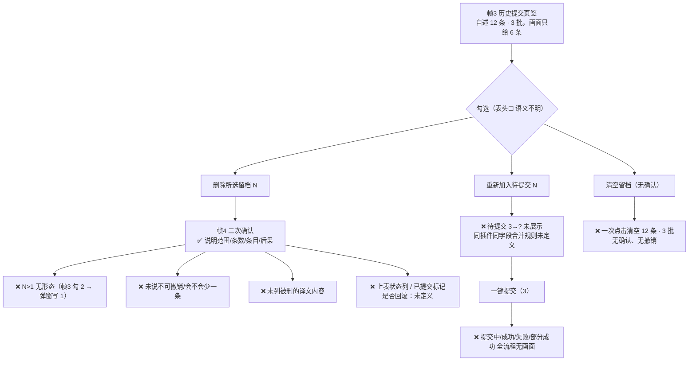

# 参与翻译（历史留档）界面还原图 · 启发式评审

**评审对象**：`ui-mockup-contribute-history.png`（4 帧，2×）+ 结构稿 `ui-mockup-contribute-history.html`
**方法**：Nielsen 10 项启发式 + 逐帧走查 + 跨帧一致性核对（SKILL.md 的严重度分级 0–4）
**未做**：未读仓库源码、未看 git、未修改任何文件；本报告正文即为交付物。

---

## 0. 结论先行

方向是对的：帧 4 的确认文案（说明范围、条数、具体条目、以及"交出去的译文不受影响"）可以当作这个插件里所有破坏性操作的文案范本；窗口里几乎所有按钮都带计数（`翻译所选（0）`、`待提交（3）`、`删除所选留档（2）`），状态可见性已经比一般插件好。

但有 5 个问题是设计定稿前必须处理的：

1. 窗口三件事里的第 ②（一键提交）**在四帧里完全没有结果画面**——没有提交中/成功/失败/部分成功的任何一帧。
2. **保护强度反了**：删一条"本地留档副本"要二次确认，而"清空留档"（12 条 / 3 批）和"清空待提交"（唯一的草稿副本）是裸按钮。
3. 帧 3 自己写着 `历史提交（12）`/`共 12 条 · 3 批`，**画面只到 6 条，且没有任何到达第 7–12 条的路径**（下栏没有滚动条，高度固定 158px，放大窗口也不长）。
4. 帧 3 的 `译文` 列被截断，**设计稿里没有任何只读看全文的入口**；唯一写明的入口"点插件名"是把这条重新加入待提交（会改数据）——"回看"这件事本身没有被设计。
5. 帧 1/帧 2 只展示了高度变化；按帧 1 的固定高度构成推算，**声明的 620×460 最小尺寸会让上表只剩一行左右的插件**，而这一帧没有画。

**Merge verdict：OK with notes（对设计稿 = 需按 P1 项修订后再进入实现）。** 严重度 4/3 ≈ P0/P1（必须在实现前补），2 ≈ P2（建议修），1 ≈ P2/P3（可选）。

---

## 1. 逐帧核对

### 帧 1（880×680，默认大小）
- 布局分工清楚：上表吃掉剩余高度、右侧有**明确的滚动条**（`.topwrap` + `.scroll .thumb{height:90px}`）说明"还有很多条"，下栏只占需要的高度。这个"上表可滚、底栏紧凑"的思路是对的。
- 上表 10 行，状态列只用两种：`你译`（绿）/`机器译`（蓝）。文字+颜色双编码，色盲可用性 OK。
- 筛选行把单选（全部/缺译文/机器译/我提交过/待复核）和多选（显示图标 / 连着已停用的库）并排放在一行，中间没有分隔（对比：操作行里用了 `│`），容易被当成同一组。
- **上表没有总条数**，而窗口其它地方全都在报数（`翻译所选（0）`、`待提交（3）`、`历史提交（12）`）。任务 ① 是"补缺译文"，玩家最想知道的"还有多少个没译"恰恰没有数字。
- 底栏四个动作里 `撤回` 没有宾语（撤回什么？），而上表同一窗口里叫 `撤回添加（0）`；`清空勾选`（只是取消勾选）与下栏的 `删除勾选`（删数据）只差一个字。

### 帧 2（880×900，拉高）
- 上表 10 → 16 行（多出 OBSPlugin、PixelPerfect、Weatherman、AutoRetainer、Lifestream、Pandora's Box），滚动条滑块变长（90 → 150），数据顺序与帧 1 完全一致，下栏 3 条不变——窗口变高时"上表变多、底栏不变"这个取舍是自洽的、渲染也没出错。
- 但要问一句：玩家把窗口拉高 220px，通常是因为**下面那栏更想看**（留档 12 条）。现在拉高对下栏零帮助，而真正需要空间的地方（12 条只显示 6 条）反而固定 158px（`.wsbody{height:158px}`）。上下两栏之间没有任何可拖动分隔。

### 帧 3（历史提交页签）
- 把日期页签合成一个页签 + 表格里带 `提交时间` 的方向是对的（比一排日期页签好）。
- `重新加入待提交（2）` 是蓝色主动作、`删除所选留档（2）` 是红色危险色，配色语义正确；两个计数都与 2 个勾选一致。
- **`译文` 列被截断**：第 2 行"一个运行时的模组加载与管理框架，可在不重启游戏的情况下热插拔…"，单元格是 `text-overflow: ellipsis`，没有任何查看全文/对照原文的入口。
- **条数对不上画面**：页签 `历史提交（12）`、提示 `共 12 条 · 3 批`，表格只有 6 行；6 行里只出现两个不同的时间（`09-22 12:30` ×3、`09-21 20:58` ×3），也就是说**第 3 批一条都没露出来**，而画面里没有任何"还有 6 条"的提示、滚动条或分页。
- **批次不可辨识**：批是这个界面的组织单位（"同一批相同"），但表里只有一列重复的时间值，没有分组头、没有批次级勾选、没有折叠；要"整批重新加入"只能逐条点。
- 时间列本身有两种含义（列头是批次提交时间，单条"什么时候写的"只在悬停可见），且没有年份（`09-22 12:30`）。
- 表头 `☐` 的语义不明：全选可见的 6 条，还是全选 12 条？旁边就是删除。

### 帧 4（删除留档二次确认）
- 文案是本图最好的一部分：标题问句（`删除所选留档？`）、说明范围（"把勾选的 1 条从本地历史留档里删掉"）、说清后果（"已经交出去的译文不受影响，词表也不会变；只是本地不再留这份记录"）、再点名具体条目（`09-22 12:30 提交 · Penumbra / 一行简介`）。三件事——删什么、影响什么、哪一条——全说了。
- 缺口：
  - 只覆盖 N=1。帧 3 里勾的是 2 条，帧 4 的弹窗写"勾选的 1 条"、只列 1 条，**对 N>1 没有任何形态**（列表 / "等 N 条"）。
  - 第二行只有"插件 / 字段"，**没有要删掉的译文内容**。删完本地就没有这条了，确认这一刻是唯一能给内容的机会。
  - 没说**不可撤销**，也没说历史列表会从 12 变 11；`词表也不会变` 里的"词表"对普通玩家是未解释的黑话。
  - 按钮 `[删除][取消]` 左红右灰，没有标默认项/键盘焦点；游戏内多为键盘或手柄操作，Enter/A 落在默认项上，默认项写在删除一侧风险偏高。
  - **弹窗期间底层页面被重排了**：与帧 3 比，筛选行少了"显示图标 / 连着已停用的库"，整行插件操作按钮（翻译所选 / 全选当前 / 清空勾选 / 添加到我的库 / 撤回添加）整行消失，上表只剩 4 行，历史表只剩 2 行且勾选内容也换了。弹窗不该重排底层页面。
  - 底栏 `删除所选留档（1）` 有 1 条勾选却呈灰化禁用态（HTML 里带 `disabled` 类），与帧 3 中 2 条勾选时可用、矛盾的计数/状态组合。

---

## 2. 问题清单

严重度按 SKILL.md 0–4：4=严重/会阻断或误导，3=主要可用性问题，2=次要，1=观感/低优先。

| ID | 启发式 | 界面/流程 | 现象与依据（帧号/位置） | 为什么重要 | 严重度 | 建议改法 |
|---|---|---|---|---|---|---|
| F01 | H1 系统状态可见性 | 一键提交 全流程 | 四帧没有任何提交中/成功/失败/部分成功的画面。`一键提交（3）` 是帧 1/2 底栏唯一入口，帧 3/4 无结果态 | 提交对象是维护者（外部、不可即时确认）。玩家长按/点完不知道发生了什么，失败更无从知晓——这是窗口三件事之一 | 3 | 补一帧结果态：进度 / 成功（`待提交 3→0`、`历史提交 12→15`）/ 失败可重试；上表状态列出现 `待复核` |
| F02 | H5 错误预防 | 帧 1/2 底栏 `清空待提交`、`删除勾选`；帧 3 `清空留档` | 只有 `删除所选留档` 有二次确认（帧 4）。`清空留档` 一次点击抹掉 12 条 / 3 批，`清空待提交` 抹掉 3 条草稿，都是裸按钮 | 保护强度反了：被确认框保护的是"本地留档副本"（已提交、别处还有），没被保护的是**未提交草稿——本地唯一副本** | 3 | 三个操作共用帧 4 的对话框（改成"清空 3 批共 12 条？"）；或给 `撤销` 提示条（本地数据，可做） |
| F03 | H1 / H6 / H8 | 帧 3 下栏表格 + 帧 2 放大 | 页签写 `历史提交（12）`、提示写 `共 12 条 · 3 批`，画面只有 6 行；下栏没有滚动条（对照上表右侧有滚动条）、没有"显示 6/12"、没有分页；`.wsbody{height:158px;overflow:hidden}`，帧 2 拉高 220px 下栏也不变大 | 玩家看不到也**不知道**还有 6 条，第 3 批完全不可达；留档越多越不可用，"整理留档"直接失效 | 3 | 下栏加滚动条（与上表同一套视觉语言）+ 标题写"显示 6 / 共 12"；上下两栏用可拖动分隔条（ImGui splitter）或让下栏按比例伸缩并设下限 |
| F04 | H6 识别优于回忆 | 帧 3 `译文` 列 + 下栏交互 | 第 2 行译文被截断为"…热插拔…"，设计稿无全文/原文对照入口；唯一写明的入口是提示里的"进去点插件名也能把这一条加回待提交"（会改状态） | 任务 ③ 是"回看"，但回看这一步看不到内容；只能靠一个会写数据的动作绕过去，等于"查看 = 修改" | 3 | 行点击 = 只读详情（原文 / 译文全文 / 写入时间 / 提交批次）；`重新加入待提交` 保持为独立按钮 |
| F05 | H5 / H8 | 最小窗口 620×460 | 四帧只有 880 宽。按帧 1 的固定构成（品牌行 + 标签 + 说明 + 搜索行 + 筛选行 + 视图行 + 操作行 + 页签 + 158px 表格 + 按钮行）合计约 420–440px，在 460px 高度里上表只剩表头（≈0–1 行插件）；搜索行（250px 输入框 + 范围标签 + 3 个复选）与帧 3 底栏的长提示（"共 12 条 · 3 批；进去点插件名也能把这一条加回待提交"）在 620 宽下会折行 | 玩家常把窗口拖小靠边放；此时主任务（找插件补译文）不可用，且折行会改变按钮位置 | 3 | 给上表最小高度（如 3 行）+ 窗口内容整体可滚动；长提示缩成"共 12 条 · 3 批"+`?`；补一帧 620×460 验证 |
| F06 | H4 一致性 | 帧 1/2/3 `待提交（3）` vs 帧 3 历史表前 3 行 | 待提交的 Penumbra 一行简介 / Penumbra 插件详情 / Questionable 插件名 与历史表第 1–3 行**逐字相同**（同插件、同字段、同译文），且历史侧同属 `09-22 12:30` 那一批 | 同一份内容既标"改过、还没提交"又标"已提交"；玩家会以为还要再点一次一键提交（界面自述重复提交同一批） | 2 | 修正样例数据（待提交换成没提交过的条目，或让历史那三条译文略有差异并说明"再改"） |
| F07 | H6 / H1 | 帧 3 时间列 | 列头 `提交时间` = 批次时间（"同一批相同"），单条写入时间只在**悬停**可见；同一列连续出现 3 个相同值；`09-22 12:30` 没有年份 | 玩家会把"提交时间"读成"我什么时候提交的这条"；相同值重复像数据出错；悬停信息在键盘/手柄下取不到；跨年留档无法分辨 | 2 | 列头改 `提交批次` 或把批次时间提到分组头；单条写入时间单独成列；时间补年份，悬停信息用可聚焦的提示代替 |
| F08 | H4 / H6 | 帧 3 下栏整体 | 界面以"批"为组织单位（`共 3 批`），但以"条"平铺：无分组头、无批次勾选、无折叠，也没有排序/筛选；页签计数只给总条数 | "整批重新加入 / 整批删除"是自然需求，逐条点无法扩展 | 2 | 按提交时间分组（分组头 = 时间 + N 条 + 整批勾选），或提供"按批次"视图与排序 |
| F09 | H5 / H9 | 帧 4 弹窗（N>1 未覆盖） | 帧 3 勾了 2 条，弹窗写"勾选的 1 条"并只列 1 条；对 N>1 没有任何形态 | 批量删除是多选后的常见路径，弹窗必须让人核对"到底删哪些"，否则只能回头看底层表格 | 2 | N=1 保持现状；N>1 列出前 3 条 + "等 N 条"，或提供可滚动的受影响条目列表 |
| F10 | H6 / H5 | 帧 4 弹窗第二行 | 只有 `09-22 12:30 提交 · Penumbra / 一行简介`，没有要删除的译文内容 | 删完本地就没有这条记录，确认瞬间是唯一能看到"删掉的是什么"的机会 | 2 | 补译文片段：`09-22 12:30 提交 · Penumbra / 一行简介：「运行时模组加载与管理器。」` |
| F11 | H5 | 帧 4 按钮 | `[删除][取消]` 无默认项/焦点标记；ImGui 里 Enter/手柄 A 常触发默认按钮，而默认位置在删除一侧 | 游戏内键盘/手柄操作多，误触即删 | 2 | 默认焦点给 `取消`，或删除需长按/二次输入；弹窗内注明 Esc 取消 |
| F12 | H1 / H9 | 帧 4 文案 | 只说"只是本地不再留这份记录"，未说明不可撤销、未说明历史列表 12→11；`词表也不会变` 的"词表"是未解释黑话 | 无法评估代价：要么不敢用这个功能，要么随手删掉 | 2 | 增一句"删除后本地无法恢复（重新提交才会再有记录）"；"词表"换成玩家听得懂的说法或直接不提 |
| F13 | H4 / H2 | 帧 1 搜索行 | 占位文字是"搜索插件名、原文、译文…"，但搜索范围只有 `插件名 / 一行简介 / 插件详情`；同时上表列头也叫 `插件名`，而"插件名"又是可被翻译的字段名（帧 3 字段列出现 `插件名`） | 同一词在"插件名称"和"被翻译的字段"两层含义之间摇摆，玩家不确定勾"插件名"到底搜什么 | 2 | 范围项改为 `插件名称 / 简介原文 / 简介译文 / 详情原文 / 详情译文`，或把占位文字改成与范围一致 |
| F14 | H4 / H7 | 帧 3 `重新加入待提交` | 是蓝色主动作，但没有说明：待提交里已有同插件同字段时是合并、覆盖还是新增一条；按下后 `待提交（3）` 变 5 还是不变，四帧都没给 | 玩家怕造出重复草稿而不敢点，这恰好是历史页的核心动作 | 2 | 勾选时即标注"待提交中已有"，或按钮旁说明合并规则，并补一帧按下后的状态 |
| F15 | H4 | 帧 1/2 上表操作行 vs 下栏 | `清空勾选`（只是取消勾选）与 `删除勾选`（删掉草稿）只差一个字、不在同一栏目但同屏；`撤回`（无宾语）与 `撤回添加`（有宾语）并存 | 一个取消选择、一个删数据，容易点错；`撤回` 不知道撤回什么（上一条修改？上一条提交？） | 2 | 统一术语并让动词带宾语：`取消勾选` / `移出待提交（删除所选草稿）` / `撤销上次修改` |
| F16 | H1 | 帧 1/2 上表 | 上表没有总条数或"缺译文 N 个"，而窗口其它地方都在报数（`翻译所选（0）`、`待提交（3）`、`历史提交（12）`、`删除所选留档（2）`）；右侧滚动条暗示还有很多条未显示 | 任务 ① 是补缺译文，玩家最需要的"还剩多少"没有数字；筛选切换（缺译文）后也无法判断剩多少 | 2 | 筛选行或表头加"共 N 个 · 缺译文 M 个"，随筛选实时更新 |
| F17 | H5 / H1 | 帧 3 表头 ☐ | 表头勾选框语义不明：全选当前可见的 6 条，还是全部 12 条？而它紧邻 `删除所选留档` | 在只显示 6 条的窗口里"全选 → 删除"可能删掉看不见的条目 | 2 | 勾选框悬停/下拉说明范围（"全选这 12 条（含未显示）"vs"仅可见 6 条"）；删除一律走确认框 |
| F18 | H1 | 帧 4 底层界面 | 弹窗期间底层与帧 3 不一致：筛选行少 2 个复选、整行插件操作按钮消失、上表 4 行、历史表 2 行且勾选不同 | 弹窗不应重排底层页面（空间记忆失效）；作为还原图也无法确认点删除时上下文是否还在 | 2 | 帧 4 复用帧 3 的底层，只叠加遮罩 + 弹窗，条数与勾选保持一致 |
| F19 | H4 | 帧 4 底栏 | 有 1 条勾选但 `删除所选留档（1）` 呈灰化禁用（HTML 带 `disabled` 类），而帧 3 有 2 条勾选时可用 | 计数与可用状态自相矛盾，玩家以为操作不可用 | 1 | 若表示"弹窗打开期间底栏冻结"，应整体一致处理并说明，不要只灰化这一个按钮 |
| F20 | H1 | 全四帧 | 缺少临界状态：待提交为空、留档清空后、提交失败后长什么样（哪些按钮禁用、空态文案）；`我提交过`/`待复核` 两个筛选在四帧里没有任何示例行，也没有状态图例 | 首次进入空窗口会以为出错；玩家不知道提交后自己会变成什么状态 | 1 | 补空态（待提交 0 / 历史 0）与状态图例，并让"一键提交"后上表出现一条 `待复核` 示例 |

---

## 3. 跨帧一致性核对

| 核对项 | 帧 1 | 帧 2 | 帧 3 | 帧 4 | 结论 |
|---|---|---|---|---|---|
| `待提交（N）` | 3 | 3 | 3 | 3 | ✅ 一致 |
| `历史提交（N）` | 12 | 12 | 12 | 12 | ✅ 一致 |
| `一键提交（N）` vs 待提交条数 | 3 / 3 | 3 / 3 | —（无该按钮） | — | ✅ |
| `翻译所选（0）`/`删除勾选（0）` vs 0 勾选 | ✅ | ✅ | — | — | ✅ |
| `重新加入待提交（2）` vs 2 勾选 | — | — | ✅ | 帧 4 显示（1）且勾 1 条 ✅ | ✅ |
| `删除所选留档（N）` vs 勾选数 | — | — | （2）/ 2 ✅ | （1）/ 1，但按钮**灰化禁用** ❌ | ❌ 见 F19 |
| 上表可见行数 | 10 | 16 | 10 | 4 | ❌ 帧 4 弹窗期间不应变（F18） |
| 下栏可见行数 vs 自述条数 | 3/3 ✅ | 3/3 ✅ | 6 / 声称 12 ❌ | 2 / 声称 12 ❌ | ❌ 见 F03 |
| 时间列出现的批次数 | — | — | 2 个时间戳 vs `3 批` ❌ | 1 个时间戳 | ❌ 第 3 批不可见（F03/F08） |
| 筛选行完整度（含 显示图标 / 连着已停用的库） | ✅ | ✅ | ✅ | ❌ 缺 2 项 | ❌ 见 F18 |
| 插件操作行（翻译所选…撤回添加） | ✅ | ✅ | ✅ | ❌ 整行缺失 | ❌ 见 F18 |
| 勾选行内容 | — | — | Penumbra 一行简介 + Aetherphone 一行简介 | Penumbra 一行简介 | ⚠️ 不冲突但弹窗只覆盖 1 条（F09） |
| 待提交内容 vs 历史内容 | 待提交 3 条 | 同 | 历史前 3 行与待提交逐字相同 | — | ❌ 见 F06 |
| 时间列含义（列头 vs 悬停） | — | — | 列头=批次时间、悬停=单条写入时间 | 同 | ⚠️ 见 F07 |
| `删除留档` 后果说明 | — | — | — | ✅ 说明清楚 | ✅ 本图最优点 |

---

## 4. 帧 3 → 帧 4 流程与缺口

---

## 5. 最严重的 5 个问题

1. **一键提交没有结果态（F01，severity 3）**——窗口三件事之一完全没有被设计。至少要有一帧表达"提交中 / 成功（计数回流：待提交 3→0、历史 12→15）/ 失败可重试"，以及提交后这条在上表变成什么状态（`我提交过`、`待复核` 两个筛选现在没有任何示例行）。
2. **破坏性操作的保护强度是反的（F02，severity 3）**——`删除所选留档` 有确认，`清空留档`（12 条 / 3 批）和 `清空待提交`（唯一草稿副本）没有。复用帧 4 的对话框即可，成本极低、收益最大。
3. **12 条只到 6 条且不可达（F03，severity 3）**——下栏高度固定 158px、无滚动条、无"还有 N 条"，拉高窗口也不帮助；而页签和提示都在宣称 12 条 / 3 批。玩家会以为记录丢了。
4. **"回看"这条任务实际做不了（F04，severity 3）**——留档译文被截断，无全文/原文对照；唯一入口是把该条重新加入待提交（会改数据）。查看与修改必须分开。
5. **最小尺寸 620×460 缺帧且按现有构成不可用（F05，severity 3）**——固定部分约占 460px 的 92%，上表只剩表头。建议补一帧最小尺寸，并给上表最小高度 + 窗口内容整体可滚。

---

## 6. 快速改善（低成本、收益明显）

- 用帧 4 的对话框**同时**覆盖 `清空留档`、`清空待提交`、`删除勾选`（改一下标题与条数即可）。
- 帧 4 第二行补上要删的译文片段；N>1 时改为列表（前 3 条 + "等 N 条"）。
- 弹窗加一句"删除后本地无法恢复"，并把 `词表` 换成玩家能懂的说法；默认焦点给 `取消`。
- 帧 3 下栏加滚动条 + 标题"显示 6 / 共 12"，或直接按批次分组（分组头 = `09-22 12:30 · 3 条` + 整批勾选）。
- 上表加"共 N 个 · 缺译文 M 个"；这也顺手解决了"筛选后还剩多少"。
- 统一术语：`取消勾选` / `移出待提交（删除所选草稿）` / `撤销上次修改`；把 `撤回` 补上宾语。
- 修样例数据：把待提交那 3 条换成没提交过的条目（现在与历史前 3 行逐字重复）。
- 帧 4 的底层复用帧 3（只加遮罩 + 弹窗），条数与勾选保持一致。

---

## 7. 需要重新设计、不是调颜色能解决的结构问题

1. **上下两栏的高度模型**：上表 `flex:1`、下栏写死 158px。应改为可拖动分隔（ImGui splitter）或两侧都有最小高度 + 各自滚动；否则"放大窗口"这个玩家动作对真正需要空间的内容毫无作用。
2. **留档的数据组织单位**：界面说"批"，交互只认"条"。需要批次分组（分组头 / 折叠 / 整批勾选 / 按批次排序筛选），否则"整理留档"在条数增长后不可用。
3. **同一窗口里的两套选择模型与两套措辞**：上表勾选 = 选插件（`翻译所选`、`清空勾选`），下栏勾选 = 选记录（`删除勾选`、`删除所选留档`）。必须用前缀或分区把"插件选择"和"记录选择"显式区分，并把动词统一到带宾语的形式。
4. **提交模型需要被界面表达**：`重新加入待提交` 后再次提交，是更新已有提交还是新增一条历史？提交后能否撤回、能否看出"已提交未合并"？现在四帧都没回答。这需要状态回流（上表状态列出现 `待复核` / 历史里标 `已合并` / `被拒`）而不只是加个按钮。
5. **查看与修改的解耦**：`点插件名 = 重新加入待提交` 这条规则把只读操作和写操作绑在一起，需要拆成两条路径。

---

## 8. 本次未能验证的点（局限）

- 这是一张静态还原图：悬停提示（帧 3 的"这条什么时候写的"）、键盘/手柄焦点、Enter 默认按钮、真实滚动行为都无法从图里验证，F07/F11 的结论基于设计稿里的文字与 CSS，未实测。
- 未读源码，因此"提交失败后计数怎么变""重复提交是否合并"这类问题只能标为"设计稿未表达"，不能断言代码行为。
- F05（620×460）是从帧 1 的固定高度构成推算的，不是观察到的一帧；建议由实现方按此尺寸实机核一遍。

**Merge verdict：OK with notes**——方向与帧 4 的确认文案值得保留；F01–F05（severity 3）应在实现前补齐，F06–F19（severity 2/1）建议一并修掉，其中 F02、F03、F06、F18 属于改动很小的"顺带修"。

---

（说明：按任务要求未写任何文件；报告正文即上，请归档到 `docs/hci/review-2026-09-22-contribute-history-heuristic.md`。本节与 SKILL.md 中"写 `docs/hci/heuristic-evaluation.md`"的默认输出不一致，以任务指定的归档路径为准。）