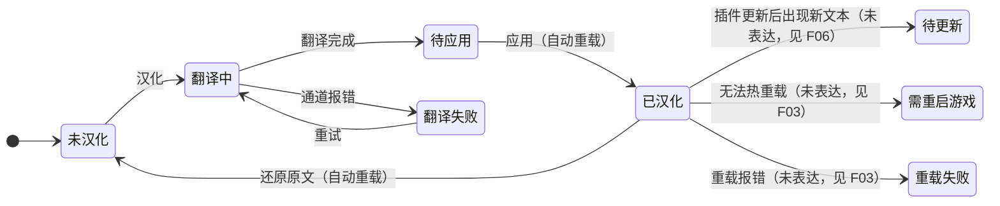

# 启发式评审 — FireGaze「插件汉化」改版（列表 + 一键汉化 / 编辑校对 / 翻译设置）

> **评审类型**：盲评（heuristic evaluation）。只看还原图与还原图 HTML，未阅读实现代码。
> **评审对象**：
> - `Resources/ui-mockup-uitext-list.png`（帧 1 默认列表 / 帧 2 展开详情 / 帧 3 进行中 / 帧 4 收尾三态）及同名 HTML
> - `Resources/ui-mockup-uitext-editor.png`（帧 1 编辑校对 / 帧 3 翻译设置独立窗口）及同名 HTML
> **方法**：Nielsen 十项启发式 + 严重度评级（本报告用 P0–P3，与评审方法的 0–4 分对照见下）。
> **口径**：P0 = 阻断或严重误导（≈4 分）；**P1 = 发布前必须改**（≈3 分，主要可用性问题）；P2 = 应改（≈2 分，次要问题）；P3 = 可选/装饰级（≈1 分）。
> **启发式编号**：H1 状态可见 / H2 贴合现实 / H3 用户控制与自由 / H4 一致性与标准 / H5 防错 / H6 识别优于回忆 / H7 灵活与高效 / H8 审美与极简 / H9 错误识别·诊断·恢复 / H10 帮助与文档。

**素材与局限（先声明，避免误读）**

1. 列表图第 4 帧（完成/失败/没文本）在我收到的 PNG 渲染中被截断，该帧的逐条依据取自同名 HTML 源码；涉及视觉密度、换行与字号类判断标注「需实机确认」。
2. 悬停、键盘、滚动、ImGui 实际字号与窗口尺寸行为无法从静态图验证，相关条目均已标注「需实机确认」。
3. 编辑器图自称 3 帧（帧 1 编辑校对 / 帧 2 设置入口 / 帧 3 翻译设置），实际只画了帧 1 与帧 3，缺帧 2；不影响本次结论，但复验图集应补齐（项目已有「还原图必须与实现同序同数」的教训）。
4. 图中 `###FireGazeUITextEditor`、`###FireGazeUITextSettings` 之类的标题串按还原图注记处理，不计为问题。

---

## 与本次改版目标的对照（先确认达标情况，再进入问题）

| # | 改版目标 | 还原图结论 |
|---|---|---|
| 1 | 列表带图标、标题、一行简介，点开有详细介绍 | **达成**。行结构为「图标 + 名称 + 一行简介 + 版本/内部名 + 状态徽标 + 操作 + 展开箭头」，展开后有作者简介与统计。图标在还原图里是字母占位块，实机应接插件真实图标 |
| 2 | 列表上直接点「一键汉化」完成 | **达成**。行内主按钮 + 行内进度（翻译 N/M + 取消），不需要进二级窗口 |
| 3 | 翻译配置移到「设置」，不在流程里改 | **达成**。列表工具条只有「翻译设置…」，编辑器只在状态行显示「通道：deepseek」 |
| 4 | 自动重载；可合并的步骤不展示成步骤 | **部分达成**。重载不再作为独立按钮出现；但「重载结果」只画了成功一种（见 F03），且进度行的「写入补丁并重载插件」仍是过程叙述 |
| 5 | 去掉不必要的按钮 | **部分达成**。行内最多 2 个按钮，符合预算；但「还原原文」与主操作并列（见 F07），编辑器仍是 4 按钮 + 「更多 ▾」 |

---

## ① 一句话总评

方向是对的——把汉化收成行内一步、进度画在行里、配置移出流程；但当前还原图在**导航命名**、**主操作命名**、**重载结果的状态模型**三处不够硬：三个汉化类页签无法区分、同一个动作有三套名字、而「重载」最会出问题的那些分支（无法热重载 / 重载失败 / 插件更新后有待更新文本）一个都没画出来。

---

## ② 逐条发现

### P1 — 必须改（发布前）

| ID | P | 位置 | 问题与证据 | 启发式 | 为什么要紧 | 建议 |
|---|---|---|---|---|---|---|
| F01 | P1 | 主窗口页签行（两队图全部帧） | 页签为「**简介汉化** ｜ 仓库体检 ｜ 插件安装器 ｜ 参与翻译 ｜ **插件汉化**」。「简介汉化」「插件汉化」「参与翻译」三个都与翻译有关，字面上无法判断哪个翻的是**界面文本**、哪个翻的是**简介/详情**、哪个是去贡献共用语料。页首说明只解释了本页做什么，没做跨页区分 | H2、H4、H6 | 首次使用的用户会进错页签，然后在错误的位置找「一键汉化」；两页的行结构、按钮、术语又不同，进错一次很难自查 | 三条路任选：① 把本页改名「**界面文本汉化**」、旧页改名「**简介汉化**」并给每页加 tooltip；② 合并成一个「汉化」页签，内部分「界面文本 / 简介」两个子段；③ 至少在页首说明里写清「本页只管插件界面上的文本；插件简介请到「简介汉化」」 |
| F02 | P1 | 列表行操作按钮 + 页首 hint | 同一个动作出现四种名字：`一键汉化`（BOCCHI）、`应用汉化`（Orbwalker/Moodles）、`更新汉化`+`还原原文`（已汉化行）。页首指引却只写「点『一键汉化』」——而列表里大多数行并不叫这个名字。「应用汉化」是否也包含翻译，用户无法从字面判断（实际只负责写入） | H2、H4、H10 | 主操作是整页的核心路径，命名分裂会把「该点哪个」变成一道阅读题；页首与行内对不上，属于一眼可见的不一致 | 统一一套「动词 + 宾语」的按钮词表：未翻译 →「**汉化**」；已翻译待应用 →「**应用**」；已汉化且插件更新过 →「**重新汉化**」；已汉化且无变化 → 只留「还原原文」或折叠次级。把「一键」这类卖点词只保留在页首说明里 |
| F03 | P1 | 帧 4 收尾行 + 徽标 | 只画了成功路径，且写成无条件承诺：「已汉化 255 处 · **已重载**」「一键汉化完成：翻译 255 条 · 写入补丁 255 处 · **插件已重新加载**。」现实里至少还有两支：**写入成功但插件无法热重载 / 需重启游戏**、**重载失败**（可重试）。此外「已重载」是把一次性事件写进持久徽标，用户过一会儿再看到这行会以为刚刚重载过 | H1、H5、H9 | 静态改 DLL 的插件存在不能安全热重载的情况（尤其带壳插件，这是本项目已知领域事实）；缺这两个状态时用户会遇到「汉化说完成了但界面还是英文」，而界面没有任何解释出口 | ① 徽标只留持久事实（`已汉化 N 处`，单位见 F18）；② 收尾行按三态写：`已自动重载，界面可立即使用` / `已写入；该插件无法热重载，重启游戏后生效` / `重载失败：<原因>，点「重试」`；③ 把「需要重启」做成一个可被 F04 过滤的状态 |
| F04 | P1 | 工具条（搜索 / 只看第三方 / 已装 198 · 已汉化 12） | 没有任何按汉化状态的筛选或排序。用户最常见的任务是「找出还没汉化的 / 失败的 / 待应用的」，在 198 项列表里只能靠滚动和肉眼扫徽标；`已装 198 · 已汉化 12` 计数是纯文本，不可点 | H6、H7 | 列表越大，找不到目标越像「功能不存在」；88% 未汉化的比例下，这一条直接决定用户能不能把功能用起来 | 加一个最小的状态筛选（下拉或分段：`全部 / 未汉化 / 失败 / 待应用 / 已汉化`），或让 `已汉化 12` 这个计数可点击变成筛选；同时给徽标列加排序 |
| F05 | P1（需实机确认） | 编辑器表格状态列（帧 1） | `Casters → 法系` 这类行只给了一个 ⚠ 符号，没有任何就地解释或图例；同列还有 ✔ 与 ·。它显然在提示某种风险（可疑译文 / 与键名或比较用串冲突），但用户读不出含义 | H1、H9 | 这是安全性提示：要么用户忽略它、要么不敢动。两者都削弱「编辑校对」页存在的意义 | 悬停给原因（一句话 + 建议动作）；表格上方或表头旁给最小图例；若该行需要用户决策，在行内给一个明确的「确认可用 / 改为不翻」动作。悬停行为需实机确认 |

### P2 — 应改

| ID | P | 位置 | 问题与证据 | 启发式 | 为什么要紧 | 建议 |
|---|---|---|---|---|---|---|
| F06 | P2 | 已汉化行的徽标 + 「更新汉化」 | 已汉化行的徽标是 `已汉化 11 处` / `已汉化 786 处`，没有任何「插件更新后出现了新文本」的信号；用户不知道该不该点「更新汉化」，大概率永远不点或每次都点 | H1、H6 | 汉化是长期维护型功能：插件一更新，旧译文就可能漏掉新串。没有「有待更新」信号，汉化会静默过期 | 检测到差异时把徽标切到 `已汉化 786 处 · 有 3 处新文本`，并让「重新汉化」成为唯一高亮按钮；无变化时该按钮置灰或收进展开区 |
| F07 | P2 | 已汉化行的「还原原文」 | 「还原原文」与主操作同级并列，点下去会改文件并触发插件重载，但没有任何确认或范围说明（只影响这一个插件？备份是否重下？重载是否现在发生？） | H3、H5、H8 | 它可逆，所以不是灾难；但它与主操作同权重会增加误触与心理负担，也与「最多两个按钮、去掉不必要按钮」的收敛方向相斥 | 把「还原原文」降级到展开区（与「编辑校对」同排），或保留行内但加一次确认，写清「会重载该插件，界面回到英文；可再次汉化」 |
| F08 | P2 | 帧 4 失败行 | 失败文案是「翻译通道不可用：**免费接口被限流（429）**。到『翻译设置』里换成大模型（自填 key）后重试，已经翻好的 12 条不会丢。」——文案把失败原因写死成「免费接口限流」，若用户正在用大模型 key 且因其它原因失败（余额、网络、代理），这就是错误诊断；同时「去翻译设置」只是一句话，没有就地入口 | H6、H9 | 错误恢复路径是「一键汉化」闭环的一部分；让用户自己去找菜单、还给出可能错误的原因，会把一次失败放大成一次困惑 | ① 失败原因按实际通道与错误码生成，分别覆盖：免费通道限流 / key 无效或余额不足 / 网络或代理失败 / 超时；② 行内直接放一个「打开翻译设置」按钮，「重试」旁注明将沿用当前通道 |
| F09 | P2 | 帧 3 进行中行的「取消」 | 按钮只有「取消」二字，没有说明取消后已翻的 137 条是否保留、补丁是否会被写入、能否稍后继续 | H3、H5 | 用户在有进度的长任务里点取消前会犹豫；点完之后的实际结果又与预期不符时，会直接影响对整条功能的信任 | 取消前给一句确认或就地说明：「取消只停止翻译，已翻的 137 条会保留，可稍后继续」 |
| F10 | P2（滚动需实机确认） | 帧 3 全窗 | 进度只画在那一行里。列表很长时用户一滚动就看不到进度；也没有任何窗口级的状态行说明「当前有任务在跑」，更没说同时能不能再对第二条插件发起汉化（并发会翻倍消耗额度、更容易撞限流） | H1、H7 | 长任务的可控感来自「随时能看到」。滚出视野后用户会不知道还在不在跑，重复点击或被限流都可能发生 | 在窗口底部或工具条下加一行常驻状态：`正在汉化：BOCCHI 137/255 · 取消`；并明确并发策略（同时只跑一条 / 排队），把它写进界面而不是留在实现里 |
| F11 | P2 | 列表页首 / 主操作附近 | 首次使用前没有明确告知「汉化会修改插件文件」。备份信息（`补丁：未应用（原始文件已备份）`）只出现在展开区，不展开就看不到 | H1、H5 | 这类「改本机文件」的动作需要事前知情，否则用户发现插件目录被动了会直接失去信任；知情也有利于放心点主按钮 | 页首说明里加一句「会写入插件文件，原文件自动备份，可随时还原」；或首次点击时一次确认（只出现一次） |
| F12 | P2（需实机确认） | 编辑器写操作 | 还原图里可见的写操作只有工具栏的「批量翻译未翻 / 应用汉化 / 还原原文 / 更多 ▾」；「标记不翻」「重新抽取」等只出现在 caption 或「更多」里，表格行上看不到任何写入口（右键菜单？悬停？） | H6、H10 | 编辑校对页的价值就是逐条改；写入口若全靠记忆与猜，页面就只剩「看」 | 行内或右键菜单显式给「改译文 / 标记不翻 / 还原此条」，并在表头附近给一行操作提示；具体交互形式需实机确认 |
| F13 | P2 | 翻译设置窗口 | 「大模型」整块（DeepSeek/其它兼容、接口地址、模型、API key、保存/清除/测试连接）在通道选「免费·自动 / Google 免 key / MyMemory」时依旧完整可见可编辑，层级关系只有一个不显眼的缩进；选了 **DeepL** 则完全没有任何可配置项（死路） | H5、H8 | 「我现在选的这条通道到底需要填什么」是设置页唯一的任务，层级不清会让用户填了不该填的、或找不到该填的 | ① 按所选通道显示对应配置区（其余禁用或折叠）；② DeepL 补 key 字段，或先隐藏该选项直到支持；③ 免费通道的限流说明只在选中免费通道时出现 |
| F14 | P2 | 翻译设置 → API key | 字段里显示「已保存（sk-…4f2a），要换就粘贴新的」。把一整句状态说明当字段内容，用户既不确定「现在到底有没有保存 key」，也可能把这句话误当值保存 | H5、H6 | key 是这条功能唯一的凭据类设置，错一次就是一路失败；这类字段的状态必须一眼可辨 | 用「掩码值 + 更换/清除按钮」的范式，或字段内只放灰字占位（`粘贴新的 key 以更换`），另用一行明确写「当前：已保存 sk-…4f2a / 未保存」 |
| F15 | P2 | 翻译设置 → 选项 + 保存语义 | ①「插件更新后自动重打汉化补丁」默认勾选，但没有任何说明它何时触发、会不会重载插件、能不能关；② 设置窗口没有保存/生效时机的说明，而编辑器里明确写了「自动保存」 | H1、H4、H5 | 默认打开一个会自动改文件的行为而用户不知情，是信任风险；同一产品的两个窗口对「保存」的说法不一致，会让人反复找「应用」按钮 | ① 该选项下加一行：触发时机（插件更新后 / 启动时）+ 会产生重载 + 可随时关闭；② 两个窗口统一声明「设置立即生效并自动保存」，或提供明确的关闭语义 |
| F16 | P2 | 列表主操作（一键汉化 / 应用汉化） | 汉化会重载目标插件，但页面上没有任何提示它可能打断该插件正在做的事（挂机、副本、长任务） | H5、H1 | 在本项目语境里，重载打断插件任务是有真实代价的（例如正在跑的任务直接停住），用户点之前需要知道 | 页首 hint 或首次确认里加一句「汉化会立即重载该插件；如果它正在执行任务，请先停一下」；成本极低 |
| F17 | P2（需实机确认） | 编辑器：批量翻译之后 | 编辑器提供两段式路径（「批量翻译未翻」→「应用汉化」）。还原图只画了静置态，没有画批量翻译完成后的样子：状态行如何变、是否提示下一步、是否把「应用汉化」提为主按钮 | H1、H6 | 用户很容易以为「翻译完 = 生效了」，回到游戏发现还是英文，就会来报 bug | 翻译完成时在状态行写 `已翻译 78 / 78 · 尚未应用，点「应用汉化」写入并重载`，并临时高亮「应用汉化」；确认真实行为需实机确认 |

### P3 — 可选 / 打磨

| ID | P | 位置 | 问题与证据 | 启发式 | 为什么要紧 | 建议 |
|---|---|---|---|---|---|---|
| F18 | P3 | 全界面 | 单位与表述混用：`翻译 255 **条** · 写入补丁 255 **处**`（同句内混用）、`已汉化 11 **处**`、`已翻译 65 **条**`、`已翻 65`、`候选 78 **条**` | H4 | 数字化界面里单位是「同一件事」的证据；混用会让用户怀疑计数器口径不同（事实上可能确实不同，那就更要说清） | 定一个基准单位（建议：文本=**条**，界面出现位置=**处**，两者都在 tooltip 里定义），全界面替换；「已翻/已翻译/已汉化」统一到一到两个词 |
| F19 | P3 | 列表展开区 + 编辑器筛选 | `候选 / 灰名单 / 未翻 / 不翻` 是术语族，其中只有「灰名单」在翻译设置里有一句解释，列表页与编辑器页都没有；编辑器的筛选标签也没有计数 | H2、H6 | 术语不解释，筛选就没有意义；带计数的筛选能让用户直接决定去哪一栏 | 筛选标签加计数（如 `未翻 13`）与 tooltip；「灰名单」的解释从设置页复制一句到编辑器筛选区 |
| F20 | P3 | 列表工具条 | 搜索占位符「搜索插件名 / **内部名**…」中的「内部名」是开发者术语 | H2 | 普通用户不知道内部名是什么，会以为自己可以忽略一半提示 | 改为「搜索插件名…」，把内部名可用写进 tooltip |
| F21 | P3 | 编辑器工具栏 | 「批量翻译未翻 (13)」读起来生硬，且与列表页的动作词不属于同一族 | H2、H10 | 工具栏首个按钮的措辞直接影响理解速度 | 改「翻译剩余 13 条」或「翻译未翻（13）」 |
| F22 | P3 | 列表页首 hint | 说明写「把插件界面上的**英文**翻成中文」，但功能实际会处理非中文文本（日语等也在范围内） | H2 | 文案与能力不符，用户会认为日文插件不受支持 | 改「把插件界面上的非中文文本翻成中文」；或按实际能力写「英文 / 日文」 |
| F23 | P3 | 帧 2 展开区 | 「普通用户看这里就够：点上面的『应用汉化』，插件会自动重载，界面立刻变中文。」这类教程口吻的句子夹在作者简介与统计之间（若为会发货的正式文案） | H8 | 混排会稀释展开区的信息结构：简介、统计、指引、来源四种内容叠在一起 | 指引移到页首 hint（已有类似句子，可合并），展开区只留简介 + 统计 + 操作 + 来源 |
| F24 | P3（需实机确认） | 编辑器工具栏 | 「还原原文」以禁用态出现且无任何解释（项目惯例是禁用按钮允许悬停看 tooltip） | H10 | 新用户会不知道它是永久不可用还是因为当前没有补丁 | 悬停写明「当前没有已应用的补丁，无需还原」 |
| F25 | P3（需实机确认） | 帧 4 第三行徽标 | `没找到可翻译的界面文本` 是一句完整的话，和其它行的短徽标（未汉化 / 已汉化 N 处）不同构，窄窗口下有换行或挤压风险 | H4、H8 | 徽标列结构不整齐时，整张列表的扫描节奏会被打断 | 徽标改短标签 `无可译文本`，把「主程序集带壳/加密」的解释留在展开行（该行已有） |
| F26 | P3（需实机确认） | 翻译设置 | 「测试连接」的结果反馈形态未设计：成功/失败写在哪里、失败给不给原因（401/余额/网络）都没画 | H1、H9 | 设置页少有的主动验证动作，反馈不清楚等于白按 | 在按钮右侧就地给一行结果（成功绿字 / 失败红字 + 原因），失败时保留 key 不清空 |
| F27 | P3 | 列表 | 没有批量入口（「汉化所有未汉化」或勾选多个批量汉化）。198 项插件逐个点的成本较高 | H7 | 只影响重度使用，不影响首次路径；作为效率机会列出 | 可选：多选 + 批量汉化（必须带限流与确认），或先提供「汉化所有未汉化（N）」并说明会依次进行 |

**状态模型缺口示意**（实线 = 还原图已表达，虚线 = 还原图未表达）：

---

## ③ 必须改（P1 及以上）清单 — 按优先级排序

| 优先级 | ID | 一句话 | 最小改法 | 复验点 |
|---|---|---|---|---|
| 1 | F01 | 三个汉化类页签无法区分 | 重命名本页为「界面文本汉化」/ 或在页首写清两页分工；每页加 tooltip | 冷启动用户在不提问的情况下能一次点对页签 |
| 2 | F02 | 主操作四套名字 + 页首指引对不上 | 落一张 4 词按钮词表（汉化 / 应用 / 重新汉化 / 还原原文），页首只引用词表里的词 | 页首出现的每个按钮名，都能在至少一行里原样找到 |
| 3 | F03 | 重载结果只有成功态，且「已重载」写进持久徽标 | 补「需重启游戏」「重载失败可重试」两个收尾状态；徽标只留持久事实 | 为这两态各出一帧还原图并实现；徽标不再含一次性事件词 |
| 4 | F04 | 198 项里无法按状态找插件 | 加状态筛选（至少：未汉化 / 失败 / 待应用）或让计数可点 | 任务「找出失败的那一条」在 5 秒内可完成 |
| 5 | F05 | 编辑器 ⚠ 只有符号没有含义 | 悬停原因 + 表头图例 + 行内决策动作 | 悬停可读出一条完整原因；实机验证 tooltip 存在 |

其中 **F01 / F02 是文案与信息架构层面的改动，成本最低、收益最高**；F03 需要先定状态词表再画图，属于设计工作量最大的一条。

---

## ④ 改完以后建议怎么复验

**A. 图集补齐（出第二版还原图时必须包含）**

1. 补三张新状态的帧：`已写入但无法热重载 / 需重启游戏`、`重载失败可重试`、`插件更新后「有 N 处新文本」`。
2. 补编辑器「批量翻译完成、尚未应用」的帧（见 F17）。
3. 补设置窗口的三态帧：选中免费通道 / 选中大模型 / 选中 DeepL（或该项被隐藏）。
4. 补一张最小窗口帧（项目惯例 620×460）与一张长列表滚动帧；编辑器图的自称帧数（3）与实际帧数（2）对齐。
5. 出图后做一次「图 vs 实现」逐项对照（按钮名、计数、行数、勾选态必须闭合）——这是项目已有的教训，别再犯。

**B. 评审复验**

1. 按项目惯例跑两路盲评（heuristic + cognitive-friction）复评第二版图，重点确认 5 条 P1 是否消解、有没有新增。
2. 对第二版图再做一次「术语一致性」扫描：列出全界面的动作词（汉化/翻译/应用/更新/还原）、单位（条/处）、状态词（候选/灰名单/未翻/不翻/已翻/已汉化），机械核对是否与词表一致。这一步不依赖实机，可以先做。

**C. 实机确认清单（静态图无法验证的部分）**

- F05：⚠ 的悬停原因是否存在、文案是否够用。
- F12：表格行的写操作入口（右键/悬停/行内）是否可发现。
- F17：批量翻译完成后的真实状态与提示。
- F24：禁用按钮的 tooltip。
- F26：「测试连接」的反馈位置与内容。
- F09 / F10：取消的实际行为；滚动出视野后任务状态是否还能看到。
- 字号与密度：13px 灰色统计/提示文字在实机缩放下的可读性；长徽标（F25）在窄窗口是否换行。

**D. 任务型验收（3 个任务，各 5 次，记录误点与耗时）**

1. 「把一个未汉化的插件汉化好」——目标 ≤2 次点击；记录误点「简介汉化」页签的次数（F01）。
2. 「找出当前翻译失败的插件」——是否必须滚动超过两屏（F04）。
3. 「把 Simple Tweaks 还原成英文，再重新汉化」——记录是否被「还原原文」的位置或确认缺失绊住（F07）、以及是否理解「重新汉化」的含义（F02）。

---

## ⑤ 方法要求的收尾总结

**Top 5 最高严重度问题**：F01 页签命名冲突 → F02 主操作命名分裂 → F03 重载结果状态不全 → F04 无状态筛选 → F05 ⚠ 无解释。这五条覆盖了「进对页面 → 找对按钮 → 看懂结果 → 找到目标 → 读懂风险」整条主链。

**Quick Wins（半天内可完成，不依赖实机）**：F02 统一按钮词表；F18 统一单位；F25 徽标改短标签；F22 页首文案改「非中文」；F14 key 字段改掩码/占位范式；F13 让「大模型」区随通道启用；F08 失败行加一个「打开翻译设置」按钮；F15 给自动重打补丁加一行后果说明。

**需要重设计而不是视觉微调的结构性问题**：
1. **汉化功能的 IA**（F01）：现有五个页签里三处与翻译相关，这不是改词能解决的，需要先明确「界面文本 / 简介文本 / 共用语料」三者关系，再决定是分页、合并还是子标签。
2. **汉化全生命周期的状态模型**（F03 + F06 + F17）：成功、需重启、重载失败、待更新、翻译失败、待应用——应当先有一张统一的状态词表/状态机（见上图），再让列表徽标、收尾行、编辑器状态行共用同一套词；逐帧打补丁式补状态会继续漏。
3. **列表作为导航的能力**（F04 + F10）：198 项列表需要「筛选 + 排序 + 全局任务状态」三件套才能撑住日常使用，而不是只靠滚动和行内徽标。
4. **设置窗口的层级与生效模型**（F13–F15）：通道选择与其配置块、自动重打补丁、保存语义目前是平铺的，需要按「选哪条通道 → 它要什么 → 什么时候生效」重组。

DONE C:/everyone/FireGaze-Refactor/docs/hci/review-2026-10-01-uitext-redesign-heuristic.md
