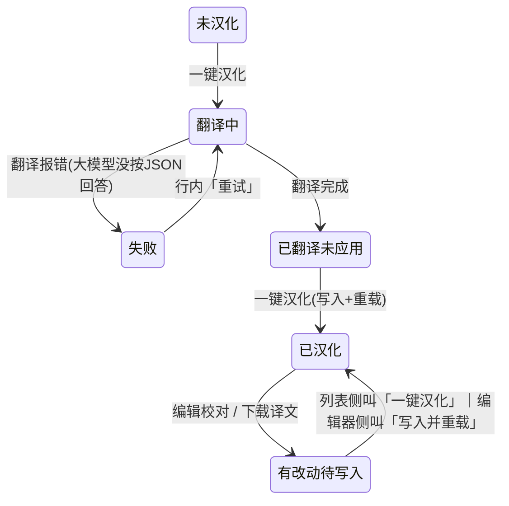

# 启发式评估 · 定向复评 — FireGaze「插件汉化」v4 还原图（2026-10-02）

> **评审方式**：fresh-context `reviewer` 子代理「定向复评」——只判定上一轮 v3 的 P1 是否消解、只扫描本轮修改引入的新问题；对上一轮已认可的部分不重审。
> **评审对象**：`Resources/ui-mockup-uitext-v4-list.{png,html}`（帧 1 列表 / 帧 2 展开详情 / 帧 3 上传确认框 / 帧 4 应用云端译文差异框）、`Resources/ui-mockup-uitext-v4-windows.{png,html}`（帧 5 编辑校对 / 帧 6 翻译设置）。
> **对照**：上一轮 v3 报告 `review-2026-10-02-uitext-v3-heuristic.md`（本报告由评审员按任务书里的清单逐条判定，未让评审员读旧报告，保持独立）。
> **口径**：P0 = 阻断或严重误导（0–4 的 4）；P1 = 发布前必须改（3）；P2 = 应改（2）；P3 = 打磨（1）。
> **局限**：悬停 / 滚动 / 键盘 / 真实字号与窗口尺寸行为无法从静态图验证，相关判断统一标注「需实机确认」。

---
## 评审范围与限制（先声明）
- 只看：`Resources/ui-mockup-uitext-v4-list.png/.html`（帧1–4）、`Resources/ui-mockup-uitext-v4-windows.png/.html`（帧5–6）+ 指定 skill（`heuristic-eval/SKILL.md`）。**未读实现代码、未读 docs/hci 旧评审、未读 v3/v2 图**（因此「是否本轮引入」我按帧内证据判定，对个别可能与 v3 同源的项明确标注，不臆断）。
- 工作树事实（`watchdog_diff`，全仓 stat）：无已暂存/已修改的跟踪文件，仅 4 个未跟踪的 v4 还原图文件。
- 严重度：P0=4 / P1=3 / P2=2 / P3=1；启发式编号 H1–H10 为 Nielsen 十项。
- 静态图不可见：悬停 / 滚动 / 键盘 / 真实字号与 DPI / 窗口尺寸；相关判断一律标「需实机确认」。

---

## ① 一句话结论
**上一轮定级 P1 的 11 条中 9 条完全消解、2 条（D2、E3/E4）部分消解；本轮未引入新的 P1（新增 9 个 P2 + 7 个 P3，全是文案/口径/冗余类），可以继续，但建议发布前顺手改掉 N1、N2、N4 三条。**

---

## ② 定向清单逐条判定

| 项 | 判定 | 证据（帧 + 图上原文） | 残留 / 条件 |
|---|---|---|---|
| **L1** 上传无确认与范围说明 | **已消解** | 帧3 新框：标题「上传译文到公共库」；「把「AutoHook」已经翻好的 981 条译文上传到社区公共库。」「人工 12 条 · 机器 969 条；只含原文、译文与代码位置，不含账号信息与 key。」「上传后会成为一个 GitHub 公开 issue，维护者收录后所有玩家都能直接下载。」按钮「上传」（普通灰）/「取消」（带焦点描边 = 默认焦点在取消）；人工12+机器969=981 与帧2 云端「981 条」一致 | 未写目标仓库/链接、未写以谁的名义提交（N14-说明缺口，P3）；无「先预览/只传人工译文」入口（N9，P2） |
| **L2** 失败恢复路径过长 | **已消解** | 帧1 Aetherphone：第一行红字「翻译失败：大模型没有按 JSON 回答」+ 第二行灰字「已翻好的 1641 条不会丢；点「重试」接着翻，或到「翻译设置」换一条通道。」+ 行内「重试」「翻译设置…」 | 新问题 N2（该行的蓝色主按钮仍是刚刚失败的「一键汉化」，与文案指引竞争，P2） |
| **L3** 失败/待写入无聚合计数 | **已消解（主诉求）** | 帧1 工具栏右：「刷新于 18:42:10 · 已装 198 · 已汉化 15 · 待处理 2」，2 = Aetherphone(失败) + AetherDraw(待写入) | ①状态下拉只有「全部 ▾」，是否含「不汉化」**图上不可判定**（R1）；②计数无单位（「已汉化 15」vs 行内「已汉化 981 条」，N10 P3）；③进行中的 AetherBlackbox 不计入「待处理」且无口径说明（并入 N10） |
| **L6** 名单徽标与「未汉化」曾同款 | **已消解** | 帧1 DailyRoutines 徽标「中文插件 · 不汉化」为浅蓝（`--info #9ec2f0`），AutoHunt「未汉化 · 候选 21 条」为灰（`--muted #a6a6a6`），肉眼可辨；帧2 同一色 | 浅蓝同时用于「翻译中 302 / 964 条」「已翻译 1641 条 · 未应用」→ 色义不唯一（N11 P3，文字标签仍可区分） |
| **L7** 单位混用（处/条） | **已消解** | 两个 HTML 全文检索无作量词的「处」（仅「三处确认框」注释与「待处理」词内出现）；帧1「已汉化 981 条 / 已翻译 1641 条 / 候选 21 条 / 已汉化 252 条 / 翻译 302 / 964 条」，帧2「候选 1083 条 · 已翻译 981 条 · 未翻译 102 条 · 不翻 0 条」，帧5「共 1083 条」「显示 1083 / 共 1083 条」，帧6「已就绪 31701 条」 | 工具栏计数缺单位（N10 P3） |
| **D1** 文案指引到不存在的控件 | **已消解** | 帧1 DailyRoutines 行确有「还原原文」「详情」；帧2 展开文案「检测到以前打过汉化补丁：点这个插件的「还原原文」即可恢复原版。」与控件同名同义 | 无补丁记录时该按钮是否隐藏/置灰，图上不可判定（R5）；同列「还原原文」字重不一致（N12 P3） |
| **D2** 「下载并应用」与「下载后点一键汉化」自相矛盾 | **部分消解** | 按钮已改名：帧2 云端行「下载译文」✓；「要重打」状态可见：帧1 AetherDraw 徽标「已汉化 252 条 · 有改动待写入」、帧2 小字「（本机改过的译文不会被覆盖；下载后点「一键汉化」重打补丁生效）」、帧5 状态串「尚未写入插件（点「写入并重载」生效）」✓ | **写入动作仍有两个名字**：列表侧叫「一键汉化」，编辑器侧叫「写入并重载」，且该行主按钮名不点明「写入」→ N1（P2，可上浮 P1） |
| **E1** 图例与实际 6 符号不符 | **已消解** | 帧5 三行图例：「状态列：✔ 人工译文 ｜ ⚙ 机器译文 ｜ ⚠ 待复核（悬停看原因）」「? 灰名单（默认不翻）｜ ⛔ 不翻 ｜ · 未翻译 ｜ 编辑完点「写入并重载」」「右键行：翻译这一条 / 标记不翻 / 清除译文 / 复制」——6 个符号齐全，表格 6 行样例一一对应 | ⚠ 样例自相矛盾（tooltip 说「占位符对不上（{0}）」但原文「Error, Try renaming」无占位符）→ N13 P3；tooltip 可达性/字形覆盖需实机确认（R6、R9） |
| **E3/E4** 统计口径与筛选计数不自洽 | **部分消解** | 帧5 表头「共 1083 条：候选 1049（文字 466 + 资源 540 + 属性 43）· 灰名单 34 · 已翻译 981 · 不翻 0」与筛选行「候选 1049 / 灰名单 34 / 未翻译 102 / 已翻译 981 / 不翻 0 / 全部 1083」逐项一致；466+540+43=1049 ✓；1049+34=1083=981+102 ✓ | ①表头四数相加=2064≠1083，两个维度（抽取 vs 翻译）混串在同一「共 N 条：」后，且「灰名单 ⊂ 未翻译」还是「⊂ 已翻译」两种加法都成立、界面无说明 → N6（P2）；②表头漏列「未翻译」，筛选行却有 → N6；③同一集合两个名字（筛选行「未翻译 102」/动作按钮「翻译未翻 (102)」，后者中文拗口）→ N6 残留；④**跨视图不一致**：帧2 同一插件写「候选 1083 条」而帧5 写「候选 1049 + 灰名单 34」→ N5（P2） |
| **S1** 「自动保存」与「保存 key」并存、可能静默丢 key | **已消解** | 帧6 key 行：黄色边框输入 + 黄字「输入还没保存」+「保存 key」+「清除」（置灰）+「测试连接」；底部两句明确分工：「除 key 外，设置立即生效并自动保存；key 要点「保存 key」才生效。」「key 只存在本机（DPAPI 加密），不会随任何提交上传；换机器/换 Windows 用户后需要重填。」 | 三重叠提示冗余（N8 P2）；关闭窗口/切换通道时是否静默丢弃未保存 key 图上不可判定（R4） |
| **S2** 设置项四级混排无分组 | **已消解** | 帧6 出现分组标题「通用选项」（3 个复选框）与「大模型设置」（DeepSeek/其它 + url/model/key + 术语表） | 最上方 6 个通道 radio 仍无标题；两个标题与说明文字同款 `.hint`（13px 灰）层级不显眼 → N15（P3） |

### 重点核对（4 问直答）
1. **帧3/帧4 默认焦点 + 公开性说明够不够** → 默认焦点**够**（两框「取消」均带焦点描边，帧3 的「上传」保持普通灰，不抢焦点）；帧3 公开性说明**基本够**（公开 issue + 所有玩家可下载 + 只含原文/译文/代码位置 + 不含账号与 key + 条数拆分）；缺口是「传到哪个仓库/链接」与「以谁的名义提交」。帧4 说明够（重点在「本机人工改过的不被覆盖」「应用后还要点一键汉化」），且差异数 23+18+12+928=981 与帧2 的 981 条对得上 ✓。
2. **帧1「有改动待写入」行 vs「已汉化」行的区别是否自明、下一步点哪个** → 区别**自明**（橙「有改动待写入」+ 出现蓝色主按钮，vs AutoHook 绿「已汉化 981 条」+ 出现「打开」）；下一步**不明确**：主按钮叫「一键汉化」，而帧2 小字叫人点「一键汉化」、帧5 叫人点「写入并重载」——同一动作两个名字 → N1、N16。
3. **帧5 状态串变橙后仍挤一行，窄窗口会不会被裁** → 在 800px 还原宽度下**已经折行**，断点落在「（原始文件已 / 备份）」中间，第二行回到最左、与按钮行视觉脱节；窄窗口只会更差，是否被裁取决于 ImGui 的换行/裁剪实现 → **需实机确认**（R3）。同时整串着橙把「已保存 18:20:31」「已应用（原始文件已备份）」等中性信息也染成警告色 → N4。
4. **帧6「输入还没保存 / 当前：未保存 / 保存 key / 清除（灰）」同屏是否更吵** → **是**，构成三重同义信号（黄边框 + 「当前：未保存」+「输入还没保存」），其中「当前：未保存」信息量最低，真正有用的（已存时间/来源）反而缺失 → N8。

---

## ③ 本次修改引入的新发现

| ID | P | 位置（帧/组件） | 问题与证据 | H | 为什么要紧 | 建议 |
|---|---|---|---|---|---|---|
| **N1** | **P2** | 帧1 AetherDraw 行 / 帧2 小字 / 帧5 | 同一「写入插件」动作两个名字：列表主按钮「一键汉化」，编辑器按钮「写入并重载」；帧2 说「下载后点「一键汉化」重打补丁生效」，帧5 说「尚未写入插件（点「写入并重载」生效）」。有改动待写入行的主按钮名不点明「写入」 | H2 H4 H6 | 用户可能以为点「一键汉化」是重跑翻译而回避它，或反过来白跑一次翻译+重载；正是上一轮 D2「改动没写进去」的同一机制，只是换了表现 | 该行主按钮改名「写入并重载」/「应用改动」；或徽标旁补「点「一键汉化」= 写入并重载」。**若按 D2 原判据可上浮 P1，请产品拍板** |
| **N2** | **P2** | 帧1 Aetherphone 行 | 蓝色主按钮仍是被点失败的那个动作「一键汉化」，同时行内给了「重试」「翻译设置…」；文案指引去点「重试」，颜色却指引去点「一键汉化」 | H5 H8 H9 | 误点主按钮会触发全流程（翻译+写入+重载），而首屏提示「插件在跑任务时先停一下，重载会打断它」——用户按颜色操作反而更危险；三个恢复入口主次不明 | 失败态把主按钮换成「重试」，「一键汉化」降为普通按钮；「翻译设置…」保持行内 |
| **N3** | **P2** | 帧5 右侧状态串 | 同一串里「尚未写入插件（点「写入并重载」生效）」与「· 已应用（原始文件已备份）」并列，两句都无主语，字面互相矛盾 | H1 H2 | 用户无法判断插件当下到底生效没生效，也就不知道该不该再点一次写入 | 改成「本次改动尚未写入（点「写入并重载」生效）；上次补丁已应用，原始文件已备份」 |
| **N4** | **P2** | 帧5 状态串 | 整串（12px）着 warn 橙，含「已保存 18:20:31」「已应用（原始文件已备份）」等非警告信息；800px 还原宽度下已折行，断在「原始文件已 / 备份）」中间，第二行顶到最左与按钮行脱节 | H1 H4 H8 | 橙色不再是「要动手」的可靠信号；用户必须先读完 60+ 字才知道下一步；窄窗口折行/裁切风险更高 | 只给「尚未写入插件（点「写入并重载」生效）」着橙（或前置 ⚠），其余保持 muted；拆成「状态」+「下一步」两行 |
| **N5** | **P2** | 帧2 展开统计 vs 帧5 表头 | 同一插件（AutoHook v6.0.2.4）两个视图口径不同：帧2「候选 1083 条 · 已翻译 981 条 · 未翻译 102 条 · 不翻 0 条」，帧5「共 1083 条：候选 1049 · 灰名单 34 · 已翻译 981 · 不翻 0」——「候选」同词不同值，帧2 也未单列灰名单 | H4 | 同一插件在两处给出不同「候选」，直接损伤统计可信度；E3/E4 想解决的「口径」问题在跨视图处复现（若实现同源则此条不成立，需以代码为准） | 帧2 统计串改用同一口径（候选 1049 · 灰名单 34 · …），或统一表述为「共 1083 条：未翻译 102（含灰名单 34）· 已翻译 981 · 不翻 0」 |
| **N6** | **P2** | 帧5 表头统计行 | 「共 1083 条：候选 1049（文字 466+资源 540+属性 43）· 灰名单 34 · 已翻译 981 · 不翻 0」四数相加 = 2064 ≠ 1083；只有约定「灰名单 ⊂ 未翻译」或「灰名单 ⊂ 已翻译」才自洽（两种都成立），界面无一句说明；表头还漏列了筛选行里的「未翻译 102」 | H1 H4 | 用户点「翻译未翻 (102)」前无法知道这 102 到底含不含那 34 条灰名单；数字对不上会让人不再信任这排计数，也违背「数字能对上」的修复初衷 | 表头写清维度：`共 1083 条｜未翻译 102（含灰名单 34）· 已翻译 981 · 不翻 0`，并把「候选 1049（文字/资源/属性）」标注为「抽取维度，不与翻译状态相加」 |
| **N7** | **P2** | 帧1 顶部状态条 + AetherBlackbox 行 | 同一次翻译在两处显示同一步并各带一个「取消」：顶部「正在汉化 AetherBlackbox：翻译 302 / 964 条 [取消]」，行内「翻译中 302 / 964 条 … [取消]」 | H4 H8 | 两个同名按钮指向同一任务，用户不确定是否各取消一个、哪个才生效；重复占用首屏纵向空间 | 二选一：进行中只在行内显示，顶部状态条改为汇总/定位；或明确两处同源（顶部取消=行内取消，并给一致反馈） |
| **N8** | **P2** | 帧6 key 行 | 同一行三重「未保存」信号：黄色输入边框 + 灰字「当前：未保存」+ 黄字「输入还没保存」；「当前：未保存」信息量最低 | H8 H1 | 提示噪声让人要读三遍才确定该做什么，反而拖慢「保存 key」这一步 | 合并为一句「输入还没保存，点「保存 key」生效」；「当前：」改为真正有用的状态（如「当前 key：已保存 18:20:31」，与帧5 状态串口径一致） |
| **N9** | **P2** | 帧3 / 帧4 确认框 | 两框只有「确认/取消」，没有「到底传/改哪几条」的入口：帧3 的「人工 12 条」、帧4 的「新增 23 条 · 覆盖机器译文 18 条」都不可展开；帧3 唯一降险路径是「先到「编辑校对」里改写或标「不翻」」（要离开当前流程） | H3 H5 | 用户不放心时只能取消整个动作再绕一圈，确认框的知情同意不完整；对不可逆的公开上传尤其可惜 | 框内加「展开查看（前 N 条）」；帧3 可再加「只上传人工译文」；成本低、收益明显 |
| **N10** | **P3** | 帧1 工具栏计数 | 「已装 198 · 已汉化 15 · 待处理 2」无单位（=插件数），同屏行内徽标却是「已汉化 981 条」（=条目数）：同一个词「已汉化」在 15 与 981 之间是两种量纲；进行中的 AetherBlackbox 也不计入「待处理」且无说明 | H2 H4 | 用户可能把「已汉化 15」读成 15 条而误判汉化规模；也正是 L7（单位一致）同一族问题 | 改为「已汉化插件 15」或统一为「插件 198 已装 · 15 已汉化 · 2 待处理」；并对「进行中」是否计入给一句口径 |
| **N11** | **P3** | 帧1 徽标配色 | 浅蓝 `--info #9ec2f0` 同时表示「中文插件 · 不汉化」（终态跳过）、「已翻译 1641 条 · 未应用」、「翻译中 302 / 964 条」 | H4 | L6 的诉求（与灰色区分）已满足，但蓝不再能区分「进行中」与「已跳过」，扫列时只能读文字（影响有限） | 给「不汉化/跳过」单独一个色或加灰度底色徽章，把 info 蓝留给进行中/未应用 |
| **N12** | **P3** | 帧1「还原原文」列 | 同列同类动作字重不一致：AutoHook、AetherDraw 用无边框 text 按钮；DailyRoutines 用普通带边框按钮 | H4 | 同列动作外观不统一，扫描时容易漏看（D1 的修复让名单行入口更显眼，代价是同列不再一致） | 统一为同一种样式（都 plain，或都 text+悬停说明）；若刻意强调，建议所有行都用 plain 并在名单行加说明文字 |
| **N13** | **P3** | 帧5 ⚠ 样例行 | 图例说「⚠ 待复核（悬停看原因）」，该行 tooltip 原因写「占位符对不上（{0}）」，但该行原文是「Error, Try renaming」，不含任何占位符 | H4 H10 | 图例的作用就是让人看懂 ⚠ 是什么，样例自相矛盾会让人更困惑（可能是 v3 遗留数据，需确认） | 样例换成真含占位符的一对（如 `Renamed {0}` → 「已重命名」） |
| **N14** | **P3** | 帧3 / 帧4 按钮区 | 两个新确认框主操作按钮样式不统一（帧3「上传」=`plain`、帧4「应用」=默认灰），且都以「取消」带焦点描边收尾 | H4 | 同一家族模态框外观不一致；帧4 的「应用」是纯本地可逆动作，却被「取消」的高亮压过，可能被读成「推荐取消」 | 统一按钮层级样式；帧3 保持「不强调危险主操作」的设计意图即可，帧4 可考虑让「应用」成为主操作 |
| **N15** | **P3** | 帧6 分组标题 | 「通用选项」「大模型设置」用的是与说明文字相同的 `.hint` 样式（13px、灰、同字重），层级只靠位置和分隔线体现；最上方 6 个通道 radio 仍无分组标题 | H4 H6 | S2 的四级混排已解决，但标题不显眼、顶层无标题，新用户仍需逐行读完才知道这屏分几块 | 标题加粗/提亮（或前置小图标）；给通道行补「翻译通道」标题 |
| **N16** | **P3** | 帧1 AetherDraw 徽标 | 整个徽标着 warn 橙，「已汉化 252 条」也被染成警告色——同一个词「已汉化」在 AutoHook 是绿、在这里是橙 | H4 H1 | 颜色不再稳定对应「已完成」，与 N1 叠加会让人怀疑这条到底汉化成了没有 | 只把「· 有改动待写入」片段着橙（加一个子 span），「已汉化 252 条」保持绿色 |

### 写入路径命名分裂示意（N1 的可视化）

---

## ④ 新的 top 3
1. **N1（P2）** 写入动作命名分裂：列表「一键汉化」/ 编辑器「写入并重载」，且「有改动待写入」行的主按钮不点明写入 → 最可能让改动静默不生效的一条，也是 D2 的未消解残留。
2. **N2（P2）** 失败行的主按钮仍是刚刚失败的动作，与「重试」指引竞争 → 误点会触发翻译+写入+重载，还可能打断正在跑的插件任务。
3. **N4（P2）** 帧5 状态串整串橙 + 已折行断在括号内（N3 是同串的语义半边：同一串里「尚未写入」与「已应用」字面矛盾）→ 编辑校对页「下一步」可读性被噪声和折行吃掉。

**最快见效（quickest wins，均为文案/样式级）**：N16（徽标只把「有改动待写入」着橙）、N8（删掉「当前：未保存」或合并成一句）、N13（换一条带占位符的 ⚠ 样例）、N10（给工具栏计数补单位）、N6（表头写清「未翻译 102（含灰名单 34）」）。

**结构性 vs 打磨**：N1、N2、N5、N6 属于**状态与动作词汇表**问题（不是视觉微调）——需要先把「翻译 / 已保存（FireGaze 内） / 写入插件 / 重载」四个动作各定一个唯一名称，列表、详情、确认框、编辑器、状态串共用，然后颜色只表达「需要动手 / 无需动手」。N3、N4、N7、N8、N9、N10–N16 是打磨/文案级，可单独小改。

**判定**：本轮**无 P1 残留、无新 P1**，不阻断继续。

---

## ⑤ 需要实机确认的点
| # | 待确认 | 为什么静态图判不了 |
|---|---|---|
| R1 | 帧1 状态下拉「全部 ▾」的选项集合（是否含「中文插件/不汉化」等六态筛选） | 下拉闭合状态，L3 的唯一盲点 |
| R2 | 两个「取消」（顶部状态条 / 行内）是否同一任务、取消语义（立即停 vs 完成当前批次）、取消后行落到哪个状态 | 行为不可见 |
| R3 | 帧5 状态串在真实字号/DPI/窗口缩放下的折行与裁切（800px 下已折行断在括号内） | ImGui 换行/裁剪行为未知 |
| R4 | 帧6 key 未保存时关闭窗口 / 切换通道 / 切换 radio 是否提醒、是否静默丢弃 | 行为不可见，S1 的残余风险点 |
| R5 | 帧1/帧5「还原原文」5 秒内二次点击确认的可见反馈（第一次点击后是否变文案/倒计时），以及列表行是否同样适用 | 时序交互不可见 |
| R6 | 悬停 tooltip 的可达性与裁切：名单徽标解释、⚠/? 的「悬停看原因」、帧6 通道选项说明；键盘导航是否可达 | 悬停状态不可见 |
| R7 | 「一键汉化」在「已翻译·未应用」（Aetherphone）与「有改动待写入」（AetherDraw）上的真实语义：重跑翻译还是只写入？会不会覆盖已翻条目（文案承诺「已翻好的 1641 条不会丢」） | 直接决定 N1、N2 的实际危害 |
| R8 | 帧1 行内动作区在真实窗口宽度下的溢出/换行（`.pact` 上限 340px；AetherDraw 4 个、Aetherphone 5 个按钮），窄窗口是否把「一键上传」挤掉 | 静态图固定 800px |
| R9 | ✔ ⚙ ⚠ ? ⛔ · 字形在 Dalamud 默认字体是否有字形（缺字会变方块）；颜色在游戏深色背景下的可辨度（含色觉障碍） | 字体/渲染环境不同 |
| R10 | 帧3 点「上传」后的过程与结果反馈（提交中/成功/失败/重复上传是否去重），图上没有 | 结果状态未画出 |
| R11 | 「翻译未翻 (102)」的实际处理范围（含不含 34 条灰名单），以及帧6「批量翻译时连灰名单一起翻」是否影响它 | 直接决定 N6 的实际影响 |
| R12 | 帧4「保留玩家译文 12 条」能否查看具体条目；「覆盖机器译文 18 条」里若含本机编辑过的条目是否真不覆盖 | 与帧2「本机改过的译文不会被覆盖」承诺的一致性 |

---
Mission: 1f4f52fe-54a7-4253-850b-6c7dc8358666 (completed)

---

## 处置（维护者补记，2026-10-02，版本 1.2.0.78）

| 发现 | 处置 |
|---|---|
| **F1 / N5 / N6 统计口径**（本轮唯一 P1） | **已修**：编辑器表头改为「共 N 条 ｜ 候选 N（文字 A + 资源 B + 属性 C）· 灰名单 G ｜ 已翻译 T · 未翻译 U · 不翻 S」——补上「未翻译」、用「｜」分开「抽取判定」与「翻译状态」两个维度；列表详情串从「候选 N 条（减法可能为负）」改为「共 N 条 · 已翻译 · 未翻译（`RowInfo.Untranslated` 新字段，与编辑器筛选同口径）· 不翻」 |
| **F2 / N3 / N4 状态串自相矛盾 + 整串变色** | **已修**：拆三段——「通道：… · 已保存 HH:mm:ss」灰 →「· 有改动尚未写入（点「写入并重载」生效）」**只这段橙** →「· 补丁：已应用（原始文件已备份）」灰；补丁段加「补丁：」前缀 |
| **F3 / N1 写入动作命名分裂** | **已修**：列表「有改动待写入」行主按钮改名「写入并重载」（与编辑器同名），悬停写「不再重新翻译」；云端小字改为「下载后点这一行的主按钮写入插件」 |
| **F4 / N2 失败行主按钮与「重试」指引竞争** | **已修**：失败行主按钮改名「重试」；原行内重复的「重试」按钮移除（保留「翻译设置…」） |
| **F6 云端差异四个数字难读** | **已修**：「新增 N 条 · 更新机器译文 N 条 · 你的 N 条人工译文保留不动 · 其余 N 条无变化」 |
| **F8 / N11 颜色语义撞车（蓝=进行中 vs 蓝=跳过）** | **已修**：新增 `UiHelpers.Skip` 柔紫专用色，「中文插件 · 不汉化」不再用 Info 蓝 |
| **F9 ⚠ 待复核会不会写入** | **已修（文案）**：图例改为「⚠ 待复核（这条不会写入，悬停看原因）」——行为已用代码确认：占位符校验失败时译文不落库，补丁只写有译文的条目 |
| **F10 同屏三次「写入并重载」+ 三行图例** | **已修（轻量）**：图例并成两行（右键说明并入第 2 行），删掉图例行里的操作指引（工具栏橙字保留一处） |
| **F11 / N8 key 行四重信号** | **已修**：输入框非空时只显示「输入还没保存」；输入为空才显示「当前：…」；「清除」置灰时加悬停「没有已保存的 key，不用清除」 |
| **N16 徽标整条变色** | **已修**：「已汉化 N 条」保持绿色，只有「· 有改动待写入」片段橙色 |
| **N13 ⚠ 还原图样例行失真** | **已修（还原图）**：样例改为真实形态——原文含 `{0}`、译文格为空 |
| **F13 上传框公开性未前置** | **已修**：第一句即「会成为一个 GitHub 公开 issue，所有玩家都能看到并下载」 |
| **F7 / N12「还原原文」样式不统一、可用性不可见** | **核为还原图伪影**：实现里所有「还原原文」都是同一种按钮，且仅在「有备份」时出现；不改代码 |
| **N7 / F5 顶部与行内双取消** | **挂账**：两处同源（同一任务），行内悬停已说明；等实机确认后决定是否只留一处 |
| **N10 / F12 工具栏计数单位与不可点筛选** | **挂账**（P3）：如果做「已汉化 / 待处理」可点筛选时一起收口 |
| **N14 两个模态按钮样式不统一** | **挂账**（P3）：差异是有意的（上传是公开不可逆动作，不抢焦点），保持「取消」默认焦点 |
| **R1–R12 实机确认点**（下拉筛选项、双取消行为、窄窗折行、字形覆盖、key 未保存关闭窗口行为等） | **挂账**：待下一轮实机验证 |

> 版本：**1.2.0.78**（本地，未推送）。还原图同步重出：`Resources/ui-mockup-uitext-v4-{list,windows}.{html,png}`。
