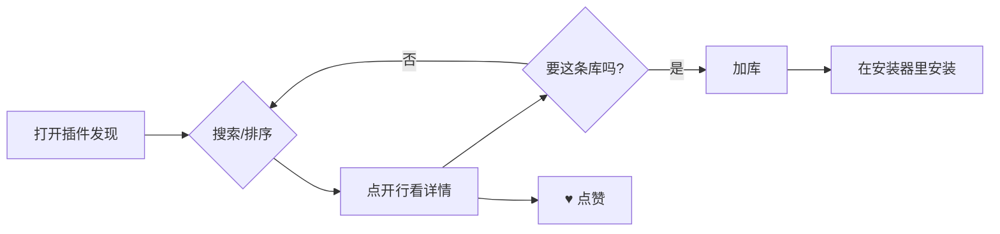

# 插件发现 — 用户旅程（user journeys）

按 `prototype-hci-pack` 的流程取 5 条：首次、核心、编辑/撤销、失败恢复、回访。

## J1 首次使用（新玩家，没加过任何库）

- 目标：看看有什么插件。
- 入口：主窗口 →「插件发现」。
- 步骤：默认落在「每周点赞排行」→ 扫行（图标/名字/一行简介/作者/库链/更新/推荐）→ 点一行展开 → 看到 ♥ 与库链。
- 决策点：要不要加这条库？→「加库」（蓝）。
- 反馈：状态行「已把这条库链加进你的插件列表」、行标变 `[已在库]`、按钮消失。
- 摩擦点：**要理解三件事的区别**（加库=本机、投稿=云库、♥=点赞），靠 tooltip 与术语；首次用户建议先看 J2。
- 出口：至少加了一条库。

## J2 核心（按中文找插件 → 加库 → 装机用）

- 目标：找某个功能插件。
- 步骤：搜「钓鱼」→ 命中 MissFisher（搜译文生效）→ 展开看详情与库链 → 加库。
- 反馈：`[已在库]`；库体检/安装器里随即能看到。
- 出口：在安装器里装插件（本页不负责安装，边缘清晰）。

## J3 编辑/撤销（加错库 / 点错赞）

- 加库反悔：筛选行「撤回添加（N）」→ 移除刚加的库（只对最近一次加库出现）。
- 点赞：**不可撤销**（v1 设计）；一周后自动可再点。诚实提示在 tooltip 里。
- 出口：回到加库前/等下周一。

## J4 失败恢复

- 投稿坏地址：粘 → 投稿 → 「检测中…」→「打回：取不到这个地址…」；输入保留，改完再投。
- 中继不可用：统计显示「统计暂不可用」（tooltip 说明降级）；点赞本地立即变灰 + `*`（未同步），每 15 秒重试一条，成功自动清 `*`。
- 索引不可用（卫月改内部字段）：页内一行 +「重试」。
- 旧词表（无库链）：行显示「来源未知」，无加库按钮，其余功能正常。
- 出口：任何失败都有可见状态与下一步。

## J5 回访（一周后 / 收录后）

- 一周后：上周点过赞的插件重新可点（北京时间周一 00:00 重置）；周榜随之更新。
- 投稿收录后：「已投稿、等收录」计数减少，插件出现在搜索里（跟随词表更新）。
- 出口：榜单有新鲜度、投稿闭环可见。

## Mermaid — 核心路径

## 未覆盖 / 待验证

- **未做过真人首次使用观察**（无用户测试数据）——J1 的摩擦点是推断。
- 未设计「按库浏览」旅程（当前不支持）。
- 未设计导航失败（游戏内 UI 无 URL/路由概念）。
