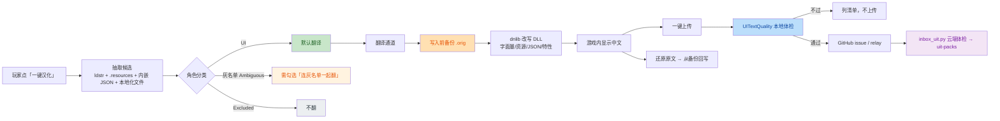
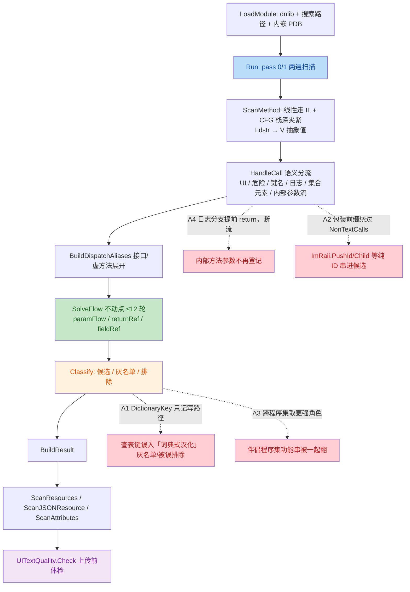

# FireGaze UIText 抽取器 / 新代码 独立评审（只读）

**评审对象**：`C:/everyone/FireGaze-Refactor` @ HEAD（当前工作树，未看任何历史 diff——本次是「整文件通读 + 发布前体检」，不是 diff 评审）
**实际通读**：`UiStringExtractor.cs`(3499 行, 全文)、`UiCallSemantics.cs`(全文)、`UITextText.cs`(全文)、`UITextJSONResources.cs`(全文)、`UITextQuality.cs`(全文)
**对照读**：`scripts/inbox_uit.py`、`scripts/validate_contribution.py`、`UITextLocalizationFiles.cs`、`UITextPatcher.cs`、`UITextPatchManager.cs`、`UI/UITextTab.cs`、`UI/UITextEditorWindow.cs`、`Translate/ContributeSender.cs`、`docs/top100-2026-10-02/sub-fp-audit.md`、`docs/known-issues-2026-10-02.md`、`docs/release-test-checklist-2026-10-03.md`
**只读声明**：未修改任何文件、未运行任何构建/测试；无 shell 访问，未做任何仓库变更（`noStagedFiles: true` 见我未产生写入）。

---

## Step 3 · 作者意图推断

> **意图**：在「不加载、不执行第三方代码」的前提下，用 dnlib 静态读 IL 做**保守优先**的界面文本判定——漏翻只损失覆盖，误翻会破坏插件功能；因此所有「拿不准」的判定都往灰名单/排除降级（类注释 12–15 行、`Literal.DictionaryKey` 注释、`BuildResult` 分支顺序都写着这条原则）。本轮 2026-10-03 的两处新增（`UITextJSONResources` / `UITextQuality`）延续同一意图：① 把「既不在 `ldstr` 也不在 `.resources` 里的内嵌 JSON 语言表」纳入候选，但**只补 zh 空槽、绝不覆盖上游中文**；② 在上传前用**与云端同口径**的纯函数体检把坏译文拦在本地，避免把「占位符丢了 / 等于没翻」的条目录进公共库。
> **可对照的硬约束**：① 渲染线程零重活/零 I/O；② 无 Harmony/MonoMod/detour；③ 写盘先备份可还原；④ 不联网路径不联网。

对这五份文件，我**逐条核对的约束结论**：② 全仓 `grep -i "Harmony|MonoMod|Detour" src` → 0 命中；④ 五份文件均无网络调用（`UITextQuality` 明确「不联网、不调用翻译通道」）；③ 内嵌 JSON 的写入/还原都在 DLL 备份/还原体系内（`PatchJSONResources` / `RevertJSONResources`）；① 五份文件在抽取线程执行，只有 `UITextQuality.Check` 会被 UI 线程调用一次（O(条数)×常数，见「已正确」一节）。

---

## Step 4 · 变更/逻辑可视化

**业务流（用户视角：一键汉化 → 写入 → 还原 / 投稿）**



**技术流（抽取器内部数据流，含本轮评审发现的位置）**



---

## Step 5 · 问题表

| # | 问题 | 位置 | 严重度 | 建议 | 置信度 |
|---|------|------|--------|------|--------|
| C1 | 本地体检与云端容器口径不一致：`file:` / `json:` 容器必被 `inbox_uit.py` 拒绝，投稿被整条/部分丢弃，而客户端仍报「已上传」 | `UITextQuality.cs:39`（Check 缺容器/key 校验）、`UITextTab.cs:865,877` | **P1**（产生错误上传） | 本地按「云端可收」口径拦下并在确认框写明「本地化文件 / 内嵌 JSON 条目暂不进公共库」；或云端补上这两类容器 | 高 |
| A1 | `DictionaryKey` 只在「写集合」调用点设置：查表路径与参数流都不带它 → 灰名单隔离层两个方向都失效 | `UiStringExtractor.cs:2644`（另见 1453 / 1899 / 2494） | P2 | 查表路径（get_Item/TryGetValue/ContainsKey）同样落 `DictionaryKey`，并让它随参数流传播；第一支只留给真正的本地化/资源 key | 高 |
| A2 | 包装前缀分支绕过 `NonTextCalls`，且这些调用永远拿不到 `###原文` 保护 → `ImRaii.PushId/Child/Table` 等纯 ID 串仍进候选并被翻译 | `UiCallSemantics.cs:293`（另见 289 / 410–419 / 454–457） | P2 | wrapper 分支也过一遍 `NonTextCalls`（补 `PushId`/`BeginTable`），或让包装类型同样走 ID 判定补 `###原文` | 高（机制）/ 中（发生率） |
| A3 | 多程序集按「更强角色」合并 + 打补丁对每个文件都用同一份 map → 伴侣程序集里同一文本的功能串被一起翻 | `UiStringExtractor.cs:197`（+`UITextPatchManager.cs:432–444`） | P2 | 冲突时降级灰名单：一侧 UI、另一侧危险/键名 → 输出 Ambiguous 而不是取 UI | 中 |
| A4 | 日志分支排在内部方法流之前 return，且 `IsLogCall` 的类型判定过宽（类型名含 `Log` 即命中）→ 这些类型上的 UI 包装方法整条断流 | `UiStringExtractor.cs:1656`（+`UiCallSemantics.cs:599–607`） | P2 | 日志分支移到第⑤步之后（内部方法仍登记 passRefs，只是不标危险），并把 `Log` 匹配收窄 | 中 |
| A5 | `ResourceKeyCount` 在两遍扫描里重复累加，且全仓无消费点（死数据 + 计数翻倍） | `UiStringExtractor.cs:1618`（`UiTextModels.cs:131`） | P3 | 只在 pass 0 累加，或直接删掉该字段 | 高 |

---

### C1 · 本地体检与云端容器口径不一致（P1）

证据 1：本地体检实现的是 `check_text` 的四条规则，**没有**容器/key 合法性这一条 ——

```csharp
// UITextQuality.cs:39-74（节选）
if (string.IsNullOrWhiteSpace(translated)) return "译文为空";
if (translated.Length > MaxTranslatedLength) return $"译文超长（{translated.Length} > {MaxTranslatedLength}）";
if (ControlChars.IsMatch(translated) || ControlChars.IsMatch(original)) return "有控制字符";
...
return UITextText.CheckPlaceholders(original, translated);   // 没有 Container/Key 校验
```

证据 2：上传侧把 `pack.Resources` **全量**（含 `file:` / `json:` 容器）交给体检并上传 ——

```csharp
// UI/UITextTab.cs:865,877
var resources = pack.Resources.Where(e => e.HasTranslation).ToList();
var healthyResources = FilterHealthy(resources, e => e.Original, e => e.Translated, e => "资源 · " + UITextQuality.Label(e.Original), problems);
// 容器前缀来源：UITextLocalizationFiles.Prefix = "file:"，UITextJSONResources.Prefix = "json:"
```

证据 3：云端把这两类容器一律判「容器名或 key 不合法」，全部条目落 `rejected`；若该插件译文只有这两类（HaselTweaks 131 条 `json:`、AutoDuty 172 条 `file:`），`accepted == 0` → 整条投稿被 `fail()` 丢掉 ——

```python
# scripts/inbox_uit.py:40,130
CONTAINER = re.compile(r"^[A-Za-z0-9_.\-]+\.resources$")     # 不含 ':' 与 '/'
if not CONTAINER.match(container) or not key or len(key) > 200:
    rejected.append(f"`{container} / {key[:40]}`：容器名或 key 不合法")
# :183  if accepted == 0: return fail(args, "这条 issue 里没有可收录的译文。")
```

证据 4：客户端只以「issue 是否建成」判成功，用户看不到云端会不会收录 ——

```csharp
// Translate/ContributeSender.cs:44
return new ContributeSendResult(ContributeSendSeverity.Good, $"已上传 {total} 条译文到社区：{message}。感谢！");
```

### A1 · `DictionaryKey` 只记「写」路径（P2）

证据 1：`DictionaryKey` 全仓只有一处赋值，在 `IsCollectionMutator` 分支里（`Add` / `set_Item` / `TryAdd`…）——

```csharp
// UiStringExtractor.cs:1446-1455（节选）
if (UICallSemantics.IsCollectionMutator(typeName, methodName))
{
    if (UICallSemantics.IsCollectionKeyCall(typeName, methodName) && argValues.Length > 0 ...)
    {
        this.MarkDangerous(scan, argValues[0], ..., hardKey: true);
        foreach (var keyId in argValues[0].IDs) { this.literals[keyId].DictionaryKey = true; }   // ← 唯一赋值
```

证据 2：查表路径（`get_Item` / `TryGetValue` / `ContainsKey`）走 `IsDangerousCall` 分支，只设 `HardKey`、不设 `DictionaryKey`；参数流同理 ——

```csharp
// UiStringExtractor.cs:1899  MarkDangerous(..., hardKey) → literal.HardKey |= hardKey;
// UiStringExtractor.cs:2494  ClassifyFlow(ui:false)     → literal.HardKey |= scan.ParamsKey[param];
```

证据 3：分类时用 `DictionaryKey` 区分「DLL 内字典键」与「外部表 key」，于是这个字面量掉进了错的支 ——

```csharp
// UiStringExtractor.cs:2644-2656
if (literal.HardKey && !literal.DictionaryKey)
{
    var sentenceKey = UITextText.LooksLikeSentenceKey(literal.Text);   // ≥20 字符 & ≥3 词
    ... Role = sentenceKey ? UITextRole.Ambiguous : UITextRole.Excluded,
        Reason = sentenceKey ? "查表 key，但形态像界面句子（词典式汉化…）" : "本地化 / 资源查表 key（翻了会查不到译文）"
```

后果（双向）：**短键**（如 `dict["Dungeon Chest"]` 只出现在 `TryGetValue` 的插件）从注释里写的灰名单掉成 Excluded → 少翻；**句形长键**被判成「词典式汉化」灰名单、理由还写着「翻译后会直接显示译文本身」，用户一勾灰名单就会翻掉一个 DLL 内部 `dict[key]` 的键 → 查表 miss（返回默认值或抛异常），功能静默失效。

### A2 · 包装前缀绕过 `NonTextCalls`，也拿不到 `###`（P2）

证据 1：只有「类型名含 ImGui」这一支才查 `NonTextCalls`，包装前缀分支无条件返回 true ——

```csharp
// UiCallSemantics.cs:288-299
if (typeFullName.Contains("ImGui", ...)) { return !NonTextCalls.Contains(methodName); }   // 只这里查名单
foreach (var prefix in KnownWrapperPrefixes) { if (typeFullName.StartsWith(prefix)) return true; }  // Dalamud.Interface.Utility.* / Components. / ECommons.ImGuiMethods. / OmenTools.ImGuiOm.
```

证据 2：同一批调用在「要不要保 ID」上被判成「只显示、不用 ID」 ——

```csharp
// UiCallSemantics.cs:454-457
if (!typeFullName.Contains("ImGui", StringComparison.OrdinalIgnoreCase)) { return false; }   // ImRaii.* → PreserveID=false
```

证据 3：仓库内已有审计结论把这类 sink 列为「必须剔除」，但名单只覆盖了 ImGui 原生的 `PushID` ——

```text
# docs/top100-2026-10-02/sub-fp-audit.md:69
判定规则：reason 末段 ∈ {SetDragDropPayload, …, PushID, PushId, BeginChild, BeginTable, …} → 剔除。
分布：TableSetupColumn 23、BeginChild 14、…、PushID 12、PushId 11、…、BeginTable 7
# UiCallSemantics.cs:410-419 NonTextCalls 只有 "PushID"/"PopID"/"GetID"/… 且被 293 行绕过
```

证据 4：`ImRaii.Child("ID")` 这种形态在第三方插件里是常态（本仓自己就这么写）——

```csharp
// src/FireGaze/UI/InstallerListScroll.cs:40
///     真正滚动的那层子窗口（ImRaii.Child("ScrollingPlugins")）。
private const string ListChildID = "ScrollingPlugins";
```

后果：纯 ID 串进候选、被翻译且不补 `###原文`（ID 语义变了、玩家一个像素也看不到）；若这串同时被当文件名/配置键用（`PushId(presetName)` + `presetName + ".json"`），就直接改坏行为。

### A3 · 跨程序集「取更强角色」合并（P2）

证据 1：合并规则是「候选 > 灰名单 > 排除」，丢掉「在哪份文件里它是功能串」这一信息 ——

```csharp
// UiStringExtractor.cs:126 / 197
/// 同一原文在多个文件里出现时，取「更强的判定」（候选 > 灰名单 > 排除），PreserveID 取或；
var keep = RoleRank(tagged.Role) < RoleRank(existing.Role) ? tagged : existing;
```

证据 2：而打补丁时**每个程序集都用同一份 pack**（map 只按 `Original` 文本建，不带文件名） ——

```csharp
// UITextPatchManager.cs:432-444
foreach (var fileState in fileStates) { ... outcome = UITextPatcher.Patch(fileState.Path, newPath, pack, entry.Version, ...); }
// UITextPatcher.cs:91-93  var map = new Dictionary<string, UITextPackEntry>(StringComparer.Ordinal);
```

后果：A.dll 里当标签、B.dll 里当字典键/IPC 名/查表键的同一文本 → 包里是 UI → B.dll 里那条 `ldstr` 也被替换。这是「同一字符串既画又作他用」的**跨程序集**版本，现有隔离层（灰名单）在这里完全没有介入点。

### A4 · 日志分支提前 return，打断内部方法流（P2）

证据 1：日志分支在第⑤步（内部方法流）与第④步（危险语境之前）就 `return` 了，且不登记任何 passRefs/paramFlowRefs ——

```csharp
// UiStringExtractor.cs:1656-1661
if (UICallSemantics.IsLogCall(typeName, methodName)) { Leave(MakeResult(callee, argValues, isInternal: false)); return; }
// UiStringExtractor.cs:1662 ④ 危险语境 …
// UiStringExtractor.cs:1688 ⑤ 本程序集内的方法：记参数流 / 返回值流
```

证据 2：`IsLogCall` 的类型判定是「名字里含 Log」，与命名空间无关 ——

```csharp
// UiCallSemantics.cs:599-610
public static bool IsLogCall(string typeFullName, string methodName) {
    if (IsChatCall(...)) return false;
    if (typeFullName.Contains("Log", StringComparison.Ordinal)) return true;   // Login / Dialog / Catalog / LogWindow 一并命中
    ...
    return methodName is "WriteLine" or "Print" or "Information" or "Debug" or "Warning" or "Error" or "Verbose" or "Fatal";
```

后果：名字含 `Log` 的类型上的 UI 包装方法（含插件自己的「日志窗口 Draw」类）不再接收参数流，参数里真正画到界面的文本永远回不到候选 → 漏翻（不会翻坏，故 P2 而非 P1）。

### A5 · `ResourceKeyCount` 死数据 + 双记（P3）

证据 1：`Run()` 里 pass 0/1 各跑一遍全部方法体，而累加写在 `HandleCall` 里 ——

```csharp
// UiStringExtractor.cs:1616-1619（HandleCall，两遍都会执行）
if (UICallSemantics.IsResourceKeyCall(typeName, methodName)) { this.resourceKeyCount += argValues[0].IDs.Count; }
```

证据 2：该属性在 `UiTextModels.cs:131` 定义，全仓（`src/**`、`scripts/**`、`uit-packs/**`）grep `ResourceKeyCount` 只命中「定义 + 赋值」，没有读取方。

---

## 已正确 / 无需改动（有证据）

1. **`###` ID 机制与补丁的配合方向是对的**：`UITextText.IDSeparator/ForDisplay/IDPart/BuildPatched`（`UITextText.cs`）与 `UsesStringAsIDForArgument => argIndex == 0`（`UiCallSemantics.cs:438`）一致——只有第 0 个字符串参数补 `###原文`，`InputTextWithHint` 的 hint / `BeginCombo` 的 preview / `InputFloat` 的 format 都不会被污染（正是 FriendlyFire 灰字 bug 的修法）。
2. **异常安全达标**：`Extract` 单程序集 try/catch（`UiStringExtractor.cs:36-76`）、`ExtractMany` 单文件失败只跳过且「全失败才算失败」、`ScanResources` 单容器 try/catch、`ScanJSONResource` 整体 try/catch、`UITextJSONResources.TryParse/Apply/Revert` 全捕获且失败即「不改动」、`UITextLocalizationFiles.Scan` 内层 per-file try —— 单插件失败不会污染整表。
3. **性能有刻意设计**：`V.MaxItems = 96` 上限（`AppendCapped`）+ `ComputeDepths` 迭代上限 `Instructions.Count * 4`（防跑飞）+ 两遍扫描只在第二遍读字段值 + 慢方法 `[slow]`/`[slow-depth]` 探针——3000+ 字符串量级下的爆炸风险已被显式封顶。
4. **`UITextQuality` 参数侧口径与云端逐字一致**：`MaxTranslatedLength=2000` / `MaxOriginalLength=4000`、`ControlChars = [\x00-\x08\x0b\x0c\x0e-\x1f\x7f]`、`DenyWords` 9 词，与 `inbox_uit.py:34-35`、`validate_contribution.py:38,40` 完全相同；额外加的「与原文相同 / 占位符对不上」只更严不更松（不会放坏译文过关）。纯函数、无网络、无文件 I/O；UI 线程只在上传时一次性 O(条数) 调用。
5. **`UITextJSONResources` 的写入语义是保守的**：`Apply` 只在 zh 空槽写（`entry[TargetLanguage]` 前有非空判断）、`Revert` 只在「当前 zh == 我们的译文」时删除，`UnsafeRelaxedJsonEscaping` 保中文不被转义；形状嗅探失败返回 false 而不是抛异常。

---

## 残余风险与未验证项（不计入问题清单）

1. **无法在本仓跑验证**：仓库只有 `src/FireGaze` 与 `tools/UITextProbe` 两个工程，**没有测试工程**，`UITextQuality` 注释里的「fgtest 钉住」在本仓无从核对。建议主控跑：`build.cmd`（0 警告 0 错误）与维护者自己的 fgtest。
2. **A2/A3 的实际发生率需要数据**：请对 top100 抽取产物按 sink 名（`ImRaii.*` / `PushId` / `Child` / `Table`）和「跨程序集同文本异角色」各跑一次统计，可把 A2/A3 从「机制成立」升级为「实测 N 条」。
3. **`TryParse` 的整表放弃**：任何**一个**非对象条目（例如上游表里混了 `"_comment": "generated"` 这类注记键）会让 `table.Clear(); return false`（`UITextJSONResources.cs:63-66`），89 行的「至少一半有 en」容忍逻辑因此在「混形状」的表上永远轮不到执行；后果是整张表静默跳过（漏翻，不翻坏）。本轮没证据表明真有这种表，故未列为问题。
4. **给管线评审的旁注（超出我这五份文件范围）**：`UITextPatcher.cs:92-95` 的 `forcePreserve` 对 **`PreserveID=false` 的纯显示条目**也会补 `###原文`；落到 `ImGui.Text`/`TextUnformatted` 这类不做 ### 解析绘制路径时，玩家会看见「译文###原文」后缀。建议管线侧确认是否要按角色（IDMarked）限定 forcePreserve。
5. **未验证**：`relay` worker 的部署代码不在本次可读范围；C1 的最坏情形（整条投稿被丢）依赖 `inbox_uit.py:183` 的 `accepted == 0` 分支，已按脚本逐行核对。

---

===ISSUES-JSON===
[
  {
    "id": "C1",
    "title": "本地体检与云端容器口径不一致：file:/json: 容器必被 inbox_uit.py 拒绝，投稿被丢而客户端仍报「已上传」",
    "severity": "P1",
    "file": "src/FireGaze/UIText/UITextQuality.cs",
    "line": 39,
    "evidence": "UITextQuality.Check(39-74) 只实现 check_text 的四条（空/超长/控制字符/违规词），没有容器与 key 合法性；UI/UITextTab.cs:865,877 把 pack.Resources 全量（含 UITextLocalizationFiles.Prefix=\"file:\"、UITextJSONResources.Prefix=\"json:\"）交给体检并上传；scripts/inbox_uit.py:40 CONTAINER=^[A-Za-z0-9_.\\-]+\\.resources$ 不含 ':' 与 '/'，:130 判「容器名或 key 不合法」全部 rejected，:183 accepted==0 时整条投稿被 fail() 丢弃；ContributeSender.cs:44 在 issue 建成时回「已上传 N 条译文到社区…感谢！」。",
    "suggestion": "本地体检补一条「云端可收」校验：Container 必须是 *.resources 且 Key ≤200，file:/json: 条目在确认框里明确写「本地化文件 / 内嵌 JSON 条目暂不进公共库」并不上传；或者云端 inbox_uit.py 补上这两类容器（file: 相对路径 + JSON 指针）的收录逻辑，两边口径对齐。",
    "confidence": "高"
  },
  {
    "id": "A1",
    "title": "DictionaryKey 只在写集合的调用点设置：查表路径与参数流都不带它，灰名单隔离层两个方向都失效",
    "severity": "P2",
    "file": "src/FireGaze/UIText/UiStringExtractor.cs",
    "line": 2644,
    "evidence": "唯一赋值在 IsCollectionMutator 分支 UiStringExtractor.cs:1453（Add/set_Item/TryAdd 等写路径）；查表路径 get_Item/TryGetValue/ContainsKey 走 IsDangerousCall，只设 HardKey（:1899），ClassifyFlow 的参数流同样只搬 HardKey（:2494）；分类处 :2644 `literal.HardKey && !literal.DictionaryKey` 把这类字面量按「外部表 key」处理：句形长键 → Ambiguous 且理由写成「词典式汉化…翻译后会直接显示译文本身」（引导用户去翻一个 DLL 内部 dict[key] 的键 → 查表 miss、功能静默失效），短键 → Excluded（注释里写明应进灰名单）。",
    "suggestion": "IsCollectionKeyCall 命中（查表路径）时同样置 DictionaryKey=true（或新增 LookupKey 标记），并让该标记随 ClassifyFlow 的参数流传播；:2644 第一支只留给真正的本地化/资源查表 key，把「DLL 内字典键」一律按 :2675 的「既进 UI 又当字典键名」灰名单口径处理。",
    "confidence": "高"
  },
  {
    "id": "A2",
    "title": "包装前缀分支绕过 NonTextCalls，且这些调用永远拿不到 ###原文：ImRaii.PushId/Child/Table 等纯 ID 串仍进候选并被翻译",
    "severity": "P2",
    "file": "src/FireGaze/UIText/UiCallSemantics.cs",
    "line": 293,
    "evidence": "只有「类型名含 ImGui」这一支查 NonTextCalls（:288-290），KnownWrapperPrefixes（Dalamud.Interface.Utility. / Components. / ECommons.ImGuiMethods. / OmenTools.ImGuiOm.）在 :293-299 无条件 return true；同一批调用在 UsesStringAsID 的 :454-457 因为类型名不含 ImGui 直接返回 false → PreserveID=false（不补 ###）；docs/top100-2026-10-02/sub-fp-audit.md:69 把 PushId(11 条)/BeginTable(7 条) 列为「必须剔除」的非绘制 sink，而 NonTextCalls(:410-419) 只收了 ImGui 原生 PushID，且即便补进名单也会被 :293 绕过；实存形态见本仓 src/FireGaze/UI/InstallerListScroll.cs:40 `ImRaii.Child(\"ScrollingPlugins\")` 的 ID 常量。",
    "suggestion": "让包装前缀分支也过一遍 NonTextCalls（把 PushId/PopId/BeginTable/PushStyleVar 之类补进名单），或对包装类型同样应用 UsesStringAsID 的 ID 判定（补 ###原文）；两者取其一即可消除「纯 ID 串被当显示文本翻译、且 ID 语义被改」的窗口。",
    "confidence": "高（机制已核实，发生率为审计文档统计的 11+7 条量级）"
  },
  {
    "id": "A3",
    "title": "多程序集按「更强角色」合并 + 补丁对每个文件用同一份 map：伴侣程序集里同一文本的功能串被一起翻",
    "severity": "P2",
    "file": "src/FireGaze/UIText/UiStringExtractor.cs",
    "line": 197,
    "evidence": ":126 注释与 :197 的 `keep = RoleRank(tagged.Role) < RoleRank(existing.Role) ? tagged : existing` 按「候选 > 灰名单 > 排除」合并，丢掉「在哪份文件里它是功能串」的信息；UITextPatchManager.cs:432-444 对插件里每个程序集都调 UITextPatcher.Patch(pack)（map 只按 Original 文本建：UITextPatcher.cs:91-93），于是 A.dll 里是标签、B.dll 里是字典键/IPC 名/查表键的同一文本，会在 B.dll 里也被替换。",
    "suggestion": "合并时检测角色冲突：一侧 UI、另一侧 Dangerous/HardKey/DictionaryKey → 输出 Ambiguous（灰名单）而不是直接取 UI（最小改动：在 ExtractMany 的合并分支里加冲突判定）；若要更彻底，在 pack 里记录「该原文在哪些文件里不该翻」。",
    "confidence": "中（机制已核实，需要插件同时满足「跨程序集同文本异角色」）"
  },
  {
    "id": "A4",
    "title": "日志分支在 HandleCall 里排在内部方法流之前，且 IsLogCall 的类型判定过宽（类型名含 Log 即命中）",
    "severity": "P2",
    "file": "src/FireGaze/UIText/UiStringExtractor.cs",
    "line": 1656,
    "evidence": ":1656 的日志分支在 ④ 危险语境(:1662) 与 ⑤ 本程序集内的方法(:1688) 之前 return，且只 Leave(MakeResult(...))、不登记 passRefs/paramFlowRefs；UiCallSemantics.cs:599-607 用 `typeFullName.Contains(\"Log\")` 做前缀无关匹配（Login/Dialog/Catalog/LogWindow 一并命中），方法名名单 Debug/Error/Warning/Print/Verbose/Fatal 也没有类型约束。后果：这些类型上的 UI 包装方法整条断流，参数里真正画到界面的文本回不到候选（漏翻，不会翻坏）。",
    "suggestion": "把日志分支挪到 ⑤ 之后（内部方法仍登记 passRefs/paramFlowRefs，只是不标危险、不当 UI），或至少在 isInternal 为真时继续走内部方法流；同时把 \"Log\" 匹配收窄为日志类型名单/命名空间前缀（Serilog、Dalamud…Log、ECommons.Log 等），避免误伤 Login/Dialog/Catalog 类。",
    "confidence": "中（机制已核实，影响是少翻）"
  },
  {
    "id": "A5",
    "title": "ResourceKeyCount 在两遍扫描中重复累加，且全仓没有任何消费点",
    "severity": "P3",
    "file": "src/FireGaze/UIText/UiStringExtractor.cs",
    "line": 1618,
    "evidence": "Run() 里 pass=0/1 各遍历一遍所有方法体，而累加写在 HandleCall(:1616-1619 `this.resourceKeyCount += argValues[0].IDs.Count`)，因此计数约为真实值的两倍；UiTextModels.cs:131 定义该属性，全仓 grep ResourceKeyCount/resourceKeys 只命中定义与赋值（无读取方），编辑器与包格式都不消费它。",
    "suggestion": "只在 pass 0 累加（用 this.useFieldValues 判断），或直接把该字段与赋值删掉——留着会让人以为它可信。",
    "confidence": "高"
  }
]
===END-ISSUES===

## 合并结论

**Merge verdict: OK with notes** —— 五份文件的**结构设计（保守优先、异常隔离、上限封顶、###-ID 与占位符机制、云端四条体检口径）是站得住的**，没有 P0；但 **C1（P1）需要在发版前处理**：`file:`/`json:` 容器的投稿必然不被云端接受，而本地体检与客户端都报成功，属于「错误上传」。A1–A5 是判定口径的加固项（P2/P3），可按优先级在后续轮次修。我未做任何修改，也未运行构建/测试。