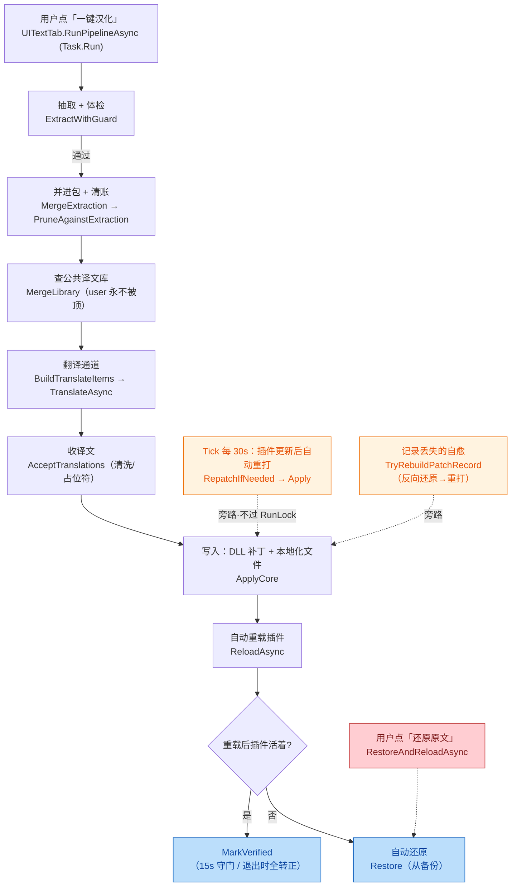
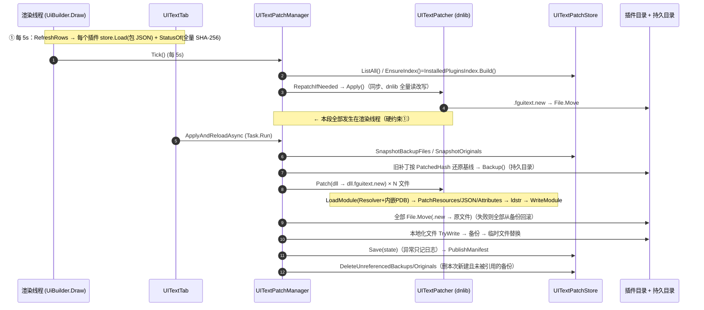

# FireGaze 管线评审（UIText 打补丁/包/流程/本地化文件）

> 只读评审：未修改任何文件、未运行构建、未执行 shell/git。工作区无 HEAD 基线 diff 可用，因此本次为**整文件通读**（任务指定「当前 HEAD 即评审对象」），非增量 diff 审查。
> 评审文件：`src/FireGaze/UIText/UITextPatcher.cs`、`UITextPack.cs`、`UITextPatchManager.cs`、`UITextFlow.cs`、`UITextLocalizationFiles.cs`；旁证文件：`UITextPatchStore.cs`、`UITextText.cs`、`UITextJSONResources.cs`、`UITextRules.cs`、`Internal/AtomicFile.cs`、`Internal/EmbeddedPdb.cs`、`UI/UITextTab.cs`、`UI/UITextEditorWindow.cs`、`Plugin.cs`、`docs/uitrans.md`、`docs/known-issues-2026-10-02.md`。

---

## Step 3 · 作者意图（推断）

**意图：把「翻好一份译文包」变成「可靠地写进第三方插件并永远能撤回」的**。三条设计主线在代码里处处可见：

1. **只动字符串、不动结构**：`ldstr` 字面量 + 内嵌 `.resources` 值 + 自定义特性构造/命名参数 + 内嵌 JSON 的 `zh` 槽 + 磁盘语言文件的 zh 侧 —— 全是"值"，键名/命令名/功能串一律不碰（`IsPatchable`、`Excluded` 硬拦）。
2. **可还原优先**：先备份（持久目录优先）→ 全打 `.new` → 才原子 `File.Move`；失败回滚；`PendingVerify` + 崩溃守门 + 更新后自动重打 + 「记录丢了用译文包反向还原出原文」的自愈链（`TryRebuildPatchRecord` / `MayContainOurPatch`）。
3. **口径唯一**：抽取合并、清账、PreserveID、占位符校验都收在 `UITextFlow` / `UITextPack` 一处，列表页与编辑器共用（见 `docs/uitrans.md`「编辑器的抽取合并统一走 UITextFlow.MergeExtraction」）。

在此基础上，本轮通读发现的偏差几乎都落在**主线之外的"旁路"**上：绕过 UI 的自动重打（第 4 条）、绕过校验的库合并（第 8 条）、以及渲染线程上的状态读取。

---

## Step 4 · 业务流 / 技术流

📊 **业务流（用户可见的一条链 + 三条旁路）**



📊 **技术流（本轮评审的写盘/线程细节）**



---

## 硬约束逐条核对

| 约束 | 结论 | 证据 |
|---|---|---|
| ① 渲染线程零重活/零文件 I/O | **不满足** | `UITextEditorWindow.cs:839` 每帧 `StatusOf`→`UITextPatchManager.cs:146` 全量 SHA-256 + 每帧读状态 JSON；`Plugin.cs:582`→`UITextPatchManager.cs:1539/1631` 在绘制线程同步跑自动重打；`UITextTab.cs:340/2758` 每 5s 读盘。见 B-01/B-02/B-03 |
| ② 不用 Harmony/MonoMod/detour | **满足** | 全仓库 `src/` 下 `Harmony|MonoMod|Detour|VirtualProtect|WriteProcessMemory` 零命中（仅 `docs/` 的历史记录命中）；写入路径全在 `UITextPatcher` 用 dnlib 静态改写 |
| ③ 写插件文件前先备份、可还原 | **基本满足，有旁路缺口** | 备份在写之前（`UpdatePatchManager` 419→507），失败有回滚（514-528）；但收尾清理可能在状态未落盘时删掉唯一备份，且 `Revert` 对"原文含 `###`"的条目还原不回来。见 B-06/B-09 |
| ④ 不联网的路径不联网 | **满足（本 5 文件）** | 5 个受审文件里 `HttpClient/WebRequest/Socket` 零命中；网络只在 `TranslationChannels.cs` / `UITextLibrary.cs`，由翻译阶段与 `UITextLibraryEnabled` 显式门控 |

---

## 问题表

| # | 问题 | 位置 | 严重度 | 建议 | 置信度 |
|---|---|---|---|---|---|
| B-01 | 编辑器打开时**每帧**对已打补丁的插件 DLL 做全量 SHA-256 并读/解析补丁状态 JSON（渲染线程 I/O + 重活，硬约束①） | `src/FireGaze/UI/UITextEditorWindow.cs:839`（另 228/651）→ `src/FireGaze/UIText/UITextPatchManager.cs:146` → `UITextModels.cs:155` | P1 | 按「文件写入时间 + 大小」缓存状态（或每 1-2 秒最多查一次），把哈希搬到后台；绘制路径只读缓存字段 | 高 0.9 |
| B-02 | `Tick()` 在绘制线程上同步执行自动重打：整套 `Apply`（dnlib 全量读改写 + 备份 + 写盘 + 重载）与 `InstalledPluginsIndex.Build()`（每插件约 20 次反射） | `src/FireGaze/UIText/UITextPatchManager.cs:1539`→`1631`；`Plugin.cs:582`（订阅 `UiBuilder.Draw`：`Plugin.cs:147`） | P1 | 与 `MigrateLegacyBackups` 同款处理：`_ = Task.Run(...)`；`EnsureIndex` 复用 UI 已建好的索引实例 | 高 0.9 |
| B-03 | 列表页每 5 秒在绘制线程上遍历全部已装插件：`store.Load` 全量读解析包 JSON + `StatusOf` 对已打补丁插件做 DLL 哈希 | `src/FireGaze/UI/UITextTab.cs:338`、`2741`、`2758` | P2 | 行摘要按包文件 mtime 缓存；状态改用 `(mtime,size)` 快判，仅在按键/动作后强制重算 | 高 0.85 |
| B-04 | `AcceptTranslations` 的资源/属性分支按「原文值」匹配写回，**没有 `HasTranslation`/`IsUserSource` 守卫** → 同一原文落在另一个 key 上的人工译文（user）会被机器译文顶掉 | `src/FireGaze/UIText/UITextFlow.cs:355`（仅 362 一道闸） | P2 | 加 `if (entry.HasTranslation) continue;`（或至少 `IsUserSource` 时跳过）；与 `PreviewMerge` 的 Protected 口径对齐 | 中高 0.75 |
| B-05 | 清账把条目改成「不翻」**不置 `ReapplyNeeded`**；配合列表页「已经是最新」短路，盘上已写进去的旧译文不会被撤掉（清账的"不再打进补丁"在这条路径上失效） | `src/FireGaze/UIText/UITextFlow.cs:158`；`src/FireGaze/UI/UITextTab.cs:1796` | P2 | `if (merge.Prune.Pruned > 0) merge.ReapplyNeeded = true;`（或把 `Prune.Any` 加进短路条件） | 中 0.6 |
| B-06 | `Apply` 收尾按「未被状态引用」删本次新建的备份，但 `store.Save` 吞异常（void + 只记日志）→ 状态没落盘时备份被删：DLL 已打补丁、无记录、无备份、清单也指向不存在的 `.orig`（违反硬约束③，只能重装） | `src/FireGaze/UIText/UITextPatchManager.cs:315`+`642`；`UITextPatchStore.cs:227-243` | P2 | `Save` 返回 bool；保存失败时**不删**本轮备份（并提示用户）；`DeleteUnreferenced*` 同时参考 `manifest.json` 的引用 | 中 0.65 |
| B-07 | 自动重打路径不走 `UITextRunLock`，与 UI 发起的 `Apply`（后台任务）可并发：同一插件被两次备份/写盘/清理，`DeleteUnreferenced*` 可能删掉对方刚建、尚未被状态引用的备份 | `src/FireGaze/UIText/UITextPatchManager.cs:1588`、`1631`；`UITextRunLock.cs`（无调用） | P2 | 在 `RepatchIfNeeded`/`Apply` 里加按插件的互斥（`RunLock.TryEnter` 或 `store.gate` 级串行），抢不到就下轮再来 | 中 0.6 |
| B-08 | 防撞车的 `forcePreserve` 是**全包全局**去重，会给「非标签」字面量也补 `###原文` → ImGui 在 hint/preview/纯文本上原样显示（文档里的 FriendlyFire 血教训会回归）；跨程序集/跨窗口的重复也会误触发 | `src/FireGaze/UIText/UITextPatcher.cs:106-109`、`214`；`UITextText.cs:39-49` | P2 | 只对 `entry.PreserveID`（抽取已判为控件标签）的条目做强制保 ID；去重范围限定在同一程序集 | 中 0.6 |
| B-09 | 反向还原对「原文自带 `###`」的条目失效：`BuildPatched` 只保留最后一段 ID（`译文###B`），而 `Revert` 的 suffixMap 用完整的 `"###"+原文`（`###A###B`）匹配 → 这类字面量既非后缀命中、也非精确命中，**还原不回来** | `src/FireGaze/UIText/UITextPatcher.cs:311`、`396-418`；`UITextText.cs:39` | P2 | 追加一条映射：`BuildPatched(original, original, false)` 的结果 → original（把"打过补丁的样子"当键），或按显示段比对 | 中高 0.75 |
| B-10 | 占位符校验只在 `AcceptTranslations` 一处；**库合并（`MergeLibrary`）与手工编辑/导入的译文不过这道校验**就直接进 DLL——`{0}`/`%s` 丢了会让调 `string.Format` 的插件在运行时抛 FormatException | `src/FireGaze/UIText/UITextPack.cs:538`；`UITextFlow.cs:339`（唯一校验点） | P2 | 在 `MergeLibrary` 与 `UITextPatcher.Patch` 收候选时也跑 `UITextQuality.Check`（不健康就跳过并在 outcome 里计数） | 中 0.7 |
| B-11 | `WriteModule` 写 PDB 失败时静默退回「不带 PDB 写」，无日志、无标记 → 产出缺调试目录的 DLL（Collections 血教训的形态）而无人知晓 | `src/FireGaze/UIText/UITextPatcher.cs:858-863` | P3 | 兜底时 `Plugin.Log?.Warning` 并在 `UITextPatchOutcome` 上加 `PdbDropped` 计数，让消息里能说明 | 高 0.8 |
| B-12 | 资源条目写回用**未 Trim** 的译文（`items.Add((key, entry.Translated))`），反向还原却按 `Trim()` 比较 → 译文首尾带空白时永远还原不了 | `src/FireGaze/UIText/UITextPatcher.cs:659` vs `474` | P3 | 两处统一 `entry.Translated.Trim()`（写回也用 Trim，或比较时也去空白） | 中 0.7 |
| B-13 | `file:` 容器豁免清账 + `SetString` 会**自动创建**缺失路径 → 插件删掉/改名某个键后，陈旧条目仍在包内，写回时会把孤立键塞进 `zh-CN` 文件（`json:` 侧无此问题，`Apply` 只改已存在的槽） | `src/FireGaze/UIText/UITextPack.cs:821`；`UITextLocalizationFiles.cs:160`、`479` | P3 | 写回前要求 `Resolve(root, pointer) is not null`（只在"英文侧存在、中文侧缺"时写），而不是靠 `CanWrite` 的 null 当"缺" | 中 0.6 |

### 证据（每条 2–4 行）

**B-01**
```csharp
// UITextEditorWindow.cs:228 / 839（DrawCore 每帧路径）
this.DrawToolbar();                       // → 651: var hasBackup = this.patches.HasBackup(entry);
var patchStatus = this.patches.StatusOf(entry, out var patchDetailText);
// UITextPatchManager.cs:146-151 —— 每个文件全量哈希
var hash = UITextPatchStore.HashOf(file.Path);   // UITextModels.cs:159 SHA256.HashData(File.OpenRead(path))
```
`StatusOf` 只在 `PendingVerify`/`NotPatched` 时提前返回，**已汉化（Applied）的插件每次绘制都全量读 DLL**（59 MB 级插件即每帧几百毫秒），且 `HasBackup`/`PatchedAt`/`StatusOf` 一帧内把状态 JSON 读解析 3 次。

**B-02**
```csharp
// Plugin.cs:147 / 582 —— 订阅的是渲染线程的 Draw
pluginInterface.UiBuilder.Draw += TickInstallerListScroll;   // 582: uiTextPatchManager.Tick();
// UITextPatchManager.cs:1514-1541
this.CheckPending();  ...  this.RepatchUpdated();            // 1539，无 Task.Run
// 1631: var (ok, message) = this.Apply(entry);   // dnlib 全量读改写 + 备份 + File.Move
```
同函数内的 `MigrateLegacyBackups` 是 `_ = Task.Run(...)`（1546-1550），说明"别占渲染线程"是既定纪律，但重打这条更重的路径没照做；`1643 EnsureIndex()` → `1732 InstalledPluginsIndex.Build()` 同样是反射重活。

**B-03**
```csharp
// UITextTab.cs:338-340（Draw 内）
if ((DateTime.Now - this.rowsAt).TotalSeconds > 5 || this.rowsDirty) { this.RefreshRows(); }
// 2741 / 2758：每个已装插件都走一遍
var pack = this.store.Load(entry.InternalName);        // 读 + 反序列化整个包 JSON（无缓存）
row.Patch = this.patches.StatusOf(entry, out var detail);  // → 逐文件 SHA-256
```

**B-04**
```csharp
// UITextFlow.cs:355-365
foreach (var entry in pack.Resources)
{
    if (!values.TryGetValue(entry.Original, out var value)) continue;
    if (pack.IsResourceSkipped(entry.Container, entry.Key)) continue;   // 只挡「不翻」，没挡「已有译文」
    ...
    entry.Translated = clean; entry.Source = "ai:" + channelName;       // 人工译文（user）在这里被顶掉
}
```
与文档口径冲突：`docs/uitrans.md`「合并口径：**人工译永不被机器/库顶掉**」、`known-issues` #3「机器翻译永不覆盖已有译文」。资源条目天然存在"一原文多 key"，所以这条路可达。

**B-05**
```csharp
// UITextFlow.cs:158 —— 清账的产物只进 result.Prune，没有回写 ReapplyNeeded
result.Prune = pack.PruneAgainstExtraction(extraction);
// UITextTab.cs:1720-1724（包保存之前算的，prune 改动不影响它）
var packTouchedSincePatch = packTimeBefore > patchedAt.AddSeconds(1);
// 1796-1800
if (targets.Count == 0 && !merge.ReapplyNeeded && libraryChanged == 0 && !packTouchedSincePatch && StatusOf(...) == Applied)
{ /* 「已经是最新」：不写盘 */ }
```

**B-06**
```csharp
// UITextPatchManager.cs:308-317
var backupsBefore = this.SnapshotBackupFiles(); var originalsBefore = this.store.SnapshotOriginals();
var (ok, message) = this.ApplyCore(entry, allowRecovery);
this.DeleteUnreferencedBackups(backupsBefore);  this.DeleteUnreferencedOriginals(originalsBefore);
// 642: this.store.Save(newState);   → UITextPatchStore.cs:227-243 Save() 内部 catch 只 Plugin.Log?.Warning
```
`DeleteUnreferenced*` 的"被引用"集合来自 `store.ListAll()`（状态文件）；状态没写成功时，刚建的唯一原始备份判为孤儿被删，而 `PublishManifest` 可能已发出指向它们的清单（`TryAdopt` 校验 `File.Exists(backup)`，此后一律拒绝认领）。

**B-07**
```csharp
// UITextPatchManager.cs:1588-1633（Tick 路径，公开方法里没有任何锁）
public void RepatchIfNeeded(InstalledPluginEntry entry) { ... var (ok, message) = this.Apply(entry); }
// UITextRunLock.cs：holder 只由 UI 流程 TryEnter（UITextTab.cs:1695 / 编辑器），RepatchIfNeeded 从不调用
```

**B-08**
```csharp
// UITextPatcher.cs:99-111：forcePreserve 由整个包（跨 DLL、跨窗口）决定
if (usedTranslation.ContainsKey(effective)) { forcePreserve.Add(entry.Original); }
// 214：抽取判为「非标签」（PreserveID=false）的条目也会被强制补 ID
var replaced = UITextText.BuildPatched(literal, entry.Translated, entry.PreserveID || forcePreserve.Contains(entry.Original));
// UITextText.cs:39-49：preserveID=true 且原文无 ### → display + "###" + original
```
`docs/uitrans.md`「血教训：只有「标签」才当 ID 用……给它们加 `###原文` 会原样显示出来（FriendlyFire 的输入框灰字）」。

**B-09**
```csharp
// UITextPatcher.cs:311  suffixMap 的键是「### + 完整原文」
suffixMap.TryAdd("###" + original, original);
// UITextPatcher.cs:400-417  RecoverLiteral 只试「literal 的第 N 个 ### 之后的整段」或整串精确匹配
if (suffixMap.TryGetValue(literal[index..], out var bySuffix) ...) return bySuffix;
return exactMap.TryGetValue(literal, out var byExact) ? byExact : null;
// 举例：原文 "A###B" → BuildPatched = "译文###B"（IDPart 取 "###B"）
// 还原时：suffixMap 只有 "###A###B"；exactMap 的键是 "译文"（不是 "译文###B"）→ 两条都不中 → null
```

**B-10**
```csharp
// UITextFlow.cs:339 是唯一校验点（另两处同函数）
var problem = UITextText.CheckPlaceholders(original, clean);
// UITextPack.cs:538 MergeLibrary：直接取库值，无任何校验
existing.Translated = incoming.Translated; existing.Source = incoming.Source ?? "library";
// UITextQuality.Check（含 CheckPlaceholders）只挂在「上传前体检」上，不打补丁路径
```
云端包由 `scripts/uit_library_build.py` 生成，其流水线只把"占位符原样保留"写进提示词，没有程序化校验（`scripts/audit_packs.py` 的 placeholder 检查是**事后离线审计**，不在 CI 门禁里）。

**B-11**
```csharp
// UITextPatcher.cs:845-863
catch when (options.WritePdb)
{
    TryDelete(tempPath);
    module.Write(tempPath, new ModuleWriterOptions(module));   // 静默降级：丢调试目录，无日志/无标记
}
```

**B-12**
```csharp
// 写回（UITextPatcher.cs:659）用未 Trim 的值：
items.Add((resourceKey, entry.Translated));
// 反向还原（UITextPatcher.cs:474）按 Trim 比较：
&& string.Equals(value, entry.Translated.Trim(), StringComparison.Ordinal))
```
（`PatchJSONResources`/`RevertJSONResources` 这对是自洽的：写回走 `Apply` 里的 `translated.Trim()`，比较也 Trim。）

**B-13**
```csharp
// UITextPack.cs:821 —— file: 容器一律豁免清账（同时也永不清理陈旧条目）
if (UITextLocalizationFiles.IsFileContainer(entry.Container)) { continue; }
// UITextLocalizationFiles.cs:160 / 479 —— CanWrite 把「Resolve 不到」当「可写」，SetString 会把路径造出来
if (!CanWrite(root, item.Key)) continue;     // Resolve(...) == null → true
obj[segment] = created;                      // 中文文件里凭空多出一层键
```
（实测口径：`json:` 容器不掉进这个坑——`UITextJSONResources.Apply` 只在 `root[key] is JsonObject` 时写。）

---

## Review

- **Correct（做对了的，有据可查）**：
  - 写入原子性主线成立：全部文件先打 `.new`、全成功才 `File.Move`，失败回滚（`UITextPatchManager.cs:481-529`）；旧补丁按 `PatchedHash` 先还原基线再改（`376-409`），杜绝"译文叠译文"。
  - 备份策略完备：持久目录优先 + 路径短哈希命名避免同名不同目录互顶（`UITextPatchStore.cs:104-137`、`DurableBackupName`）；同哈希复用；`PublishManifest` 只收持久目录内的备份，缺一份就整份不发。
  - 自愈链路设计正确：`MayContainOurPatch` 便宜预检（≥3 条译文 + ≥1 条 `###原文`）→ `TryRebuildPatchRecord` 阈值兜底（<3 或 <已译一半即拒绝）→ 失败就明确让用户重装，不硬造"原文"。
  - PDB 保全方向正确：`EmbeddedPdb.TryRead` 覆盖内嵌 + 外挂便携 PDB，`WriteModule` 以 EmbeddedPortablePDB 写回（Collections 血教训已闭环）。
  - 清账双向口径正确：只恢复"系统自动排的"（`AutoSkipNotePrefix` / 旧文案 / `IsLibraryLeftOver`），用户手标的"不翻"绝不碰（`UITextPack.cs:767-777`）；空壳（无译文且无来源）才删。
  - 库合并的优先级正确：`existing.IsUserSource → continue` 三处齐备（`UITextPack.cs:564/626/687`），与 `PreviewMerge` 的 Protected 计数口径一致。
  - 硬约束②④在本模块成立（无 Harmony/detour；5 文件无网络代码）。
- **Fixed**：无（本评审只读，未改动任何文件）。
- **Merge verdict**：**OK with notes（B-01/B-02 建议发版前修）**。两条 P1 都是"渲染线程干重活"这一类（硬约束①），修法小（缓存 + `Task.Run`）但收益直接（消除大插件汉化用户的可感卡顿/假死）。P2 里 **B-04（顶掉人工译文）**、**B-09（含 `###` 原文还原不回来）**、**B-06（备份被误删导致不可还原）** 建议在下一个补丁周期内收口；其余为报告级。
- **需要监督者执行的命令（本评审未运行）**：
  1. `dotnet build src/FireGaze/FireGaze.csproj -t:Rebuild -c Release`（仓库纪律要求全量重建确认 0 警告，见 `docs/uitrans.md`「流程发现」）。
  2. 仓库内**没有**覆盖本管线的不变量测试：`src/` 下无测试工程，`tools/UITextProbe` 只是诊断 CLI；文档提到的断言住在本仓库外的 `C:\Users\Fire\fgtest-refactor`。建议补离线断言（都已有纯函数入口）：`UITextPatchManager.IntersectMissing`、`UITextPatcher.RecoverLiteral`（含原文带 `###` 的用例，钉 B-09）、`UITextPatchManager.ChooseExtractionSource`、`MayContainOurPatch` 三形态、以及"清账把条目改成不翻 → `ReapplyNeeded` 必须为真"（钉 B-05）。
  3. `python scripts/audit_packs.py`（仓库内，包体检；可查 B-10 的占位符缺失是否已在库包里出现）。

```acceptance-report
{
  "criteriaSatisfied": [
    {
      "id": "criterion-1",
      "status": "satisfied",
      "evidence": "返回了完整中文评审产物：5 个受审文件整文件通读 + 旁证文件交叉验证；13 条问题（2×P1 / 8×P2 / 3×P3）每条带位置、真实代码片段证据、建议与置信度；硬约束①②③④逐条核对结论；两张含 fill+color 的 Mermaid 图；末尾附 ===ISSUES-JSON=== 机器格式数组；未修改任何文件、未运行构建。"
    }
  ],
  "changedFiles": [],
  "testsAddedOrUpdated": [],
  "commandsRun": [
    {
      "command": "（未运行任何 shell/git/构建；只读工具 read/grep/find/ls）",
      "result": "not-run",
      "summary": "评审为只读模式，未运行构建或测试；已在报告中列出需监督者执行的命令"
    }
  ],
  "validationOutput": [
    "硬约束①：不满足 —— UITextEditorWindow.cs:839 每帧 StatusOf → UITextPatchManager.cs:146 全量 SHA-256；Plugin.cs:582 → UITextPatchManager.cs:1539/1631 在 UiBuilder.Draw 线程同步跑 Apply；UITextTab.cs:340/2758 每 5s 读盘",
    "硬约束②：满足 —— src/ 下 Harmony|MonoMod|Detour|VirtualProtect|WriteProcessMemory 零命中（仅 docs/ 历史记录命中）",
    "硬约束③：基本满足但有缺口 —— 备份在写前（419→507）、失败回滚（514-528）；但 UITextPatchManager.cs:315 + UITextPatchStore.cs:227（Save 吞异常）可致唯一备份被删，Revert 对原文含 ### 的条目还原失败（UITextPatcher.cs:311 vs 396-418）",
    "硬约束④：满足（本 5 文件）—— 受审文件内 HttpClient/WebRequest/Socket 零命中，网络仅在 TranslationChannels.cs / UITextLibrary.cs",
    "B-05 复核：UITextFlow.cs:158 之后无任何 ReapplyNeeded 赋值；UITextTab.cs:1720-1724 的 packTouchedSincePatch 在包保存之前计算，故 1796-1800 的『已经是最新』短路可达"
  ],
  "residualRisks": [
    "B-01/B-02 的影响量级未能实机量化（未运行游戏/未构建）：需实机确认编辑器打开时大插件（如 59MB 级）的帧时与 Tick 自动重打时的卡顿秒数",
    "B-04 可达性依赖『同一英文原文落在多个资源 key、其中一个已有人工译文』的真实分布，建议在用户机上的包（uitrans/*.json）里统计该形态条数再定优先级",
    "B-05 的可达性依赖『抽取规则把某键名改成 Excluded 且本次无新增候选/无库更新』这一组合，未做真实样本复现",
    "B-06/B-07 的触发条件是环境相关（状态文件写失败、并发自动重打），未构造复现；结论基于代码路径而非实测",
    "B-10 是否已在现有 uit-packs 里发生（库译文缺占位符）未验证——需跑 scripts/audit_packs.py",
    "本次无 HEAD diff 基线，未做变更集审查；结论只对当前 HEAD 的整文件状态有效"
  ],
  "noStagedFiles": true,
  "diffSummary": "无 diff：本次为只读整文件评审（watchdog_diff 在本 cwd 不可用/无基线），未修改仓库任何文件",
  "reviewFindings": [
    "P1: src/FireGaze/UI/UITextEditorWindow.cs:839 - 编辑器每帧 StatusOf → 对已打补丁插件 DLL 全量 SHA-256 + 每帧读状态 JSON（渲染线程 I/O，违反硬约束①）",
    "P1: src/FireGaze/UIText/UITextPatchManager.cs:1539/1631 - Tick 在 UiBuilder.Draw 线程同步执行自动重打整套 Apply（dnlib 全量读改写+写盘+重载）与 InstalledPluginsIndex.Build()",
    "P2: src/FireGaze/UIText/UITextFlow.cs:355 - 资源条目按原文匹配写回且无 HasTranslation/IsUserSource 守卫，人工译文会被机器译文顶掉（与文档口径矛盾）",
    "P2: src/FireGaze/UIText/UITextFlow.cs:158 + UI/UITextTab.cs:1796 - 清账不置 ReapplyNeeded，『已经是最新』短路使盘上旧译文撤不掉",
    "P2: src/FireGaze/UIText/UITextPatchManager.cs:315/642 - 状态保存失败被吞后仍删本次新建备份，导致 DLL 已打补丁但无记录无备份（违反硬约束③）",
    "P2: src/FireGaze/UIText/UITextPatchManager.cs:1588/1631 - 自动重打不走 UITextRunLock，与 UI 的 Apply 可并发写同一插件并互删备份",
    "P2: src/FireGaze/UIText/UITextPatcher.cs:106-109/214 - 全包全局译文去重会强制给非标签字面量补 ###原文，ImGui 上原样显示（血教训回归）",
    "P2: src/FireGaze/UIText/UITextPatcher.cs:311 vs 396-418 - 原文自带 ### 的条目反向还原不回来（suffixMap 用完整原文做键，而补丁只留最后一段 ID）",
    "P2: src/FireGaze/UIText/UITextPack.cs:538 - 库合并/手工编辑的译文不过 CheckPlaceholders 就进 DLL，占位符丢失会让插件运行时抛 FormatException",
    "P3: src/FireGaze/UIText/UITextPatcher.cs:858 - 写 PDB 失败静默降级为『不带 PDB 写』，无日志无标记",
    "P3: src/FireGaze/UIText/UITextPatcher.cs:659 vs 474 - 资源译文写回未 Trim、反向还原按 Trim 比较，含首尾空白的译文还原失败",
    "P3: src/FireGaze/UIText/UITextLocalizationFiles.cs:160/479 - file: 容器豁免清账 + SetString 自动建路径，陈旧指针会往中文语言文件塞孤立键",
    "P2: src/FireGaze/UI/UITextTab.cs:338/2758 - 列表页每 5 秒在绘制线程读解析所有插件包 JSON 并对补丁 DLL 做哈希"
  ],
  "manualNotes": "评审范围与限制：①工作区无可用 HEAD diff 基线，任务指定『当前 HEAD 即评审对象』，故按整文件通读执行，未做变更集/提交范围审查；②全程只读，未运行 dotnet build / fgtest / 任何 shell，报告中已列出需监督者执行的 3 条命令；③严重度按任务给定口径（P0 发版阻断/P1 翻坏插件或错误上传/P2 真实但影响有限/P3 风格）判定，B-01/B-02 虽属『硬约束①违规』而非直接数据损坏，因存在明确可感卡顿与 Dalamud 长卡判定风险，定 P1；④仓库内不存在覆盖本管线的自动化断言（tools/UITextProbe 是诊断 CLI），故『测试是否覆盖』一项依据是缺点而非缺测失败；⑤本次未 발견 P0 级崩溃/数据损坏路径：写入主线（.new + File.Move + 备份回滚 + dnlib 无 PDB 兜底）经逐一核验未发现会使插件 DLL 结构损坏的写法。"
}
```

===ISSUES-JSON===
[{"id":"B-01","title":"编辑器绘制路径每帧对已打补丁插件 DLL 做全量 SHA-256 并读/解析状态 JSON（渲染线程 I/O + 重活，违反硬约束①）","severity":"P1","file":"src/FireGaze/UI/UITextEditorWindow.cs","line":839,"evidence":"DrawCore 每帧调 DrawToolbar()（UITextEditorWindow.cs:228）；DrawToolbar 第 651 行 this.patches.HasBackup(entry)、DrawHeader 第 839 行 this.patches.StatusOf(entry, out var patchDetailText) 都是无条件调用；StatusOf 对每个文件执行 UITextPatchManager.cs:146 var hash = UITextPatchStore.HashOf(file.Path)，即 UITextModels.cs:159 SHA256.HashData(File.OpenRead(path)) 的全量读哈希；StatusOf 只在 PendingVerify/NotPatched 时提前 return，所以已汉化插件在编辑器开着期间每帧做一次大 DLL 全量哈希（外加状态 JSON 每帧读解析 3 次）。","suggestion":"绘制路径改为读缓存：用 (文件写入时间, 文件大小) 作为轻量指纹，指纹未变时复用上次 StatusOf 结果（后台每 1-2 秒或动作后刷新一次）；把哈希与 StatusOf 的调用移到 Task.Run，绘制只读不可变字段。","confidence":0.9},{"id":"B-02","title":"Tick 在渲染线程上同步执行自动重打：整套 Apply（dnlib 全量读改写+备份+写盘+重载）与 InstalledPluginsIndex.Build()（每插件约 20 次反射）","severity":"P1","file":"src/FireGaze/UIText/UITextPatchManager.cs","line":1539,"evidence":"Plugin.cs:147 pluginInterface.UiBuilder.Draw += TickInstallerListScroll; 其中 Plugin.cs:582 调 uiTextPatchManager.Tick()（渲染线程）；Tick 内 1531 this.CheckPending()、1539 this.RepatchUpdated() 均无 Task.Run；RepatchUpdated→1588 RepatchIfNeeded→1631 var (ok, message) = this.Apply(entry) 是同步的 dnlib 全量读改写 + 备份 + File.Move 写盘；1643 var current = this.EnsureIndex() → 1732 InstalledPluginsIndex.Build() 对每个已装插件做约 20 次反射属性读取。同函数内 1546-1550 的 MigrateLegacyBackups 反而是 _ = Task.Run(...)，说明『别占渲染线程』是既定纪律但重打路径未照做。","suggestion":"把 RepatchUpdated/RepatchIfNeeded 整段放进 Task.Run（与 MigrateLegacyBackups 一致），并用 RunLock 或按插件互斥串行化；EnsureIndex 复用 UI 已建好的索引实例而不是每 30 秒在绘制线程重建。","confidence":0.9},{"id":"B-03","title":"列表页每 5 秒在绘制线程遍历全部已装插件：store.Load 全量读解析包 JSON + StatusOf 对补丁 DLL 做哈希","severity":"P2","file":"src/FireGaze/UI/UITextTab.cs","line":2758,"evidence":"UITextTab.cs:338-340 在 Draw 里 if ((DateTime.Now - this.rowsAt).TotalSeconds > 5 || this.rowsDirty) this.RefreshRows(); RefreshRows（2727 起）对每个已装插件执行 2741 var pack = this.store.Load(entry.InternalName)（UITextStore.Load 每次 File.ReadAllText + JsonSerializer.Deserialize，无缓存）、2758 this.patches.StatusOf(entry, out var detail)（→ UITextPatchManager.cs:146 逐文件 SHA-256）。注释自述『不要每帧读盘』，但 5 秒一轮在 190+ 插件规模下仍是可感卡顿。","suggestion":"行摘要按包文件 mtime/size 缓存（只在变化时重新 Load），补丁状态同样用指纹缓存；只对当前筛选/可见行做重活。","confidence":0.85},{"id":"B-04","title":"AcceptTranslations 资源/属性分支按原文匹配写回且无 HasTranslation/IsUserSource 守卫，同一原文的其它 key 上人工译文会被机器译文顶掉","severity":"P2","file":"src/FireGaze/UIText/UITextFlow.cs","line":355,"evidence":"UITextFlow.cs:355-388 foreach (var entry in pack.Resources) 只检查 values.TryGetValue(entry.Original) 与 pack.IsResourceSkipped(...)（362），随后直接 entry.Translated = clean; entry.Source = 'ai:' + channelName（384）——没有 HasTranslation / IsUserSource 判断；资源条目的身份是「容器+key」而匹配键是原文值，一原文多 key 是常态，故另一个 key 上已有人工/库译文时会被机器译文覆盖。与 docs/uitrans.md「合并口径：人工译永不被机器/库顶掉」、docs/known-issues-2026-10-02.md #3「机器翻译永不覆盖已有译文」直接矛盾。","suggestion":"两处循环各加一道闸：if (entry.HasTranslation) continue;（或至少 IsUserSource 时跳过并在返回值里计入 Protected 计数）；与 UITextFlow.PreviewMerge 的 Protected 口径保持一致。","confidence":0.75},{"id":"B-05","title":"清账把条目改成「不翻」不置 ReapplyNeeded，配合列表页『已经是最新』短路，盘上已写进去的旧译文撤不掉","severity":"P2","file":"src/FireGaze/UIText/UITextFlow.cs","line":158,"evidence":"UITextFlow.cs:158 result.Prune = pack.PruneAgainstExtraction(extraction); 之后函数结束，ReapplyNeeded 只在新增条目/Role 变化/PreserveID 变化时置真（86-155 行），清账导致的 MarkSkipped 不影响它；UITextTab.cs:1720-1724 的 packTouchedSincePatch 用保存前的包 mtime 计算，1796-1800 的短路条件为 targets==0 && !merge.ReapplyNeeded && libraryChanged==0 && !packTouchedSincePatch && StatusOf==Applied。结果是：抽取规则把某键名改判 Excluded/移出候选后，包已标『不翻』但盘上旧译文仍在，界面显示『已经是最新』。","suggestion":"在 result.Prune 之后补一句 if (merge.Prune.Pruned > 0) merge.ReapplyNeeded = true;（或把 Prune.Any 纳入 UITextTab 的短路条件）。","confidence":0.6},{"id":"B-06","title":"状态保存失败被吞后仍按『未被引用』删除本次新建备份：DLL 已打补丁但无记录无备份不可还原（违反硬约束③）","severity":"P2","file":"src/FireGaze/UIText/UITextPatchManager.cs","line":315,"evidence":"Apply 在 ApplyCore 结束后无条件执行 315 DeleteUnreferencedBackups(backupsBefore) 与 316 DeleteUnreferencedOriginals(originalsBefore)；而 ApplyCore 的成功路径是 642 this.store.Save(newState) —— UITextPatchStore.Save 返回 void 且 catch 里只 Plugin.Log?.Warning（UITextPatchStore.cs:227-243），写失败时新备份不属于任何状态→判为孤儿被删；644 PublishManifest 可能已写入指向这些 .orig 的清单，此后 TryAdopt 因 File.Exists(backup) 失败一律拒绝认领。后果：盘上是补丁、无状态、无备份、后续 Apply 会把补丁后的 DLL 当基线（文档记载过的『杂种 DLL』形态）。","suggestion":"Save 改为返回 bool；只在状态已持久化后才清理本轮新建备份，保存失败时保留备份并把失败原因返回给用户（提示不要再打补丁）；DeleteUnreferenced* 的『被引用』集合同时纳入 manifest.json 中的备份名。","confidence":0.65},{"id":"B-07","title":"自动重打（Tick→RepatchIfNeeded→Apply）不走 UITextRunLock，与 UI 发起的 Apply 可并发写同一插件并互删备份","severity":"P2","file":"src/FireGaze/UIText/UITextPatchManager.cs","line":1588,"evidence":"RepatchIfNeeded 是公开方法且内部 1631 this.Apply(entry) 没有任何锁；它唯一的调用点在 RepatchUpdated:1659（Tick 路径）。UITextRunLock 只被 UI 流程 TryEnter（UITextTab.cs:1695 一键汉化、UITextTab.cs:2598 还原、编辑器按钮禁用），RepatchIfNeeded 从不调用；Apply 开头 308-309 取快照、结尾 315-316 删『本次新建且未被引用』的备份，两个线程交错时 B 可能删掉 A 刚建、尚未被状态引用的备份。","suggestion":"在 ApplyCore 外层加按插件的互斥（如 store 级 lock 或新增 per-plugin gate），并通过 UITextRunLock 让 Tick 路径与 UI 路径互相可见；抢不到锁时把状态标记延后到下一轮。","confidence":0.6},{"id":"B-08","title":"全包全局译文去重的 forcePreserve 会给非标签字面量也补 ###原文，ImGui 上原样显示（文档血教训回归）","severity":"P2","file":"src/FireGaze/UIText/UITextPatcher.cs","line":106,"evidence":"UITextPatcher.cs:99-111 只用 entry.PreserveID 判断是否登记 usedTranslation，命中重复译文即 forcePreserve.Add(entry.Original)，这个集合覆盖整个包（跨 DLL、跨窗口），与『同一文件内同一窗口撞 ID』的真实成因不对应；214 行 var replaced = UITextText.BuildPatched(literal, entry.Translated, entry.PreserveID || forcePreserve.Contains(...))，而 UITextText.cs:39-49 在 preserveID=true 且原文无 ### 时输出 display + '###' + original。对于抽取判定为非标签（hint/preview/纯文本）的条目，###原文 会被 ImGui 原样画出来——正是 docs/uitrans.md『只有「标签」才当 ID 用』里 FriendlyFire 输入框灰字那个血教训。","suggestion":"强制保 ID 只在『该条目被抽取器判为控件标签』时生效（例如 entry.PreserveID 为真，或新增一个由抽取器给出的 UsedAsLabel 标记）；去重范围收窄到同一程序集（甚至同一方法）内。","confidence":0.6},{"id":"B-09","title":"原文自带 ### 的条目反向还原失效：补丁只保留最后一段 ID，Revert 的 suffixMap 却用完整原文做键","severity":"P2","file":"src/FireGaze/UIText/UITextPatcher.cs","line":311,"evidence":"UITextPatcher.cs:311 suffixMap.TryAdd('###' + original, original) 的键是完整原文；RecoverLiteral（396-418）只尝试 literal 的每个 ### 之后的整段与 suffixMap 比对，或整串 exactMap 命中，而 exactMap 的键是 translated（318）。举例原文 'A###B'：BuildPatched（UITextText.cs:39-49，IDPart 取 '###B'）产出 '译文###B'；还原时 suffixMap 里只有 '###A###B'、exactMap 键是 '译文' → 两条都不中 → 返回 null，该字面量永远还原不回来（记录丢失的自愈会残留旧译文，阈值不过就提示用户重装）。","suggestion":"额外登记一条映射：把 BuildPatched(original, original, preserveID:false) 的产物（即补丁后应该长成的样子）映射回 original；或在 RecoverLiteral 里允许用「Display 段 + 包内译文」组合匹配。","confidence":0.75},{"id":"B-10","title":"库合并与手工编辑/导入的译文不过占位符校验就进 DLL，{0}/%s 丢失会让插件运行时抛 FormatException","severity":"P2","file":"src/FireGaze/UIText/UITextPack.cs","line":538,"evidence":"全仓库 CheckPlaceholders 只有三个调用点：UITextFlow.cs:339/375/410（AcceptTranslations，即自己的机器翻译通道）与 UITextQuality.cs:74（上传前体检）。MergeLibrary（UITextPack.cs:538 起）直接 existing.Translated = incoming.Translated（无校验），而云端包由 scripts/uit_library_build.py 生成——该脚本只把『占位符原样保留』写进提示词（第 74 行），没有程序化校验（scripts/audit_packs.py 的 placeholder-missing 是离线审计，不在 CI 门禁）。UITextPatcher.Patch 收候选时也不复核。","suggestion":"在 MergeLibrary 里对 incoming 译文跑 UITextQuality.Check（不健康就跳过并计数），并在 UITextPatcher.Patch 收候选时做同一道复核，把被拦条数写进 UITextPatchOutcome 供界面/日志显示。","confidence":0.7},{"id":"B-11","title":"写 PDB 失败时静默降级为『不带 PDB 写』，无日志无标记","severity":"P3","file":"src/FireGaze/UIText/UITextPatcher.cs","line":858,"evidence":"UITextPatcher.cs:845-863 WriteModule 在 module.PdbState 非空时设 PdbFileKind=EmbeddedPortablePDB 且 WritePdb=true，catch when (options.WritePdb) 分支 TryDelete(tempPath) 后直接 module.Write(tempPath, new ModuleWriterOptions(module))，既不记日志也不在 UITextPatchOutcome 上留标记。产生的 DLL 会缺调试目录（docs/uitrans.md 记录的 Collections NRE 形态），而用户与日志都看不出降级发生过。","suggestion":"兜底分支加 Plugin.Log?.Warning（含异常原文）并在 UITextPatchOutcome 增一个 PdbDropped 标记，消息里说明『本次补丁未带调试符号』。","confidence":0.8},{"id":"B-12","title":"资源译文写回用未 Trim 的值、反向还原却按 Trim 比较，含首尾空白的译文还原失败","severity":"P3","file":"src/FireGaze/UIText/UITextPatcher.cs","line":659,"evidence":"写回路径 UITextPatcher.cs:659 items.Add((resourceKey, entry.Translated))（未 Trim）；反向路径 474 行 string.Equals(value, entry.Translated.Trim(), StringComparison.Ordinal)（Trim 过）。译文首尾带空白时写进容器的值不等于 Trim 后的值，还原时判不相等 → 该资源条目还原不了。对照 PatchJSONResources/RevertJSONResources 是自洽的（Apply 内部用 translated.Trim() 写、Revert 用 Trim 比）。","suggestion":"两处统一为 entry.Translated.Trim()（写回即 Trim，或在比较处也去空白），并入同一处小工具方法以免再次漂移。","confidence":0.7},{"id":"B-13","title":"file: 容器豁免清账 + SetString 自动创建缺失路径，陈旧指针会往中文语言文件塞孤立键","severity":"P3","file":"src/FireGaze/UIText/UITextLocalizationFiles.cs","line":160,"evidence":"UITextPack.cs:821/828 让 file:、json: 容器跳过自动清账（因此陈旧条目永不清理）；TryWrite 的准入用 CanWrite（UITextLocalizationFiles.cs:160），而 CanWrite 在 Resolve 不到指针时返回 true（把『不存在』当『可写』），随后 SetString（457-486）会 obj[segment] = created 逐级建出路径 → 英文/中文两侧都没有的陈旧指针会被凭空写进 zh-CN 文件。json: 侧无此问题（UITextJSONResources.Apply 只写已存在的根 key 对象）。","suggestion":"写回前要求 Resolve(root, item.Key) is not null（即只在『英文侧确实存在、中文侧缺』时写入），另可给 file: 容器的陈旧条目设一个『连续 N 轮不出现即自动不翻』的软清账。","confidence":0.6}]
===END-ISSUES===