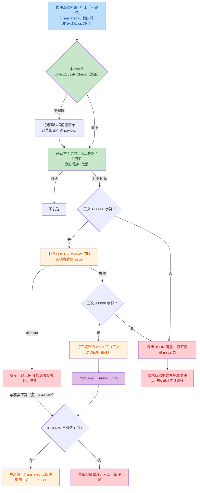

# FireGaze 投稿/上传链路独立评审（只读）

**评审对象**：`C:/everyone/FireGaze-Refactor` 工作树。`.git/refs/heads/main` = `00623b2fb7e69c064b8ebc802778698781ffdcb7`（提交信息 "…一键上传/编辑器提交内置本地体检…（1.3.20）"）。
**方法**：按 `TRAE-code-review/SKILL.md` 的 Step3（推断意图）/Step4（Mermaid）/Step5（问题扫描）执行；Step5.5 由外层安排、Step7 按任务要求跳过。
**限制（先说清）**：本 cwd 无可用 Git diff 基线（`watchdog_diff` 明确报告无 HEAD 基线），我只能逐文件读工作树，**没有**做"commit 范围"比对，也无法确认工作树是否与 HEAD 完全一致；未运行构建/测试（只读评审）。

---

## 1. 作者意图（Step 3 推断）

本次改动（`UITextQuality` + 两处上传入口接线）的意图可归纳为三条：

1. **出站内容先体检再送**：把云端 `inbox_uit.py::check_text` 的硬检查（空译文/超长/控制字符/违规词）搬到本地，并加两条只有本地能拦的（占位符对不上、照抄原文）；不健康的**不上传**，且列进确认框让用户先修 —— 防止"退库的译文把别人插件翻坏 / 污染公共库"。
2. **两条入口共用一条通道**：列表行「一键上传」与编辑器「提交人工译文到公共库…」都走 `ContributeSender.SubmitAsync`（中继优先 → 失败回退 GitHub 提交页），修掉 2026-10-02 那次"编辑器标题缺 `contributions` 关键词导致 HTTP 400"的口径分裂。
3. **出站知情同意**：上传前弹确认框（条数 / 人工机器占比 / 公开性 / 不健康清单），默认焦点在「取消」；中继成功才算成功，失败绝不谎报。

前两条在实现里基本落实（见 Correct），第三条在两个**回退分支**上被破坏（C-03/C-04/C-07）。

## 2. 流程图（Step 4）

### 2.1 业务流：玩家点「一键上传」之后发生了什么



### 2.2 技术流：调用链与线程/服务端边界

```mermaid
flowchart LR
    subgraph Draw["绘制线程（与 ImGui.Draw 同一调用栈）"]
        A1["ImGui.Button 一键上传<br/>UITextTab.cs:798"]
        A2["StartUpload()<br/>UITextTab.cs:850"]
        A3["store.Load() → File.ReadAllText<br/>+ FromJSON 反序列化<br/>UITextTab.cs:863"]
        A4["FilterHealthy ×3：逐条正则体检<br/>UITextTab.cs:876-878"]
        A5["JsonSerializer.Serialize(整包, WriteIndented)<br/>UITextTab.cs:891-897"]
        A6["PendingUpload + OpenPopup<br/>UITextTab.cs:910-919"]
    end
    subgraph Pool["线程池 Task.Run"]
        B1["RunUpload → ContributeSender.SubmitAsync<br/>UITextTab.cs:970-974"]
        B2["ContributeRelay.TrySubmitAsync<br/>HttpClient 20s / MaxBody=60000"]
        B3["失败：Util.OpenLink(issue 页)<br/>异常只写日志"]
    end
    subgraph Server["服务端 / CI"]
        C1["Worker：title/body 校验<br/>（必须含 json 围栏 + 关键词）"]
        C2["GitHub issue"]
        C3["inbox.yml → inbox_uit.py<br/>check_text + 容器正则 + 包存在性"]
        C4["uit-packs/内部名.json<br/>Source=user"]
    end
    A1 --> A2 --> A3 --> A4 --> A5 --> A6 --> B1 --> B2 --> C1 --> C2 --> C3 --> C4
    B2 -. 失败 .-> B3
    C1 -. 附件路线正文无 json 围栏 .-> C1
    C3 -. 从建不出来的包 .-> C4
    style Draw fill:#e3f2fd,color:#0d47a1
    style Pool fill:#fff8e1,color:#e65100
    style Server fill:#f3e5f5,color:#4a148c
    style A3 fill:#ffcdd2,color:#b71c1c
    style A4 fill:#ffcdd2,color:#b71c1c
    style A5 fill:#ffcdd2,color:#b71c1c
    style B3 fill:#ffcdd2,color:#b71c1c
    style C4 fill:#c8e6c9,color:#1a5e20
```



## 3. 先记做对了的（Correct）

- **中继两侧上限一致**：`ContributeRelay.MaxBody = 60000`（ContributeRelay.cs:22）↔ `worker.js` `MAX_BODY = 60000`，两边都按 UTF-16 code unit 计长，不存在"客户端以为能发、Worker 判 413"的边界裂缝。
- **失败不谎报（中继段）**：`TrySubmitAsync` 只在 `ok===true` 时返回成功（ContributeRelay.cs:52-65）；客户端据此才写 Good（ContributeSender.cs:42-43）。HTTP 错误会把 Worker 的 `error/detail` 变成人话（ContributeRelay.cs:81-108），比旧版只有 `HTTP 400` 有进步。
- **重复点击有闸**：`uploading`/`enabling` 是 `ConcurrentDictionary`（UITextTab.cs:141-146），`StartUpload` 先查、`RunUpload` 先 `TryAdd`、行按钮在忙时禁用（UITextTab.cs:797）。
- **后台 → UI 的收尾走框架线程**：`FinishUploadAsync` 用 `Plugin.Framework.RunOnFrameworkThread` 回写 `notes/rowsDirty`（UITextTab.cs:1085-1095），`notes` 用并发字典（UITextTab.cs:136）；`ActivityLog` 有锁（ActivityLog.cs:53/115-121）。
- **确认框的知情同意要素齐**：条数/人工机器占比/公开性/不带账号与 key，且默认焦点在「取消」（UITextTab.cs:1018-1054, 1075）。
- **本地体检是纯函数、不联网**（UITextQuality.cs 无任何网络调用；硬约束④不破）。
- **体检后 payload 的四项云端硬检查确实对齐**：空译文/译文超长/原文超长/控制字符/违规词（见下表）。

### 3.1 本地 `UITextQuality.Check` ↔ 云端 `inbox_uit.check_text` 逐条差异（评审重点 #3）

| 检查项 | inbox_uit.check_text | UITextQuality.Check | 差异后果 |
|---|---|---|---|
| 空译文 | 有 | 有 | 一致 |
| 译文 > 2000 | Python 码点 `len()` | C# UTF-16 `Length`（代理对算 2） | 本地更严，**误拦**（只影响 emoji/扩展 B 汉字，可忽略） |
| 原文 > 4000 | 有 | 有 | 一致 |
| 控制字符（原+译） | 有（`validate_contribution.CONTROL`） | 同一正则（UITextQuality.cs:28） | 一致 |
| 违规词（只查译文） | 有（同一份 DENY_WORDS） | 有（UITextQuality.cs:22-25） | 一致（同一份 9 词，目前无漂移） |
| 占位符对不上 | **无** | 有（`UITextText.CheckPlaceholders`） | 本地更严（设计如此） |
| 与原文相同 | **无** | 有（UITextQuality.cs:66-71） | 本地更严 → 见 **C-06 误拦** |
| **资源容器名合法性** | **有**（`CONTAINER`，inbox_uit.py:40/129） | **无** | 见 **C-02：该拦没拦** |
| **资源 key 非空 / ≤200** | **有**（inbox_uit.py:129） | **无** | 影响小（本地 key 是 JSON 指针/entry 名） |
| **该插件在 uit-packs 有没有包** | **有**（inbox_uit.py:94-96，缺则整条丢弃） | **无** | 见 **C-04：假成功** |
| 每类条数上限 3000 | 有（静默截断） | 无 | 实际上被 60000 字符正文上限先挡住，不再单列 |

## 4. 问题清单（Step 5）

| # | 问题 | 位置 | 严重度 | 建议 | 置信度 |
|---|---|---|---|---|---|
| C-01 | 行「一键上传」不带 `Source` 过滤，机器译/库译也当人工交上去；服务端**无条件覆盖**并标 `user`，公共库译文可被任意玩家的机器译文静默顶掉且永久固化 | `src/FireGaze/UI/UITextTab.cs:863-866`；`scripts/inbox_uit.py:119-120,142-143,161-162`；`scripts/uit_library_build.py:411-412` | **P1** | 行上传只收 `IsUserSource`（或加显式勾选）；服务端分级写入：投稿为 user 才允许覆盖已有 user，非 user 只补空；覆盖前把旧值记进包内历史 | 0.8 |
| C-02 | 服务端容器名硬检查与本地 payload 不一致：`file:` / `json:` 容器必被拒，条目逐条静默丢弃，而客户端已报"已上传 N 条" | `scripts/inbox_uit.py:40,129`；`src/FireGaze/UIText/UITextLocalizationFiles.cs:22,336`；`src/FireGaze/UIText/UITextJSONResources.cs:27`；`src/FireGaze/UIText/UITextQuality.cs:39` | **P1** | 服务端放宽正则（白名单前缀）或客户端把这两类容器编码成合法名字；本地体检补上同一条硬检查 | 0.85 |
| C-03 | 回退"拖附件"路线**没有接收端**：正文无 JSON 围栏 → 投稿不进任何存档，附件从不被读取 | `src/FireGaze/Translate/ContributeSender.cs:58-66`；`src/FireGaze/UI/ContributeWindow.Contributions.cs:233-240`；`.github/workflows/inbox.yml:34-37`；`scripts/relay/worker.js:181` | **P1** | 附件路线兑现为：把正文压成"最小可用 JSON"（分批/只发 diff），或在工作流里读 `issue.body` 的附件链接并下载解析；两者都不做就应把该分支文案改成"请改用中继/手工贴正文" | 0.85 |
| C-04 | 公共库里没有该插件的包时，中继建 issue 成功 → 客户端报"已上传 N 条译文到社区"，实际整条投稿被丢弃 | `src/FireGaze/Translate/ContributeSender.cs:42-43`；`scripts/inbox_uit.py:94-96`；`uit-packs/`（HEAD 只有 README.md）；`scripts/uit_targets.txt`（≈40 个）；`src/FireGaze/UI/UITextTab.cs:794-810` | **P1** | 上传前用 `UITextLibrary.CachedIndex` 判断"公共库有没有这个包"，没有就禁用+改文案；服务端在缺包时新建空包而不是整条 fail | 0.85 |
| C-05 | 确认框承诺"不想分享的条目…标「不翻」"，但资源/属性（以及编辑器三条）不按不翻名单过滤 → 用户明确排除的内容仍被上传 | `src/FireGaze/UI/UITextTab.cs:1053`（文案）vs `:864-866`（只有 entries 过滤）；`src/FireGaze/UI/UITextEditorWindow.cs:1452-1463` | P2 | 三处都加 `!IsResourceSkipped/!IsAttributeSkipped/!IsSkipped`；或把文案改成"标「不翻」只影响写入，不影响分享" | 0.8 |
| C-06 | 「与原文相同，等于没翻」是本地独有的**误拦**：这类条目（缩写/品牌名/OK）被列成"没过检测"并要求用户去修，实际无解 | `src/FireGaze/UIText/UITextQuality.cs:66-71`；`src/FireGaze/UI/UITextTab.cs:1035-1055` | P2 | 单列"无需上传（照抄原文）"类别、不计入 problems，或仅当原文是纯 ASCII 单词时静默跳过 | 0.75 |
| C-07 | 回退 1 的 6000 字上限按**未转义**长度判定；`OpenIssue` 又把异常吞成日志，文案仍无条件宣称"已替你打开提交页" | `src/FireGaze/Translate/ContributeSender.cs:27,50-56,87-96`；对比 `src/FireGaze/UI/ContributeWindow.Contributions.cs:247-254` | P2 | 按 `Uri.EscapeDataString` 之后的长度判定（或与简介投稿共用 `url.Length > 20000` 的降级）；`OpenIssue` 返回 bool，失败时改文案 | 0.6 |
| C-08 | 点击路径在**绘制线程**做整包读盘 + 整包 JSON 序列化 + 全量正则体检（对照硬约束①） | `src/FireGaze/UI/UITextTab.cs:798-800,863,876-878,891-897`；`src/FireGaze/UIText/UITextStore.cs:73-104` | P2 | 把 Load + 体检 + 序列化挪进 `Task.Run`，完成后再 `RunOnFrameworkThread` 开确认框（与其它任务一致） | 0.75 |
| C-09 | 死分支 + 原因文案不对：`Info`（"译文较多，已替你打开提交页"）不可达，该场景其实是"中继不可用" | `src/FireGaze/Translate/ContributeSender.cs:50-56`；`ContributeRelay.cs:22` | P3 | 删掉 Info 分支，失败原因统一为"中继不可用/正文过长" | 0.9 |
| C-10 | 中继无幂等键：20s 超时判失败 → 回退手工重交，可能产生重复 issue/重复通知 | `src/FireGaze/Translate/ContributeRelay.cs:24,30-70` | P3 | 正文带 `batchId`（插件端生成），Worker/inbox 侧按它去重 | 0.7 |
| C-11 | 反馈发送的回调直接在线程池上写绘制线程会读的 UI 字段（同文件其它路径都走 `RunOnFrameworkThread`） | `src/FireGaze/UI/UITextTab.cs:2085-2113` vs `:1085-1095` | P3 | 统一走 `RunOnFrameworkThread` 回写 | 0.7 |

### 证据（每条 2-4 行）

**C-01**
- `UITextTab.cs:864`：`var entries = pack.Entries.Where(e => e.HasTranslation && !pack.IsSkipped(e.Original)).ToList();` —— 只要"有译文"就收，**不看 Source**；编辑器那条路写的是 `e.IsUserSource && e.HasTranslation && …`（`UITextEditorWindow.cs:1453`）。
- `inbox_uit.py:119-120`：`target["Translated"] = translated;` / `target["Source"] = "user"` —— 资源（142-143）、属性（161-162）同；**没有任何"现值是 user 就不覆盖"的判断**，后到的投稿赢。
- `uit_library_build.py:411-412`：`if translated: item["Source"] = old.get("Source") or "library"` —— 已翻条目不会被重翻，一旦被标 `user` 就**永久固化**在公共库里。
- `docs/uitrans.md:151-153` 的口径写的是"把当前包里 `Source=user` 的条目打成投稿"，与行上传的实际 payload 不一致。

**C-02**
- `inbox_uit.py:40`：`CONTAINER = re.compile(r"^[A-Za-z0-9_.\-]+\.resources$")`；`:129` `if not CONTAINER.match(container) or not key or len(key) > 200:` → `"容器名或 key 不合法"` 直接 `continue`。
- `UITextLocalizationFiles.cs:22`：`public const string Prefix = "file:";`，`:336`：`var container = Prefix + Path.GetRelativePath(pluginDirectory, chineseFile).Replace('\\', '/');` → 形如 `file:Localization/zh-CN.json`（含 `:` 与 `/`，必然不匹配）。
- `UITextJSONResources.cs:27`：`Prefix = "json:"`；`UiStringExtractor.cs:2872`：`Container = UITextJSONResources.Prefix + container` → 形如 `json:HaselTweaks.Translations.json`（含 `:`，必然不匹配）。
- `UITextQuality.cs:39`：`public static string? Check(string original, string translated)` —— 本地体检签名里**没有容器**，`UITextTab.cs:865-866` 也不筛容器，所以这两类条目会带着"已通过体检"的身份进入 payload。

**C-03**
- `ContributeSender.cs:60`：`var shortBody = $"### FireGaze contributions · 插件界面文字译文贡献\n\n- 插件：…\n- 条数：{total}\n\n条目较多，正文放不下；投稿文件见本 issue 的附件。\n";` —— **没有 JSON 围栏**；`ContributeWindow.Contributions.cs:235` 同理（"完整清单见附件"）。
- `.github/workflows/inbox.yml:34-37`：`printf '%s' "$ISSUE_BODY" > "$RUNNER_TEMP/issue-body.md"` —— 工作流只拿 `github.event.issue.body`；`inbox_uit.py:84-86` 用 `rules.extract_json(body)`，`inbox_contribution.py` 解析失败即打印"没找到 ```json``` 块"。
- `scripts/relay/worker.js:181`：`if (!body.includes('```json') || …)` —— 附件路线连中继的入口校验都过不了。
- 全仓 `grep 附件/attachment` 只命中客户端文案与 `docs/uitrans.md:293`（把它当既定方案），**没有任何接收端实现**。

**C-04**
- `ContributeSender.cs:42-43`：`if (ok) { return new ContributeSendResult(ContributeSendSeverity.Good, $"已上传 {total} 条译文到社区：{message}。感谢！"); }` —— `ok` 只代表"issue 建好了"。
- `inbox_uit.py:94-96`：`pack = load_json(pack_path); if pack is None: return fail(args, f"库里还没有 \`{plugin}\` 的包…")` —— 整条投稿不收录。
- `ls uit-packs/` 当前只有 `README.md`（无任何 `<内部名>.json`、无 `index.json`）；`scripts/uit_targets.txt` 只列 ≈40 个插件，而行按钮在 `info is { Translated: > 0 }` 时对所有插件都亮（`UITextTab.cs:794-800`）。
- `UITextTab.cs:806-810` 的 tooltip 还承诺"维护者收录后所有人「一键汉化」时能直接下载"。

**C-05**
- `UITextTab.cs:1053`：`ImGui.TextWrapped("不想分享的条目，可以先到「编辑校对」里改写或标「不翻」。");`
- `UITextTab.cs:864` 只有 entries 带 `!pack.IsSkipped(...)`；`:865`/`:866` 的 resources/attributes 只有 `e.HasTranslation`，没有 `IsResourceSkipped` / `IsAttributeSkipped`。
- `UITextEditorWindow.cs:1452-1463` 三条 Where 都不含 Skipped 过滤；`SetRowSkipped`（`:1078-1118`）只记名单、**不清译文**，所以被标"不翻"的条目仍带译文进 payload。

**C-06**
- `UITextQuality.cs:66-71`：`if (string.Equals(translated.Trim(), original.Trim(), StringComparison.Ordinal)) { return "与原文相同，等于没翻"; }`
- `inbox_uit.py:57-75` 的 `check_text` **没有**这条（服务端会收），说明这是本地新增的更严口径。
- `UITextTab.cs:1040-1055` 把它和"空译文/超长/控制字符"并列成"N 条没过，不会上传——"并让用户"修好后…再点一次"，但品牌名/缩写/`OK` 这类条目没有可"修"的写法。

**C-07**
- `ContributeSender.cs:27`：`private const int GitHubURLBodyLimit = 6000;`，`:50` 判的是 `body.Length`（未转义）；`ContributeRelay.cs:74-79` 用 `Uri.EscapeDataString(title/body)` 拼 URL —— 中文每字 3 字节 → `%XX%XX%XX`（9 字符），6000 字正文可生成约 5 万字符的 URL。
- 同类场景在简介投稿里有保护：`ContributeWindow.Contributions.cs:247-254` `if (url.Length > 20000) { … url = $"{RepoURL}/issues/new"; }`；UIText 这条通道没有对应降级。
- `ContributeSender.cs:87-96`：`OpenIssue` 的 `catch (Exception e) { Plugin.Log?.Warning(e, …); }` 只写日志，而 `:53-55` / `:61-66` 的文案无条件写"已替你打开提交页，按 Submit 即可提交"。

**C-08**
- 调用栈：`UITextTab.cs:798-800`（`ImGui.Button("一键上传")` → `this.StartUpload(plugin)`）在 `UITextTab.Draw()` 的同一调用栈上（`Draw()` 见 `:222-228`）。
- `UITextTab.cs:863`：`var pack = this.store.Load(entry.InternalName);` → `UITextStore.cs:73-104` `File.ReadAllText` + `UITextPack.FromJSON`（大包数百 KB）。
- `UITextTab.cs:876-878` 对**全部**条目跑 `UITextQuality.Check`（每条最多 3 次正则 + 9 个词 Contains，`UITextQuality.cs:53-74`）。
- `UITextTab.cs:891-897`：`JsonSerializer.Serialize(new { … }, new JsonSerializerOptions { WriteIndented = true, … })` 把整包健康条目一次拼成字符串，全部发生在绘制线程。既有先例 `RefreshRows` 也读盘，但有"每 5 秒 / 动作后刷新；不要每帧读盘"的节流注释（`UITextTab.cs:2718-2721`）。

**C-09**
- `ContributeSender.cs:50-56`：进入回退 1 需要 `body.Length <= 6000`，而 `MaxBody = 60000`（`ContributeRelay.cs:22`）→ 该 body 必然已经试过中继；失败必有 `relayError`（三个失败出口都返回非空串），因此 `Info` 分支不可达。
- 能走到这里的原因只有"中继不可用"，文案却写"译文较多"（`ContributeSender.cs:55`）。

**C-10**
- `ContributeRelay.cs:30-70` 的请求体只有 `{title, body}`（或加 `type`），没有批次标识；`:24` `Timeout = TimeSpan.FromSeconds(20)`。
- Worker 侧每次 POST 无条件建 issue（`worker.js` 的 `POST /repos/{repo}/issues`），超时重试即重复建条；`inbox_uit` 的收录本身幂等，但会重复评论与重复手机通知。

**C-11**
- `UITextTab.cs:2085-2113`：`Task.Run(async () => { … this.feedbackSending = false; this.feedbackStatus = "已提交，感谢反馈！"; this.feedbackSentURL = message; this.feedbackText = string.Empty; … })` —— 全部直接写绘制线程读取的字段。
- 对比同文件上传路径：`UITextTab.cs:1085-1095` `FinishUploadAsync` 明确用 `Plugin.Framework.RunOnFrameworkThread` 回写（注释还写着"上传是后台任务"）。

## 5. 判定

- **Merge verdict：BLOCK** —— 上传链路上有 4 条 P1（C-01 公共库可被静默覆盖且固化、C-02 资源条目必被服务端拒、C-03 附件回退无接收端、C-04 缺包时假报成功），都在本轮新增/复用的"一键上传 + 中继/回退"路径上、可复现、且后果是"投稿丢 / 库被污染 / 用户被误导"。P2/P3 共 7 条建议同批收口。
- **最小放行组合**（若必须先合一部分）：C-04 + C-03（不再让用户白上传、不再教玩家拖附件）→ C-02（要么服务端放宽容器名，要么客户端换编码）→ C-01（行上传只收 user / 服务端分级写入）。
- **未验证项（残留风险）**：① 无 Git 基线，不能排除工作树与 HEAD 有差异；② `Util.OpenLink` 超长 URL 的实际行为、以及 `Uri.EscapeDataString` 后 URL 的真实长度阈值未实机测（C-07 置信度已降到 0.6）；③ 未运行 `dotnet build` / `fgtest` / 任何 Python 脚本，规则行为由代码阅读判定。

```acceptance-report
{
  "criteriaSatisfied": [
    {
      "id": "criterion-1",
      "status": "satisfied",
      "evidence": "报告给出 11 条带文件/行号证据的问题（C-01~C-11），含 4 条 P1 与合并判定 BLOCK；末尾附严格的 ISSUES-JSON 机器块；未修改仓库任何文件（只读评审），残留风险列在 residualRisks"
    }
  ],
  "changedFiles": [],
  "testsAddedOrUpdated": [],
  "commandsRun": [
    {
      "command": "dotnet build src/FireGaze/FireGaze.csproj -c Release",
      "result": "not-run",
      "summary": "只读评审，未执行构建；建议由监督方运行以确认 HEAD 可编译"
    },
    {
      "command": "python scripts/inbox_uit.py --issue 0 --body <含 file:/json: 容器的投稿正文> --comment-out /tmp/c.md",
      "result": "not-run",
      "summary": "建议监督方复现 C-02：预期在评论里看到『容器名或 key 不合法』逐条拒绝"
    }
  ],
  "validationOutput": [
    "C-02 由三处源码互证：inbox_uit.py:40/129 的 CONTAINER 正则要求以 .resources 结尾，而 UITextLocalizationFiles.cs:22/336 生成 file:Localization/zh-CN.json、UITextJSONResources.cs:27 + UiStringExtractor.cs:2872 生成 json:HaselTweaks.Translations.json，必然不匹配",
    "C-03 由『接收端只读 issue.body』证明：inbox.yml:34-37 + inbox_uit.py:84-86 + worker.js:181，全仓无任何读取 issue 附件的代码",
    "C-04 由数据现状证明：uit-packs/ 当前只有 README.md（无包、无 index.json），而按钮在 info.Translated>0 时对所有插件都出现（UITextTab.cs:794-800）"
  ],
  "residualRisks": [
    "本 cwd 无 Git diff 基线（watchdog_diff 报告无 HEAD 基线），只能按工作树文件评审，无法确认工作树与 HEAD=00623b2f 完全一致，也未做 commit 范围比对",
    "未运行构建与 fgtest；C-07 依赖 Util.OpenLink 对超长 URL 的实际行为（未实机验证，置信度 0.6）",
    "C-01 的『是否允许上传机器译文』存在产品口径歧义：确认框会显示『人工 N 条 · 机器 M 条』，若这是有意设计，则只需收窄到『排除 library 回声 + 服务端不把非 user 标成 user』",
    "C-08 的严重度取决于实测帧耗时：RefreshRows 已有『每 5 秒读全部包』的先例，本次点击路径未实测卡顿幅度"
  ],
  "noStagedFiles": true,
  "diffSummary": "只读评审，未产生 diff。评审对象为工作树中的投稿/上传链路：UITextTab.cs（StartUpload/FilterHealthy/DrawUploadConfirmModal/RunUpload）、UITextEditorWindow.cs（SubmitContributions）、ContributeSender/ContributeRelay/FeedbackSender、ContributeWindow*.cs、UITextQuality，以及接收端 scripts/inbox_uit.py、scripts/validate_contribution.py、scripts/relay/worker.js、.github/workflows/inbox.yml",
  "reviewFindings": [
    "blocker: src/FireGaze/UI/UITextTab.cs:863-866 - 行「一键上传」不带 Source 过滤，配合 inbox_uit.py:119-120 的无条件覆盖+标记 user，公共库译文可被任意玩家的机器译文静默顶掉并永久固化（P1）",
    "blocker: scripts/inbox_uit.py:40,129 - 与本地 payload 的容器名口径不一致，file:/json: 容器条目必被逐条拒绝而客户端已报成功（P1）",
    "blocker: src/FireGaze/Translate/ContributeSender.cs:58-66 - 正文 >6000 字符的『拖附件』回退没有任何接收端，投稿静默丢失（P1）",
    "blocker: src/FireGaze/Translate/ContributeSender.cs:42-43 - uit-packs 中无该插件包时中继仍建 issue，客户端报『已上传 N 条译文到社区』，实际整条丢弃（P1）",
    "non-blocker: C-05~C-11（标不翻未过滤、照抄误拦、URL 长度与 OpenIssue 吞异常、绘制线程读盘+整包序列化、Info 死分支、无幂等键、反馈回调线程不一致）"
  ],
  "manualNotes": "本任务要求 ISSUES-JSON 块位于报告最后且其间只放 JSON 数组，因此 acceptance-report 块被放在其之前，报告末尾两行仍是 ===ISSUES-JSON=== / ===END-ISSUES===。评审全程只读：未编辑文件、未运行构建、未使用 shell，也未写 progress.md（review-only 优先）。"
}
```

===ISSUES-JSON===
[
  {
    "id": "C-01",
    "title": "行「一键上传」不带 Source 过滤，机器译/库译被当人工交上去；服务端无条件覆盖并标 user，公共库译文可被静默顶掉且永久固化",
    "severity": "P1",
    "file": "src/FireGaze/UI/UITextTab.cs",
    "line": "863-866",
    "evidence": "UITextTab.cs:864 `pack.Entries.Where(e => e.HasTranslation && !pack.IsSkipped(e.Original))` 不看 Source（编辑器那条路是 `.Where(e => e.IsUserSource && e.HasTranslation && …)`，UITextEditorWindow.cs:1453）；inbox_uit.py:119-120 `target[\"Translated\"] = translated; target[\"Source\"] = \"user\"`（资源 142-143、属性 161-162 同），无「现值是 user 不覆盖」判断；uit_library_build.py:411-412 `item[\"Source\"] = old.get(\"Source\") or \"library\"` 说明标成 user 后不会再被重建洗掉；docs/uitrans.md:151-153 的口径只写「Source=user 的条目」。",
    "suggestion": "行上传只收 IsUserSource（或加显式勾选「连机器译文一起交」）；服务端分级写入：投稿为 user 才允许覆盖已有 user，非 user 只补空/补新增；覆盖前把旧值记进包的历史；若确认允许上传机器译文，则至少不要把它标成 user。",
    "confidence": 0.8
  },
  {
    "id": "C-02",
    "title": "服务端容器名硬检查与本地 payload 不一致：file:/json: 容器条目必被拒，客户端却已报「已上传 N 条」",
    "severity": "P1",
    "file": "scripts/inbox_uit.py",
    "line": "40,129",
    "evidence": "inbox_uit.py:40 `CONTAINER = re.compile(r\"^[A-Za-z0-9_.\\-]+\\.resources$\")`，:129 不匹配即 `rejected.append(\"容器名或 key 不合法\")`；UITextLocalizationFiles.cs:22 `Prefix = \"file:\"` + :336 生成 `file:Localization/zh-CN.json`（含 : 与 /）；UITextJSONResources.cs:27 `Prefix = \"json:\"` + UiStringExtractor.cs:2872 生成 `json:HaselTweaks.Translations.json`（含 :）；UITextQuality.cs:39 的本地体检签名只有 (original, translated)，UITextTab.cs:865-866 也不筛容器，故这些条目带着「已通过体检」进 payload。",
    "suggestion": "二选一：服务端放宽 CONTAINER（白名单 `file:`/`json:` 前缀 + 长度/key 规则），或客户端在组装 payload 时把容器编码成 `^[A-Za-z0-9_.\\-]+\\.resources$` 可接受的名字；并在 UITextQuality 里补上同一条硬检查（否则「口径与云端同步」不成立）；同时把被服务端拒绝的条数回显给用户。",
    "confidence": 0.85
  },
  {
    "id": "C-03",
    "title": "回退「拖附件」路线没有接收端：正文无 JSON 围栏 → 投稿不进任何存档，附件从不被读取",
    "severity": "P1",
    "file": "src/FireGaze/Translate/ContributeSender.cs",
    "line": "58-66",
    "evidence": "ContributeSender.cs:60 的 shortBody 只有「条目较多，正文放不下；投稿文件见本 issue 的附件」，没有 JSON 围栏（ContributeWindow.Contributions.cs:235 同理「完整清单见附件」）；.github/workflows/inbox.yml:34-37 只把 `github.event.issue.body` 落成文件；inbox_uit.py:84-86 用 `rules.extract_json(body)`，inbox_contribution.py 解析失败即打印「没找到 ```json``` 块」；scripts/relay/worker.js:181 也要求正文含 json 围栏；全仓 grep「附件/attachment」只有客户端文案与 docs/uitrans.md:293。",
    "suggestion": "要么让工作流真正处理附件（读 issue 里的附件链接并下载解析），要么把正文压成最小可用 JSON（分批提交/只发与库不同的 diff），要么把该分支文案改为「请改用中继或把正文贴进 issue」，不要把「拖附件」说成完成动作。",
    "confidence": 0.85
  },
  {
    "id": "C-04",
    "title": "公共库里没有该插件的包时，中继建 issue 成功 → 客户端报「已上传 N 条译文到社区」，实际整条投稿被丢弃",
    "severity": "P1",
    "file": "src/FireGaze/Translate/ContributeSender.cs",
    "line": "42-43",
    "evidence": "ContributeSender.cs:42-43 `if (ok) return … Good, $\"已上传 {total} 条译文到社区：{message}。感谢！\"` 而 ok 只代表 issue 建好了；inbox_uit.py:94-96 `pack = load_json(pack_path); if pack is None: return fail(… \"库里还没有 `{plugin}` 的包（必须先有生成的包才能收译文）\")` 丢整条；uit-packs/ 在 HEAD 只有 README.md（无任何 <内部名>.json、无 index.json），scripts/uit_targets.txt 只列约 40 个插件，而按钮在 `info is { Translated: > 0 }` 时对所有插件都出现（UITextTab.cs:794-800），tooltip 还承诺「维护者收录后所有人一键汉化时能直接下载」（UITextTab.cs:806-810）。",
    "suggestion": "上传前用已有的 UITextLibrary.CachedIndex 判断该插件在公共库有没有包：没有就禁用按钮并说明原因；服务端在缺包时新建空包（或至少回一条明确的「未收录」评论），客户端把服务端收录条数与本地条数分开显示。",
    "confidence": 0.85
  },
  {
    "id": "C-05",
    "title": "确认框承诺「不想分享就标不翻」，但资源/属性（以及编辑器三条）不过滤不翻名单，用户明确排除的内容仍被上传",
    "severity": "P2",
    "file": "src/FireGaze/UI/UITextTab.cs",
    "line": "864-866,1053",
    "evidence": "UITextTab.cs:1053 确认框文案「不想分享的条目，可以先到「编辑校对」里改写或标「不翻」。」；:864 只有 entries 带 `!pack.IsSkipped(...)`，:865/:866 的 resources/attributes 只有 `HasTranslation`（无 IsResourceSkipped/IsAttributeSkipped）；UITextEditorWindow.cs:1452-1463 三条都不过滤 Skipped；SetRowSkipped（UITextEditorWindow.cs:1078-1118）只记名单、不清译文，所以被标不翻的条目仍带译文进 payload。",
    "suggestion": "三处都加 `!IsSkipped/!IsResourceSkipped/!IsAttributeSkipped`；或者把确认框文案改成「标不翻只影响写入插件，不影响分享」，并把「不进 payload 的条目」在确认框里单列一行数字。",
    "confidence": 0.8
  },
  {
    "id": "C-06",
    "title": "「与原文相同，等于没翻」是本地独有口径，属误拦：修不了的条目被列成「没过检测」",
    "severity": "P2",
    "file": "src/FireGaze/UIText/UITextQuality.cs",
    "line": "66-71",
    "evidence": "UITextQuality.cs:66-71 `if (string.Equals(translated.Trim(), original.Trim(), StringComparison.Ordinal)) return \"与原文相同，等于没翻\";`；inbox_uit.py:57-75 的 check_text 没有这条（服务端会收），说明这是本地新增的更严口径；UITextTab.cs:1040-1055 把它与空译文/超长/控制字符并列成「N 条没过，不会上传」并要求「修好后…再点一次」，但品牌名/缩写/OK 这类条目没有可修的写法。",
    "suggestion": "单列「无需上传（照抄原文）」类别、不计入 problems，或仅当原文是纯 ASCII 单词/缩写时静默跳过；同时把该类别与真正的「问题」在确认框里分成两段，避免用户去找不存在的修法。",
    "confidence": 0.75
  },
  {
    "id": "C-07",
    "title": "回退 1 的 6000 字上限按未转义长度判定，且 OpenIssue 吞异常，文案仍无条件宣称「已替你打开提交页」",
    "severity": "P2",
    "file": "src/FireGaze/Translate/ContributeSender.cs",
    "line": "27,50-56,87-96",
    "evidence": "ContributeSender.cs:27 `GitHubURLBodyLimit = 6000` 判的是 `body.Length`（未转义），而 ContributeRelay.cs:74-79 用 Uri.EscapeDataString（中文每字 → %XX%XX%XX，9 字符），6000 字正文可生成约 5 万字符 URL；同类场景在 ContributeWindow.Contributions.cs:247-254 有 `if (url.Length > 20000)` 的降级，UIText 通道没有；ContributeSender.cs:87-96 `OpenIssue` 的 catch 只写日志，:53-55/:61-66 的文案仍写「已替你打开提交页，按 Submit 即可提交」。",
    "suggestion": "按 Uri.EscapeDataString 之后的长度判定（或复用简介投稿的 url.Length>20000 降级）；OpenIssue 返回 bool，失败时改成「没能自动打开提交页，请手动到 …/issues/new 粘贴正文」并把内容导出路径显式给出。",
    "confidence": 0.6
  },
  {
    "id": "C-08",
    "title": "点击路径在绘制线程做整包读盘 + 整包 JSON 序列化 + 全量正则体检（对照硬约束①）",
    "severity": "P2",
    "file": "src/FireGaze/UI/UITextTab.cs",
    "line": "798-800,863,876-878,891-897",
    "evidence": "调用栈 ImGui.Button（UITextTab.cs:798-800）→ StartUpload（:850）在 Draw()（:222-228）同一调用栈；:863 `this.store.Load(entry.InternalName)` → UITextStore.cs:73-104 `File.ReadAllText` + `UITextPack.FromJSON`；:876-878 对全部条目跑 UITextQuality.Check（每条最多 3 次正则 + 9 词 Contains，UITextQuality.cs:53-74）；:891-897 `JsonSerializer.Serialize(… WriteIndented = true …)` 把整包健康条目一次拼成字符串。既有 RefreshRows 也读盘但有「每 5 秒 / 动作后刷新；不要每帧读盘」的节流注释（UITextTab.cs:2718-2721）。",
    "suggestion": "把 Load + 体检 + 序列化挪进 Task.Run，完成后再用 Plugin.Framework.RunOnFrameworkThread 打开确认框（与同文件其它后台任务一致）；或复用 RefreshRows 已算好的包摘要做前置判断，只在后台任务里读整包。",
    "confidence": 0.75
  },
  {
    "id": "C-09",
    "title": "ContributeSender 的 Info 分支是死代码，且文案把「中继不可用」说成「译文较多」",
    "severity": "P3",
    "file": "src/FireGaze/Translate/ContributeSender.cs",
    "line": "50-56",
    "evidence": "进入回退 1 需要 `body.Length <= 6000`，而 ContributeRelay.cs:22 `MaxBody = 60000`，故该 body 必然已试过中继；TrySubmitAsync 的三个失败出口都返回非空 message（ContributeRelay.cs:48/63/68），relayError 必非空 → 只走 Bad 分支；Info 文案「译文较多，已替你打开提交页」不可达，而真实原因是中继不可用。",
    "suggestion": "删掉 Info 分支；把回退原因写进文案（中继不可用 / 正文过长 / 超过 URL 上限），便于玩家与维护者定位。",
    "confidence": 0.9
  },
  {
    "id": "C-10",
    "title": "中继提交没有幂等键：20 秒超时判失败后回退手工重交，可能产生重复 issue 与重复通知",
    "severity": "P3",
    "file": "src/FireGaze/Translate/ContributeRelay.cs",
    "line": "24,30-70",
    "evidence": "ContributeRelay.cs:30-70 的请求体只有 {title, body}（或加 type），无批次标识；:24 `Timeout = TimeSpan.FromSeconds(20)`；Worker 侧每次 POST 无条件建 issue（worker.js 的 POST /repos/{repo}/issues）；玩家按提示在网页再交一次即两条相同投稿（inbox_uit 的收录本身幂等，但会重复评论与重复手机通知）。",
    "suggestion": "插件端生成 batchId（含内部名+条数+时间）放进标题或正文 marker，Worker/inbox 侧按它去重并回显「同一批次已收到」。",
    "confidence": 0.7
  },
  {
    "id": "C-11",
    "title": "反馈发送的回调直接在线程池上写绘制线程读取的 UI 字段（同文件其它路径统一走 RunOnFrameworkThread）",
    "severity": "P3",
    "file": "src/FireGaze/UI/UITextTab.cs",
    "line": "2085-2113",
    "evidence": "UITextTab.cs:2085-2113 在 Task.Run 内直接赋值 `this.feedbackSending/feedbackStatus/feedbackStatusError/feedbackText/feedbackSentURL`，这些字段被绘制线程同帧读取；对比同文件上传路径 UITextTab.cs:1085-1095 FinishUploadAsync 明确用 Plugin.Framework.RunOnFrameworkThread 回写（注释「上传是后台任务」）。",
    "suggestion": "反馈回调统一走 Plugin.Framework.RunOnFrameworkThread（或改成小状态机 + 绘制线程消费），与 uploading/finishUpload 的收尾保持一致。",
    "confidence": 0.7
  }
]
===END-ISSUES===